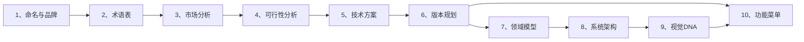

# Product Documentation Standard (full-stack-doc v3.0)

Enforces a fixed directory-and-naming convention for product documentation, suitable for general product families. Ready-to-copy Markdown templates live under [`templates/`](templates/). Detailed file mappings and conventions in [`references/structure.md`](references/structure.md).

---

## 1. When to Use

- Creating or initializing a product documentation repository
- Scaffolding doc trees for product families or standalone products
- Auditing or aligning existing repos against the product doc standard
- Generating / renaming docs to match the naming convention
- Aligning `product-docs/` content with the template structure
- Writing or expanding any of the 10 root-level planning documents

---

## 2. Start Here

Before copying or editing templates, load only the references needed for the task:

- Placeholder interpretation and secret handling: [`references/placeholder-protocol.md`](references/placeholder-protocol.md)
- Product/version/module/delivery ownership: [`references/document-boundaries.md`](references/document-boundaries.md)
- Optional architecture and product patterns: [`references/applicability.md`](references/applicability.md)
- Reusable example identities and adaptation rules: [`references/example-profiles.md`](references/example-profiles.md)
- Evidence-oriented completion criteria: [`references/quality-rubric.md`](references/quality-rubric.md)
- Exact filenames and dependency map: [`references/structure.md`](references/structure.md)
- Project README selection, evidence, bilingual, and preservation rules: [`references/readme-template-guide.md`](references/readme-template-guide.md)
- Rust common template and optional domain-profile selector: [`templates/readme/rust-profiles/README.md`](templates/readme/rust-profiles/README.md)
- Complete architecture template, evidence, and profile selection: [`references/architecture-template-guide.md`](references/architecture-template-guide.md)

### 2.1 Placeholder Summary

| Placeholder | Meaning | Example |
|:---|:---|:---|
| `{{PRODUCT_NAME}}` | Product / brand name | `ExampleCommerce`, `ExampleMemory` |
| `{{OPEN_SOURCE_NAME}}` | Open-source variant name (if dual-track) | `ExampleCommerce-Open`, `ExampleMemory-Open` |
| `{{VERSION}}` | Version directory name | `V1`, `V2` |
| `{{MODULE_NAME}}` | Module short name | `登录页`, `设备中心` |
| `{{DATE}}` | Date placeholder | `2026-03-27` |
| `{{OWNER}}` | Author / reviewer name | `张三` |
| `{{ORGANIZATION}}` | Organization name | `ExampleOrg` |
| `{{DOC_ROOT}}` | Documentation root | `product-docs/ExampleProduct` |

Replace double-brace placeholders in **both filenames and content**. Single-brace prompts such as `{例如：订单中心}` are authoring examples, not global tokens. Root keeps one `6、` file; the former detailed feature list is merged into `10、功能菜单与版本规划`.

### 2.2 Adaptation Contract

1. Inspect the target repository and collect confirmed facts before filling templates.
2. Choose applicable sections; remove non-applicable dual-track, SaaS, DDD/COLA, Agent, CLI/IM, mobile, or enterprise examples.
3. Keep rich examples as labeled examples, but never present them as facts about the target product.
4. Label uncertain content as **推断**, **假设**, or **待确认** and attach evidence where possible.
5. Preserve source examples when maintaining this skill; improve boundaries and labels instead of deleting depth.
6. Name generated standalone architecture documents `*-Architecture.md` or `*-Architecture.zh_CN.md`; place component/version qualifiers before `-Architecture`.

---

## 3. Document Architecture

### 3.1 Four-Layer Structure

```
{{PRODUCT_NAME}}/
├── 1、{{PRODUCT_NAME}}-命名与品牌说明.md          ─┐
├── 2、{{PRODUCT_NAME}}-术语表与词汇表.md          │
├── 3、{{PRODUCT_NAME}}-市场与商业分析.md          │
├── 4、{{PRODUCT_NAME}}-技术与可行性分析.md        │ Root (10) — 产品级，与版本无关
├── 5、{{PRODUCT_NAME}}-技术方案与路线.md          │
├── 6、{{PRODUCT_NAME}}-产品与版本规划.md          │
├── 7、{{PRODUCT_NAME}}-领域模型设计.md            │
├── 8、{{PRODUCT_NAME}}-Architecture.zh_CN.md      │
├── 9、{{PRODUCT_NAME}}-视觉与交互DNA规范.md       │
├── 10、{{PRODUCT_NAME}}-功能菜单与版本规划.md      ─┘
│
├── V1/                                   ─┐
│   ├── 1、{{PRODUCT_NAME}}-需求调研文档-V1.md      │
│   ├── 2、{{PRODUCT_NAME}}-需求分析文档-V1.md      │
│   ├── 3、{{PRODUCT_NAME}}-V1-Architecture.zh_CN.md│ Version (7) — 版本级实施文档
│   ├── 4、{{PRODUCT_NAME}}-功能与界面规划-V1.md    │
│   ├── 5、{{PRODUCT_NAME}}-PRD文档-V1.md           │
│   ├── 6、{{PRODUCT_NAME}}-功能菜单与版本规划-V1.md│
│   ├── 7、{{PRODUCT_NAME}}-UI设计说明-V1.md        │
│   │                                     ─┘
│   ├── 1、{模块A}/                       ─┐
│   │   ├── {{PRODUCT_NAME}}-{模块A}-PRD-V1.md      │ Module (3) — 可选，按模块
│   │   ├── {{PRODUCT_NAME}}-{模块A}-Stitch设计提示词.md │
│   │   └── {{PRODUCT_NAME}}-{模块A}-UI设计说明-V1.md    ─┘
│   └── ...
│
├── 其他/                                 ─┐
│   ├── 1、技术细分模板.md                │
│   ├── 2、功能提测模板.md                │ Delivery (5) — 可选，研发交付
│   ├── 3、测试结果模板.md                │
│   ├── 4、上线通知模板.md                │
│   └── 5、项目运维模板.md                ─┘
│
├── 技术调研/                             ── 技术调研、协议分析（版本无关）
└── assets/                               ── 图片、附件等
```

### 3.2 Scope Summary

| Scope | Count | Templates | Naming Pattern |
|:---|:---:|:---|:---|
| Root | 10 | [`templates/root/`](templates/root/) | `{{MODULE_INDEX}}、{{PRODUCT_NAME}}-{文档名}.md` |
| Version (`{{VERSION}}/`) | 7 | [`templates/version/`](templates/version/) | `{{MODULE_INDEX}}、{{PRODUCT_NAME}}-{文档名}-{{VERSION}}.md` |
| Module (optional) | 3 per module | [`templates/module/`](templates/module/) | `{{PRODUCT_NAME}}-{{MODULE_NAME}}-{类型}-{{VERSION}}.md` |
| Delivery (optional) | 5 | [`templates/delivery/`](templates/delivery/) | Context-dependent |

### 3.3 Root 10 Documents — Authoring Chain

文档间存在严格的上下游依赖关系，编写时应按顺序递进：



| 序号 | 文档 | 关键输入 | 关键输出 | 对标 Mermaid 类型 |
|:---:|:---|:---|:---|:---|
| 1 | 命名与品牌说明 | 产品愿景 | 品牌口径、边界 | `graph LR` (品牌关系) |
| 2 | 术语表与词汇表 | Doc 1 品牌定位 | 统一语言 | 无（纯表格） |
| 3 | 市场与商业分析 | Doc 1 定位 + 外部数据 | TAM/SAM/SOM、竞品、定价 | `quadrantChart` / `funnel` |
| 4 | 技术与可行性分析 | Doc 3 机会 + Doc 5 初步选型 | 可行性结论、风险 | `flowchart` / `sequenceDiagram` |
| 5 | 技术方案与路线 | Doc 4 结论 | 技术栈、ADR、里程碑 | `flowchart` / `gantt` |
| 6 | 产品与版本规划 | Doc 3 商业 + Doc 5 路线 | 版本矩阵、定价、发布策略 | `graph` / `timeline` |
| 7 | 领域模型设计 | Doc 2 术语 + Doc 6 功能边界 | 限界上下文、聚合、事件 | `classDiagram` / `graph TB` |
| 8 | 系统架构设计 | Doc 5 技术栈 + Doc 7 领域 | 分层、数据流、部署 | `flowchart` / `sequenceDiagram` |
| 9 | 视觉与交互DNA规范 | Doc 1 品牌气质 | 色彩、字体、组件、动效 | `flowchart` (页面骨架) |
| 10 | 功能菜单与版本规划 | Doc 6 + Doc 8 + Doc 9 | 导航、路由、功能清单、优先级 | `mindmap` / `pie` / `flowchart` |

---

## 4. Scaffolding Workflow

### Step 1 — Root Docs

Copy all 10 files from `templates/root/` into the project root. Rename each replacing `{{PRODUCT_NAME}}`:

```bash
# Example: ExampleCommerce
for f in templates/root/*.md; do
  name=$(basename "$f" | sed 's/{{PRODUCT_NAME}}/ExampleCommerce/g')
  cp "$f" "product-docs/ExampleCommerce/$name"
done
```

### Step 2 — Version Docs

Create `{{VERSION}}/` (e.g., `V1/`). Copy 7 files from `templates/version/`. Replace both `{{PRODUCT_NAME}}` and `{{VERSION}}` in filenames and content.

### Step 3 — Module Docs (optional)

For each functional module, create `{{VERSION}}/{{MODULE_INDEX}}、{{MODULE_NAME}}/`. Copy 3 files from `templates/module/`. Replace `{{PRODUCT_NAME}}`, `{{MODULE_NAME}}`, and `{{VERSION}}`.

Example (ExampleCommerce V1 商品采集):
```
V1/1、商品采集/
├── ExampleCommerce-商品采集-PRD-V1.md
├── ExampleCommerce-商品采集-Stitch设计提示词.md
└── ExampleCommerce-商品采集-UI设计说明-V1.md
```

### Step 4 — Delivery Docs (optional)

Copy `templates/delivery/` into `其他/` or a dedicated delivery folder. Replace `{{PRODUCT_NAME}}` and dates.

### Step 5 — Special Directories

Create `技术调研/` for tech research and `其他/` for non-standard docs. Directories like `demo/`, `assets/`, `.stitch/` stay untouched.

### Step 6 — Validate

Run the validation checklist (Section 7).

---

## 5. Quality Standards

### 5.1 Evidence-Oriented Quality Gates

Line counts, table counts, and diagram counts are diagnostics, not acceptance gates. A document is complete when it enables the next decision or delivery step with traceable evidence.

| Dimension | Required outcome |
|:---|:---|
| Scope | Audience, ownership, included/excluded scope, and upstream/downstream boundaries are explicit |
| Evidence | External claims include source, date, and confidence; repository claims point to files, APIs, tests, or runtime evidence |
| Decisions | Alternatives, decision, rationale, constraints, and reversal conditions are recorded |
| Consistency | Terms, versions, timelines, menu names, APIs, states, and acceptance criteria agree across documents |
| Delivery | Each requirement has verifiable acceptance criteria; architecture/UI sections cover failure, empty, loading, permission, and rollback states where applicable |
| Honesty | Confirmed facts, inferences, assumptions, and TBD items are distinguishable |

Use [`references/quality-rubric.md`](references/quality-rubric.md) for scoring. Add diagrams and tables only when they make a relationship or comparison materially clearer.

### 5.2 Universal Document Structure

每份 root 文档 **必须** 包含以下标准结构：

**文档头部**:
```markdown
# {{PRODUCT_NAME}} 文档标题

> **文档说明**：一句话说明文档用途与范围。
>
> **版本**：V1.0.0
> **最后更新**：{{DATE}}
```

**文档尾部**:
```markdown
---

**文档版本**：V1.0.0
**创建日期**：{{DATE}}
**最后更新**：{{DATE}}
**文档状态**：✅ 待评审
```

### 5.3 Formatting Conventions

| 元素 | 规范 |
|:---|:---|
| 章节编号 | `## N.` 顶级，`### N.M` 子级，层级不超过 3 层 |
| 表格对齐 | 使用 `:---` 左对齐 |
| 可行性评级 | ✅ 高可行 / ⚠️ 中可行 / 🔴 低可行 |
| 优先级 | P0（必须）/ P1（重要）/ P2（期望）/ P3（可选） |
| 版本标签 | 🆓 免费 / 👤 个人 / 👥 专业 / 🏢 企业 |
| 状态标记 | ✅ 已实现 / 🔧 开发中 / ⏳ 计划中 / ❌ 不实现 |
| Mermaid | 每图前后空行；diagram 类型应匹配内容（见 3.3 对标列） |
| 代码块 | 标注语言（`typescript`/`go`/`bash`/`yaml`/`sql`） |
| 中英混排 | 中文与英文/数字间加空格：`OpenAI 模型` |

### 5.4 Cross-Reference Rules

- Doc 3 关联文档必须链接 Doc 1（品牌边界）和 Doc 5（技术可行性）
- Doc 5 Gantt 日期必须与 Doc 6 版本里程碑、Doc 10 发布节奏一致
- Doc 7 聚合名称必须在 Doc 2 术语表中有定义
- Doc 8 分层名称必须与 Doc 5 技术选型对应
- Doc 10 功能列表的版本标注必须与 Doc 6 版本矩阵一致

---

## 6. Gotchas

- Sequence numbers `1–7` in version folders are **reserved** for the 7 standard docs. Non-standard docs must use `8+` or go into `其他/`.
- Root has **one** file numbered `6、` (产品与版本规划). Detailed feature lists are embedded in `10、功能菜单与版本规划`.
- Don't reorganize special directories (`demo/`, `assets/`, `.stitch/`, `stitch_*`, `实施指南/`) unless the user explicitly requests it.
- Delivery templates are optional and do **not** occupy root-level standard sequence numbers.
- When a product has open-source + commercial dual-track (e.g., ExampleCommerce-Open/ExampleCommerce), each track gets its own full 10-doc set with cross-references.

---

## 7. Validation Checklist

Run the bundled structural validator from the skill directory:

```bash
python3 scripts/validate_templates.py
```

For generated standalone architecture documents, validate filenames before delivery:

```bash
python3 scripts/validate_architecture_filenames.py \
  docs/ExamplePlatform-Architecture.md \
  docs/ExamplePlatform-Architecture.zh_CN.md
```

Then review semantic consistency that cannot be reduced to file counts:

- [ ] Target facts are evidence-backed; examples remain labeled examples
- [ ] Root/version/module/delivery responsibilities do not duplicate ownership
- [ ] Non-applicable dual-track, DDD/COLA, Agent, SaaS, CLI/IM, mobile, or enterprise sections were removed or adapted
- [ ] Timeline dates agree across market, technology, version, and menu documents
- [ ] Terminology agrees with the glossary; menu, route, API, and state names agree across PRD/UI/architecture
- [ ] Requirements have observable acceptance criteria and failure/permission/empty/loading states where relevant
- [ ] No resolved passwords, tokens, private paths, or private product/repository names were introduced
- [ ] Standalone architecture filenames match `*-Architecture.md` or `*-Architecture.zh_CN.md`

---

## 8. Template Inventory

| Group | Location | Count | Main responsibility |
|:---|:---|:---:|:---|
| Product baseline | `templates/root/` | 10 | Brand, terminology, market, technology, roadmap, domain, architecture, design DNA, and product-wide IA |
| Version delivery | `templates/version/` | 7 | Research, analysis, version architecture, scope, PRD, menu, and UI decisions |
| Module detail | `templates/module/` | 3 | Module-specific PRD, design-generation prompt, and UI specification |
| Engineering delivery | `templates/delivery/` | 5 | Technical breakdown, test handoff/result, release, and operations |
| Project entry point | `templates/readme/` | 5 + 7 Rust profiles | Java, Rust, plugin, and skill-ecosystem direct-use templates, a complete reference, and composable Rust domain coverage |
| Architecture design | `templates/architecture/` | 1 + 7 profile documents | Complete architecture contract plus runtime, plugin, edge, event, AI, and control-plane profiles |

The original 25 lifecycle templates intentionally retain detailed reusable content and labeled full examples. The README family adds four type-specific templates plus one complete reference; the Rust template adds seven composable profile documents. The architecture family adds one complete master template and seven profile documents. Do not replace any of them with short empty shells.

---

## 9. Related Skills

- **`doc-coauthoring`**: Interview-driven collaborative document drafting. Install with: `npx skills add full-stack-skills/document-skills --skill doc-coauthoring`.
- **`api-doc-generator`**: Source/OpenAPI-driven API documentation. Install with: `npx skills add full-stack-skills/document-skills --skill api-doc-generator`.

## 10. Completion Contract

Before reporting completion, state which template groups were used, which optional patterns were removed, which claims remain assumptions/TBD, and which validation commands passed. For standalone architecture outputs, report the filename validation result. If the target repository could not be inspected, say so explicitly rather than presenting example content as confirmed facts.
