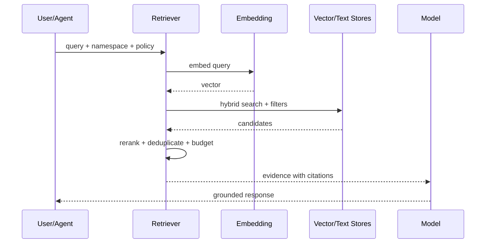

# 架构剖面：AI、Agent 与 RAG 系统

> 适用于模型调用、Agent Runtime、记忆、工具执行、RAG、多智能体和人在回路系统。

## Agent 主链与横切面

```text
Session / Request
  → identity + workspace/context
  → deterministic policy and routing
  → model/agent reasoning
  → tool or retrieval execution
  → validation + safety + response
  → memory/audit/observability
```

调度器、策略、安全和沙箱是横切基础设施，不应让 Agent/业务主链退化为无法解释的 DAG 或工具执行器。

## 组件与责任

| 组件 | 责任 | 非责任 | 状态 |
|---|---|---|---|
| Session | 连续上下文和身份 | 长期知识权威 | `{state}` |
| Context assembler | 选择、压缩和排序上下文 | 修改事实 | `{state}` |
| Model provider | 模型调用和流式输出 | 工具副作用 | `{state}` |
| Agent kernel | 计划、推理和调用协调 | 绕过策略 | `{state}` |
| Tool runtime | 有界执行 | 自行扩大权限 | `{state}` |
| Memory | 分层写入和召回 | 自动成为事实 | `{state}` |
| RAG | 检索和证据拼装 | 保证答案正确 | `{state}` |

## 确定性与非确定性边界

| 决策 | 必须确定性 | 可由模型建议 | 最终批准方 |
|---|:---:|:---:|---|
| 身份/权限 | ✅ | ❌ | Policy engine |
| 工具参数草案 | 部分 | ✅ | Schema + policy |
| 高风险副作用 | ✅ | 可解释建议 | HITL/Policy |
| 自然语言回复 | 约束后 | ✅ | Output validator |
| 记忆写入 | ✅ 过滤/分层 | ✅ 提议 | Memory policy |

## 上下文与记忆分层

| 层 | 生命周期 | 内容 | 写入条件 | 召回条件 | 清理 |
|---|---|---|---|---|---|
| Turn | 单轮 | 当前输入/工具结果 | 自动 | 当前轮 | 轮结束 |
| Session | 会话 | 摘要和状态 | 策略 | 同会话 | TTL |
| User/Tenant | 长期 | 偏好/业务知识 | 同意+验证 | scoped query | 删除请求 |
| Shared knowledge | 版本化 | 文档和索引 | ingestion | namespace | retention |
| Archive/Audit | 合规 | 决策与事件 | append | 受控 | policy |

## RAG 运行链



说明 namespace、租户隔离、chunk、embedding 版本、混合检索、rerank、引用、删除传播和索引重建。

## Tool 合同与执行安全

| Tool | 输入 Schema | 副作用 | 权限 | Sandbox | 审批 | 结果可见性 |
|---|---|:---:|---|---|---|---|
| `{tool}` | `{schema}` | 是/否 | `{capability}` | `{boundary}` | `{policy}` | redacted/full |

模型只能提供候选参数；服务端注入身份、租户、会话和敏感上下文。Tool 结果进入模型、持久化和审计前分别执行裁剪。

## 多智能体协作

| 角色 | 输入 | 输出 | 交接合同 | 失败责任 |
|---|---|---|---|---|
| Planner | 目标/约束 | 可验证计划 | task schema | 重新规划 |
| Worker | 子任务 | 产物/证据 | result schema | bounded retry |
| Evaluator | 产物/标准 | 评分/缺口 | rubric | 拒绝/返工 |
| Coordinator | 状态 | 交接/合并 | workflow state | 恢复/人工 |

避免 Agent 之间只用自由文本交接关键状态。

## 模型路由与降级

| 任务 | 主模型 | 降级 | 路由条件 | 不可降级条件 |
|---|---|---|---|---|
| `{task}` | `{provider/model}` | `{fallback}` | 成本/能力/区域 | 安全/质量 |

记录 timeout、rate limit、内容过滤、上下文超限、流中断和供应商不可用的恢复语义。

## AI 安全与评估

- Prompt injection、数据外泄、越权工具、恶意检索文档；
- 输出 Schema、引用完整性、事实性、拒答和敏感信息；
- 离线固定集、回归集、对抗集、人工评审和线上监控；
- 模型、Prompt、工具、知识库和策略均需版本化；
- 非确定性指标使用分布和重复运行，不用单次成功证明。

## AI 架构验收

- [ ] Agent 主链与策略/沙箱横切面明确
- [ ] 模型不能决定身份、权限和高风险提交
- [ ] 上下文、记忆和知识库的所有权与生命周期明确
- [ ] Tool 输入、权限、副作用、结果可见性和持久化受控
- [ ] RAG 的 namespace、版本、引用和删除闭环
- [ ] 评估覆盖正常、失败、对抗和漂移场景
