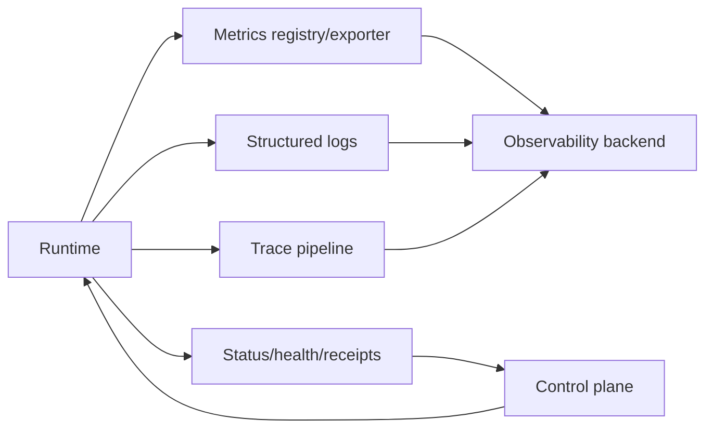
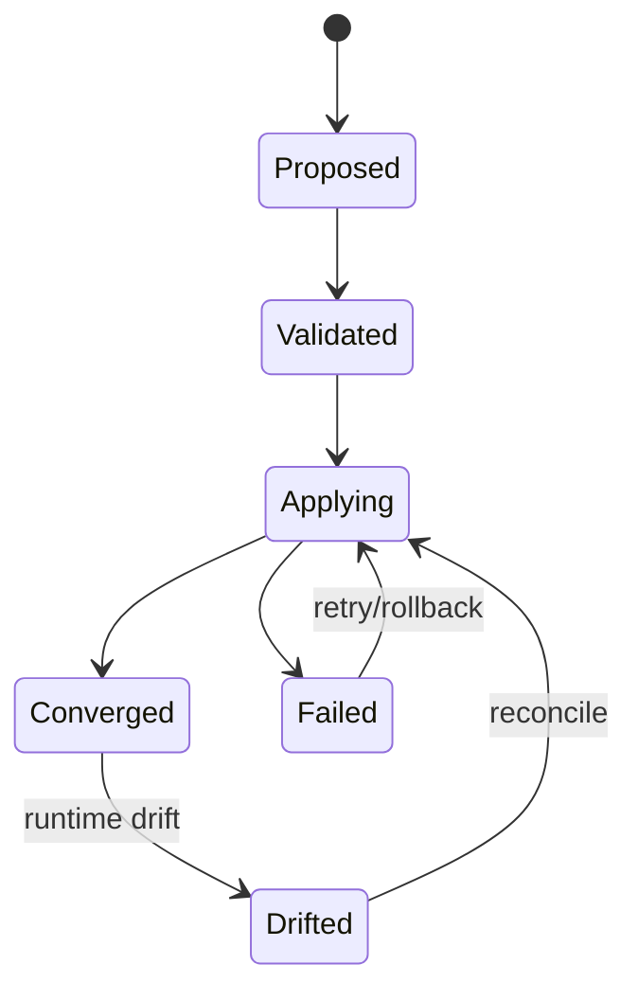

# 架构剖面：可观测性与控制面

> 适用于监控插件、遥测采集、管理平面、配置控制面、诊断系统和治理平台。

## 控制面与数据面边界

| 平面 | 负责 | 不负责 | 可写状态 |
|---|---|---|---|
| 数据面 | 执行请求和业务数据处理 | 长期治理决策 | 运行状态 |
| 控制面 | 配置、策略、发布、租约 | 代替业务处理 | 期望状态 |
| 观测面 | 收集和关联信号 | 修改核心业务语义 | 遥测/审计 |

## 三条采集链



## 指标目录与基数

| 指标 | 类型 | Labels | 基数预算 | 来源 | SLO/告警 |
|---|---|---|---:|---|---|
| `{requests_total}` | Counter | component,result | `{budget}` | runtime | error rate |
| `{duration_seconds}` | Histogram | component,operation | `{budget}` | runtime | latency |
| `{queue_depth}` | Gauge | queue | `{budget}` | scheduler | saturation |

禁止把 user ID、session ID、原始 URL、消息正文等无界或敏感值作为 label。

## 日志与追踪

| 字段 | 日志 | Trace | 审计 | 说明 |
|---|:---:|:---:|:---:|---|
| trace/correlation ID | ✅ | ✅ | ✅ | 关联主链 |
| tenant | hash/scope | scoped | ✅ | 受访问控制 |
| payload | 摘要 | 禁止/裁剪 | 受控 | 不记录原文 |
| secret/token | ❌ | ❌ | ❌ | 永不记录 |

## 抓取、推送与缓存

| 模式 | 优点 | 风险 | 失败行为 |
|---|---|---|---|
| Pull/scrape | 简单、解耦 | 目标不可达 | 标记 stale |
| Push/export | 适合短生命周期 | 背压/丢失 | 有界缓冲 |
| Agent/collector | 统一处理 | 额外组件 | 本地降级 |

## 控制命令合同

```json
{
  "commandId": "cmd-001",
  "target": "node-001",
  "desiredVersion": 42,
  "action": "config.apply",
  "deadline": "2026-01-01T00:05:00Z",
  "payload": {}
}
```

回执包括接受、拒绝、执行中、成功、失败、超时和实际版本。控制命令必须认证、授权、幂等、可审计，并与遥测通道隔离。

## 期望状态与实际状态



## 健康语义

区分 liveness、readiness、dependency、degraded 和 stale。观测后端不可用不应自动使业务进程死亡，但必须暴露遥测丢失和缓冲状态。

## 遥测失败与资源边界

| 失败 | 行为 | 数据损失 | 资源上限 |
|---|---|---|---|
| 后端不可用 | 本地有界缓冲/丢弃低优先级 | 可量化 | bytes/events |
| exporter 超时 | 取消并重连 | 当前 batch | deadline |
| label 爆炸 | 拒绝/裁剪 label | 聚合维度 | cardinality budget |
| 日志风暴 | 采样/限流 | 低级日志 | rate/volume |

## 管理 API 与权限

状态读取、配置变更、诊断、重启、迁移和秘密操作使用不同权限。所有写操作支持 dry-run、版本检查、审计和回滚。

## 控制面验收

- [ ] 控制、数据和观测平面责任不混淆
- [ ] 指标 label 有基数和隐私预算
- [ ] 日志、追踪、审计的字段与访问权限明确
- [ ] 观测后端失败不会形成无界内存增长
- [ ] 控制命令有期望/实际版本、回执和幂等
- [ ] 漂移检测、收敛、回滚和审计可以验证
