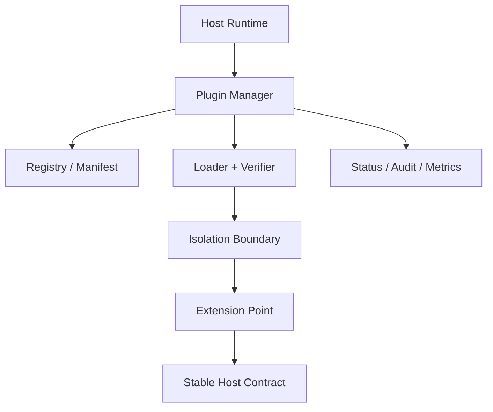
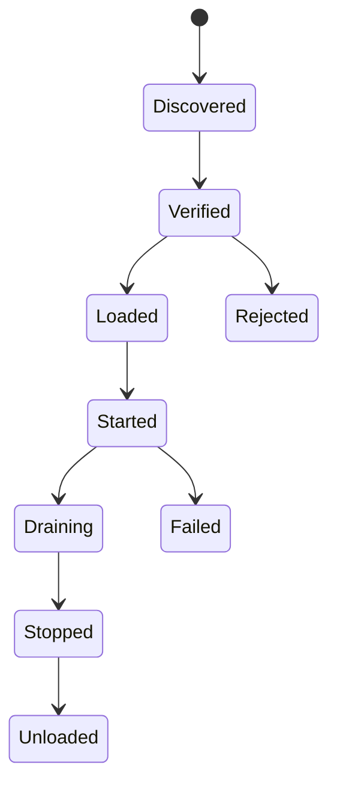

# 架构剖面：插件与扩展体系

> 适用于插件管理器、Extension Point、Hook、SPI、Channel、Tool、Provider、MCP 和适配器生态。

## 插件体系定位

| 问题 | 插件解决 | 插件不解决 |
|---|---|---|
| 新能力接入 | 在稳定合同下增加实现 | 修改宿主核心语义 |
| 第三方隔离 | 权限、生命周期和资源边界 | 自动信任第三方代码 |
| 独立发布 | 版本和清单治理 | 取消兼容测试 |

## 插件全景



## 扩展点目录

| Extension Point | 用途 | 输入/输出 | 生命周期 | 权限 | 稳定性 |
|---|---|---|---|---|---|
| Channel | 外部渠道 | message ↔ normalized event | start/stop | network | stable |
| Provider | 外部能力 | request ↔ result | request-scoped | network/secret | stable |
| Tool | 执行动作 | schema ↔ result | call-scoped | capability | stable |
| Storage | 状态后端 | key/query ↔ data | app-scoped | data | stable |
| Hook | 生命周期拦截 | context/event | ordered | scoped | experimental |

## 清单与发现

```json
{
  "id": "example-plugin",
  "version": "1.0.0",
  "hostApi": ">=1 <2",
  "entrypoint": "dist/index.js",
  "permissions": ["network:api.example.com"],
  "extensions": ["tool", "hook"]
}
```

清单必须覆盖身份、版本、宿主兼容、入口、权限、资源、扩展点和完整性校验。

## 生命周期状态机



| 阶段 | 宿主责任 | 插件责任 | 失败语义 |
|---|---|---|---|
| verify | 签名、版本、权限 | 提供完整清单 | 拒绝加载 |
| load | 提供受限 context | 注册扩展 | 回滚注册 |
| start | 排序启动 | 建立资源 | 标记不可用 |
| drain/stop | 停止新调用 | 排空并释放 | 超时强制隔离 |
| unload | 清除引用 | 无后台任务 | 泄漏检测 |

## 隔离与权限

| 模式 | 隔离强度 | 热加载 | 性能 | 适用 |
|---|---|---|---|---|
| 同进程接口/SPI | 低 | 有限 | 高 | 可信内置扩展 |
| ClassLoader/module | 中 | 是 | 高 | JVM 插件 |
| WASM | 中高 | 是 | 中 | 能力受限扩展 |
| 子进程/container | 高 | 是 | 中低 | 不可信插件 |
| 远程扩展/MCP | 网络边界 | 是 | 网络开销 | 独立服务 |

权限通过 capability/context proxy 注入；插件不得直接读取宿主全部配置、秘密、文件和状态。

## Hook 顺序与副作用

| Hook | 时机 | 可修改 | 可阻止 | 超时 | 失败策略 |
|---|---|---|:---:|---:|---|
| before | 核心动作前 | scoped input | 是 | 短 | fail closed/open 按风险 |
| after | 核心动作后 | result metadata | 否 | 短 | 记录但不反转提交 |
| persist | 写入前 | redaction/shape | 是 | 短 | 默认阻止敏感写入 |

## 热升级与兼容

说明并行版本、流量排空、状态迁移、序列化兼容、旧插件回滚、宿主 API 窗口和插件锁文件。

## 插件验收

- [ ] 身份、入口、权限和兼容来自真实清单
- [ ] 扩展点合同与宿主内部实现分离
- [ ] 生命周期、排序、超时和卸载清理有测试
- [ ] 插件失败不拖垮宿主核心主链
- [ ] 秘密、状态和 Agent/用户可见数据受隔离
- [ ] 包、签名、来源和供应链可验证
