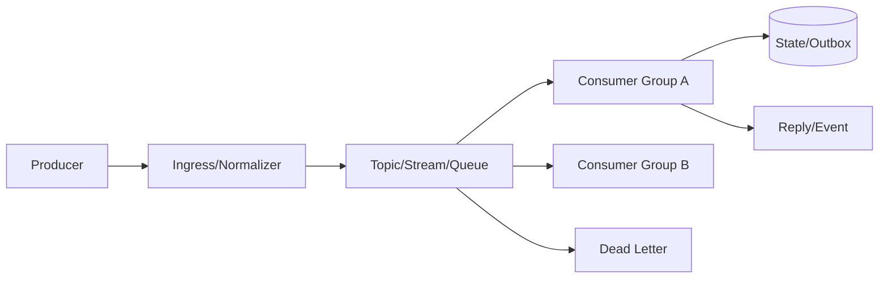
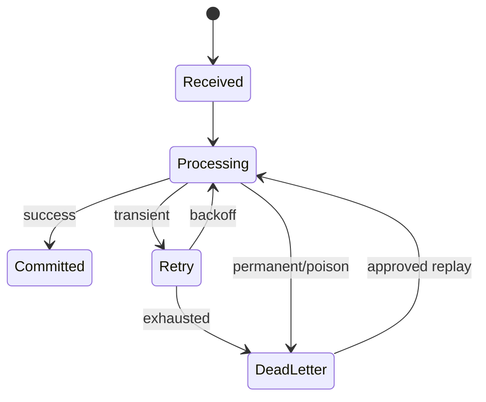

# 架构剖面：消息与事件驱动系统

> 适用于 Pub/Sub、Stream、消息队列、事件总线、任务代理、Webhook 桥和双向渠道。

## 模式选择

| 模式 | 持久化 | 消费语义 | 适用 | 主要风险 |
|---|:---:|---|---|---|
| Pub/Sub | 否/短暂 | 在线订阅 | 实时广播 | 离线丢失 |
| Queue | 是 | 竞争消费 | 任务分发 | 重复/毒消息 |
| Stream/Log | 是 | offset/consumer group | 回放、审计 | 积压和保留成本 |
| Request/Reply | 视实现 | correlation | 异步 RPC | 超时和孤儿响应 |

## 消息拓扑



## Topic、Subject 与路由

| 名称 | 生产方 | 消费方 | 分区/顺序键 | 保留 | 敏感级别 |
|---|---|---|---|---|---|
| `{domain.event.v1}` | `{producer}` | `{consumer}` | `{key}` | `{policy}` | 中 |

说明通配符、动态路由、租户/会话隔离、命名版本和未知 topic 策略。

## 消息信封与 Schema

```json
{
  "id": "msg-001",
  "type": "example.created.v1",
  "source": "example-service",
  "partitionKey": "entity-001",
  "tenantId": "tenant-001",
  "correlationId": "corr-001",
  "causationId": "cmd-001",
  "occurredAt": "2026-01-01T00:00:00Z",
  "attempt": 1,
  "payload": {}
}
```

Schema 规则必须覆盖必填字段、未知字段、最大载荷、压缩、版本、时间、字符编码和敏感内容。

## ACK、提交与交付语义

| 语义 | ACK 时机 | 重复风险 | 丢失风险 | 适用 |
|---|---|---|---|---|
| at-most-once | 处理前 | 低 | 高 | 可丢遥测 |
| at-least-once | 成功提交后 | 高 | 低 | 默认业务事件 |
| effectively-once | 提交 + 幂等/事务 | 受控 | 低 | 有副作用业务 |

“Exactly once”必须写明边界；代理内部保证不等于端到端副作用只发生一次。

## 幂等、顺序与并发

- 幂等键作用域、TTL 和存储；
- partition key 与同键顺序；
- 多消费者并发和状态冲突；
- outbox/inbox、去重表或版本检查；
- 重放时是否触发外部副作用；
- 延迟、乱序、重复和时钟漂移策略。

## 重试、死信与重放



| 失败 | 是否重试 | 上限 | DLQ 原因 | 重放前检查 |
|---|:---:|---:|---|---|
| timeout | 是 | 3 | attempts exhausted | 依赖恢复 |
| invalid schema | 否 | 0 | validation | 修复/转换 |
| permission | 否 | 0 | unauthorized | 授权审计 |

## 背压与积压

| 指标 | 阈值 | 系统行为 |
|---|---:|---|
| queue depth/lag | `{value}` | 扩容/限流 |
| oldest message age | `{value}` | 告警/优先恢复 |
| inflight | `{value}` | 暂停拉取 |
| DLQ rate | `{value}` | 阻止发布/人工处理 |

生产者、代理、消费者和下游都要有边界，不能靠无限内存队列吸收压力。

## 连接与会话生命周期

说明连接池、订阅、consumer group、租约、heartbeat、重连、重新平衡、优雅关闭和状态恢复。双向渠道还要说明会话映射与回复路由。

## 消息验收

- [ ] Topic、消费者、顺序和保留策略有清单
- [ ] ACK 与业务提交关系明确
- [ ] 幂等、重复、乱序、重放和毒消息有测试
- [ ] 背压从消费者传播到入口
- [ ] DLQ 有所有者、诊断和批准重放流程
- [ ] 日志和指标不泄漏完整消息或无界 label
