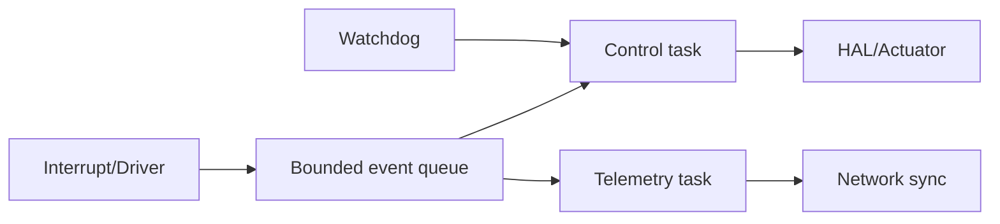
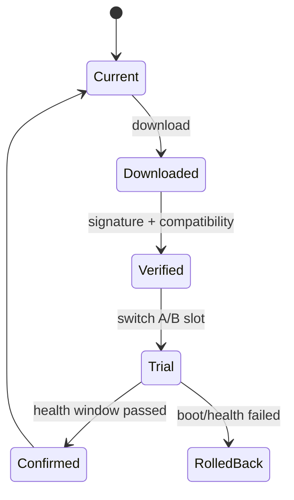

# 架构剖面：边缘与嵌入式系统

> 适用于边缘网关、单板机、路由器、NAS、MCU、ESP-IDF、FreeRTOS、裸机或强资源约束节点。

## 硬件与资源画像

| 档位 | CPU/架构 | RAM | Flash/磁盘 | 网络 | OS/RTOS | 功耗 |
|---|---|---:|---:|---|---|---:|
| micro | `{MCU}` | `{KB}` | `{MB}` | Wi-Fi/BLE | RTOS | `{W}` |
| edge-lite | `{arch}` | `{MB}` | `{GB}` | Ethernet | Linux/Zig | `{W}` |
| edge-full | `{arch}` | `{GB}` | `{GB}` | 多网口 | Linux | `{W}` |

所有模块、缓冲区、队列、模型、日志和 OTA 都必须落入预算。

## 本地自治与上移边界

| 能力 | 本地执行 | 上移执行 | 断网行为 | 一致性 |
|---|---|---|---|---|
| 传感采集 | 是 | 汇总 | 本地缓冲 | 顺序/时间戳 |
| 安全控制 | 是 | 策略下发 | 安全默认 | 版本化策略 |
| 重计算/模型 | 裁剪 | 是 | 降级规则 | 结果带来源 |
| 长期记忆 | 热缓存 | 权威存储 | 有界保留 | 回连同步 |

```text
Cloud/Control Plane
       ▲ policy, model, config, update
       │ telemetry, result, audit
       ▼
Edge Coordinator
       ▲ command / event
       ▼
Device Runtime → HAL → Sensors / Actuators
```

## 设备模块

| 模块 | 责任 | Task/线程 | 内存预算 | 失败影响 |
|---|---|---|---:|---|
| HAL | 硬件抽象 | driver/task | `{budget}` | 单设备能力 |
| Protocol | 编解码和连接 | event loop | `{budget}` | 离线 |
| Control | 规则和状态机 | high priority | `{budget}` | 安全关键 |
| Storage | NVS/flash/cache | serialized | `{budget}` | 状态恢复 |
| OTA | 下载、验证、切换 | background | `{budget}` | 升级 |

## 主循环与任务优先级



说明中断中禁止的操作、task priority、栈预算、队列满策略、看门狗喂养、时钟和低功耗唤醒。

## Capability Manifest

```json
{
  "deviceType": "example-node",
  "hardwareRevision": "r1",
  "firmwareVersion": "1.0.0",
  "capabilities": ["sensor.read", "relay.write"],
  "limits": {"ramBytes": 524288, "maxInflight": 4}
}
```

上游只下发设备声明支持、资源允许且策略授权的动作。

## 设备安全

- secure boot、固件签名和回滚保护；
- 设备身份、证书/密钥烧录和轮换；
- 控制命令签名、nonce、时间窗和 replay 防护；
- HAL allowlist、危险动作审批和本地安全联锁；
- 调试接口、串口日志、NVS 和崩溃转储脱敏；
- 物理攻击、断电、Flash 磨损和时钟不可信边界。

## OTA 与回滚



## 断网、断电与回连

| 事件 | 本地行为 | 保存状态 | 回连动作 |
|---|---|---|---|
| 断网 | 安全自治/停止高风险动作 | 有界队列 | 去重上传 |
| 断电 | 原子检查点 | NVS/flash | 恢复状态机 |
| 上游重置 | 保留已确认策略 | policy version | 重新协商 |

## 设备验收

- [ ] 固件、RAM、栈、队列、CPU、网络和功耗均有预算
- [ ] 本地与上移能力边界明确
- [ ] 控制命令有身份、回执、幂等和 replay 防护
- [ ] 断网、断电、回连和看门狗路径通过测试
- [ ] OTA 签名、兼容检查、试运行和回滚闭环
- [ ] 模拟器测试与真实硬件测试分开声明
