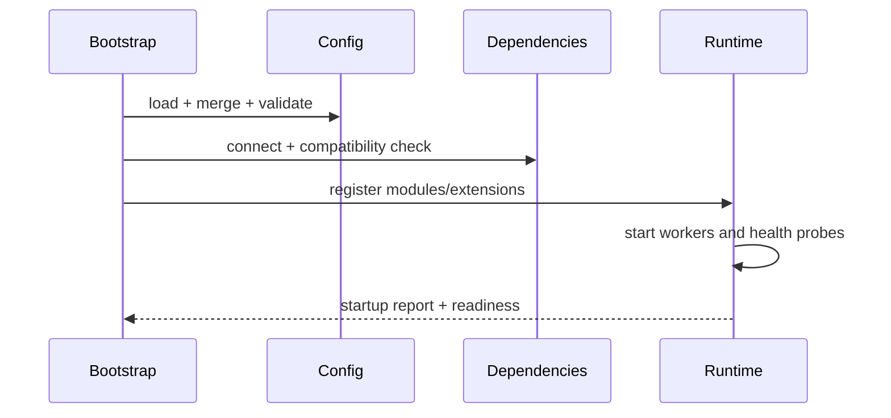

# 架构剖面：运行时与应用平台

> 适用于服务端运行时、桌面/本地应用、企业平台及 Java、Rust、Python、Go 等通用应用系统。

## 技术栈与运行时收敛

| 层 | 选择 | 版本基线 | 用途 | 被拒绝方案 | 决策证据 |
|---|---|---|---|---|---|
| Language/runtime | `{runtime}` | `{version}` | `{reason}` | `{alternative}` | ADR |
| Web/Gateway | `{framework}` | `{version}` | `{reason}` | `{alternative}` | spike/test |
| Persistence | `{store}` | `{version}` | `{reason}` | `{alternative}` | load test |
| Messaging | `{broker}` | `{version}` | `{reason}` | `{alternative}` | failure test |

同一架构下存在多个技术 profile 时，应共享合同和验收，只把差异限制在 Adapter、启动、并发和部署层。

## 进程、容器与模块映射

```text
Deployable process
├── bootstrap/configuration
├── gateway/adapters
├── application/use cases
├── core contracts
├── runtime/scheduler
└── infrastructure adapters
```

| 逻辑组件 | 工程模块 | 运行单元 | 扩缩容单位 | 状态 |
|---|---|---|---|---|
| Gateway | `{module}` | `{process}` | 实例 | 无状态 |
| Runtime | `{module}` | `{process}` | worker | 任务状态 |
| Control plane | `{module}` | `{process}` | 单元/副本 | 权威配置 |

## 启动与装配



启动报告应包含版本、运行 profile、启用模块、配置来源、依赖状态、迁移状态和降级项。

## 并发实现剖面

| Runtime 类型 | 适用模型 | 关键风险 | 必需验证 |
|---|---|---|---|
| Async event loop | I/O 密集 | 阻塞调用、任务泄漏 | blocking audit、cancellation |
| Virtual/green threads | 大量阻塞式 I/O | pinning、无界创建 | thread dump、capacity |
| Native threads | CPU/实时任务 | 上下文切换、栈内存 | bounded pool |
| Actor/event loop | 状态所有权 | mailbox 堆积 | mailbox budget |
| Structured concurrency | 父子任务 | 取消和异常传播 | deadline tests |

## 运行 Profile

| Profile | 入口 | 状态后端 | 并发 | 扩展 | 适用场景 |
|---|---|---|---|---|---|
| lite | 本地/单端口 | 内存/文件 | 低 | 静态 | 开发、小规模 |
| server | HTTP/event | 数据库/cache | 中 | 动态或静态 | 标准生产 |
| cluster | LB/broker | 分布式状态 | 高 | 受治理 | 高可用 |
| enterprise | 多入口 | 审计/租户/审批 | 策略化 | 签名插件 | 组织治理 |

## 企业治理（按需）

说明租户、组织、RBAC/ABAC、审批、审计、配额、策略、配置分层和数据驻留。治理能力是横切面，不应取代业务/Agent 主链。

## 生命周期与关闭

```text
boot → self-check → ready → serve → degrade/recover
     → drain → checkpoint → stop
```

明确优雅关闭顺序、未完成任务、连接池、线程/协程、后台调度和临时资源的处理。

## 平台验收

- [ ] 技术栈选择与架构驱动有对应关系
- [ ] 逻辑组件、工程模块和部署单元可映射
- [ ] 启动报告能证明实际装配结果
- [ ] 并发、取消、deadline 和关闭有测试
- [ ] 不同 profile 的能力、资源和兼容边界明确
- [ ] 治理面不改变核心主链所有权
