# {{PROJECT_NAME}} 架构设计文档

> **文档目的**：定义 {{PROJECT_NAME}} 的架构目标、边界、组件职责、运行主链、数据与协议、安全与可靠性、部署运维及演进约束，使设计、开发、测试、发布和运维使用同一套可验证架构合同。
>
> **架构版本**：{{VERSION}}<br>
> **文档状态**：{草案 / 评审中 / 已批准 / 已废弃}<br>
> **负责人**：{{OWNER}}<br>
> **最后更新**：{{DATE}}

<!--
使用说明：
0. 输出文件名必须是 `{{PROJECT_NAME}}-Architecture.md`（英文/默认语言）或 `{{PROJECT_NAME}}-Architecture.zh_CN.md`（中文）。组件或版本信息放在 `-Architecture` 之前。
1. 本文件是技术无关的架构母模板，不是要求所有项目保留全部章节。
2. 从 manifests、源码、配置、CI、部署文件、协议、测试和运行证据核实事实。
3. 阅读 profiles/README.md，只组合适用的领域剖面。
4. 保留完整示例作为写作指导，但最终文档必须替换为目标系统真实内容。
5. 无法核实的内容标注“推断”“假设”或“TBD”，禁止把目标态写成已实现。
6. 最终交付时删除本注释、无关章节和未解析占位符，并重新编号。
-->

> **文件名约束**：英文或默认语言使用 `{{PROJECT_NAME}}-Architecture.md`；中文使用 `{{PROJECT_NAME}}-Architecture.zh_CN.md`。例如组件文档使用 `{{PROJECT_NAME}}-{Component}-Architecture.zh_CN.md`，版本文档使用 `{{PROJECT_NAME}}-V2-Architecture.zh_CN.md`。

## 目录

1. 文档控制与阅读指南
2. 执行摘要
3. 业务背景、架构驱动与约束
4. 范围、边界与外部上下文
5. 当前态、目标态与差距
6. 架构原则与关键决策
7. 总体架构与分层
8. 组件、模块与依赖
9. 运行时、进程与并发模型
10. 核心业务与系统主链
11. 状态机、生命周期与任务模型
12. 数据、状态与一致性
13. 接口、协议与互操作
14. 配置、特性开关与秘密
15. 安全、隐私与信任边界
16. 可靠性、失败与恢复
17. 性能、容量与资源预算
18. 部署、升级与回滚
19. 可观测性、运维与诊断
20. 扩展、插件与生态边界
21. 兼容、迁移与演进
22. 测试、验证与架构验收
23. 风险、技术债与实施路线
24. 附录

---

## 1. 文档控制与阅读指南

### 1.1 文档信息

| 字段 | 内容 |
|---|---|
| 系统/项目 | {{PROJECT_NAME}} |
| 架构版本 | {{VERSION}} |
| 适用代码版本 | `{tag / branch / commit}` |
| 适用部署形态 | `{本地 / 单机 / 集群 / SaaS / 边缘 / 设备}` |
| 负责人 | {{OWNER}} |
| 评审人 | `{架构 / 安全 / 运维 / 数据 / 业务负责人}` |
| 状态 | `{草案 / 评审中 / 已批准 / 已废弃}` |
| 事实核验日期 | {{DATE}} |

### 1.2 读者与阅读路径

| 读者 | 优先章节 | 期望获得 |
|---|---|---|
| 产品与业务 | 2–5、10、23 | 系统价值、范围、主链和路线 |
| 开发者 | 6–14、20–22 | 模块边界、接口、状态和扩展合同 |
| 测试 | 10–17、21–22 | 主链、失败、性能和验收矩阵 |
| 安全 | 4、13–16、20 | 信任边界、威胁、秘密和恢复 |
| 运维/SRE | 16–19、21–23 | SLO、部署、观测、回滚和风险 |

### 1.3 实现状态标签

| 标签 | 定义 | 必需证据 |
|---|---|---|
| `[已实现]` | 当前代码和部署存在，可验证 | 源码、测试、运行或发布证据 |
| `[部分实现]` | 有骨架或局部闭环 | 已完成与缺失清单 |
| `[设计目标]` | 目标架构，尚未落地 | ADR、计划和退出条件 |
| `[实验性]` | 可运行但不承诺稳定 | 限制、开关和回退方式 |
| `[非目标]` | 明确不由本系统承担 | 责任归属或替代方案 |

每个核心能力至少标记一次状态。不要用未来时态掩盖当前缺口。

### 1.4 关联文档

| 文档 | 责任边界 | 链接 |
|---|---|---|
| 产品/需求 | 为什么做、业务验收 | `{relative link}` |
| 领域模型 | 业务语义和聚合边界 | `{relative link}` |
| API/协议 | 字段级契约 | `{relative link}` |
| 配置参考 | 配置键、默认值和校验 | `{relative link}` |
| 部署运维 | 环境级操作手册 | `{relative link}` |
| ADR | 单项关键决策 | `{relative link}` |

## 2. 执行摘要

### 2.1 一句话架构

**{{PROJECT_NAME}} 是一个 {系统类型}，通过 {核心机制} 把 {输入/参与者} 转换为 {输出/业务结果}，并以 {安全、可靠性或资源约束} 作为不可退化边界。**

### 2.2 一眼看懂

```text
用户 / 设备 / 外部系统
        │ 请求、事件或数据
        ▼
┌───────────────────────────────────────────────────┐
│ {{PROJECT_NAME}}                                  │
│ 入口层       认证、限流、协议归一                  │
│ 应用/编排层  用例、路由、状态机、事务边界          │
│ 核心层       领域规则、策略、公共合同              │
│ 适配层       存储、消息、模型、设备、第三方服务    │
└───────────────────────────────────────────────────┘
        │ 结果、事件、审计或控制回执
        ▼
调用方 / 下游 / 运维与治理系统
```

### 2.3 核心结论

| 维度 | 架构结论 | 状态 | 证据 |
|---|---|---|---|
| 主体 | `{系统真正围绕什么运行}` | 已确认 | `{source}` |
| 分层 | `{模块/服务/平面划分}` | 已确认 | `{manifest/source}` |
| 核心主链 | `{input -> process -> output}` | 已实现/目标 | `{test/trace}` |
| 数据 | `{权威存储和一致性}` | 已确认 | `{schema/code}` |
| 安全 | `{主要信任边界}` | 部分 | `{threat model}` |
| 部署 | `{主要拓扑}` | 已验证 | `{deployment evidence}` |
| 最大风险 | `{当前最重要风险}` | 待处理 | `{risk entry}` |

### 2.4 架构质量属性优先级

| 优先级 | 质量属性 | 可验证目标 | 取舍 |
|:---:|---|---|---|
| P0 | 正确性/安全性 | `{invariant or security gate}` | 可牺牲部分吞吐 |
| P0 | 可恢复性 | `{RTO/RPO or replay target}` | 增加状态与审计成本 |
| P1 | 性能 | `{latency/throughput target}` | 不破坏正确性 |
| P1 | 可扩展性 | `{extension or scale target}` | 控制抽象复杂度 |
| P2 | 成本/资源 | `{budget}` | 按部署档位裁剪 |

## 3. 业务背景、架构驱动与约束

### 3.1 背景与问题

| 当前问题 | 影响 | 根因 | 架构需要解决 |
|---|---|---|---|
| `{problem}` | `{business/technical impact}` | `{cause}` | `{architecture response}` |

### 3.2 架构驱动

| 驱动 | 类型 | 强度 | 来源 | 决策影响 |
|---|---|:---:|---|---|
| `{business goal}` | 业务 | P0 | `{requirement}` | `{decision}` |
| `{compatibility}` | 兼容 | P0 | `{contract}` | `{decision}` |
| `{resource limit}` | 技术 | P0 | `{hardware/runtime}` | `{decision}` |
| `{compliance}` | 合规 | P0 | `{policy}` | `{decision}` |

### 3.3 硬约束

硬约束必须能直接否决架构方案。

| ID | 硬约束 | 验证方式 | 违反后的处理 |
|---|---|---|---|
| `C-001` | `{不可退化合同}` | `{conformance test}` | 阻止发布 |
| `C-002` | `{资源/平台限制}` | `{budget test}` | 裁剪或降级 |
| `C-003` | `{安全边界}` | `{security gate}` | 默认拒绝 |

### 3.4 假设与待确认

| ID | 假设/TBD | 影响 | 验证计划 | 截止时间 | 负责人 |
|---|---|---|---|---|---|
| `A-001` | `{assumption}` | 高 | `{experiment}` | `{date}` | `{owner}` |

## 4. 范围、边界与外部上下文

### 4.1 系统负责与不负责

| 系统负责 | 系统不负责 | 外部责任方 |
|---|---|---|
| `{responsibility}` | `{non-responsibility}` | `{owner/system}` |

### 4.2 系统上下文

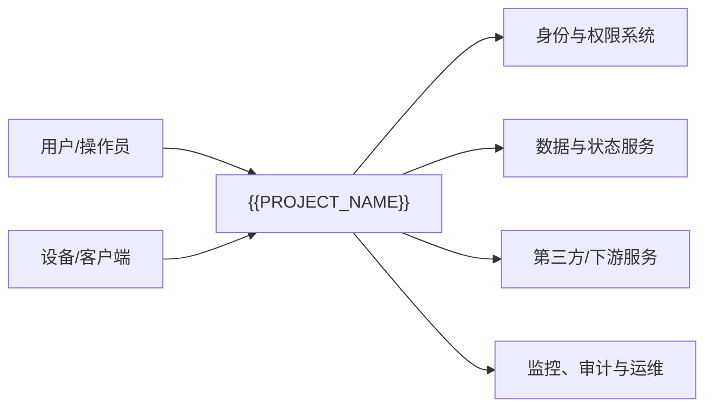

### 4.3 外部依赖清单

| 依赖 | 用途 | 协议 | 关键 SLA | 失败影响 | 降级/替代 | 责任方 |
|---|---|---|---|---|---|---|
| `{dependency}` | `{purpose}` | `{protocol}` | `{SLA}` | 高 | `{fallback}` | `{owner}` |

### 4.4 信任与管理边界预览

```text
Untrusted                Controlled                  Trusted
Internet / Device  ──►  Gateway / Adapter  ──►  Core / State
                             │                         │
                         validation               least privilege
```

## 5. 当前态、目标态与差距

### 5.1 当前真实架构

只记录当前仓库和运行环境真实存在的组件、路径与能力。

| 能力 | 当前实现 | 完成度 | 已知限制 | 证据 |
|---|---|---|---|---|
| `{capability}` | `{module/service}` | 部分 | `{gap}` | `{source/test}` |

### 5.2 目标架构

| 目标能力 | 目标组件 | 预期合同 | 前置条件 | 验收 |
|---|---|---|---|---|
| `{capability}` | `{component}` | `{contract}` | `{dependency}` | `{acceptance}` |

### 5.3 差距矩阵

| 差距 | 当前 | 目标 | 优先级 | 实施阶段 | 回退方案 |
|---|---|---|:---:|---|---|
| `{gap}` | `{current}` | `{target}` | P0 | Phase 1 | `{fallback}` |


## 6. 架构原则与关键决策

### 6.1 架构原则

| 原则 | 含义 | 工程规则 | 反例 |
|---|---|---|---|
| 主链优先 | 核心主体不被横切设施替代 | 主请求路径保持清晰 | 审批/策略成为业务主语 |
| 边界明确 | 合同与实现分离 | Core 不依赖 Adapter | 基础层反向依赖入口 |
| 默认安全 | 失败时拒绝或安全降级 | 最小权限、显式 allowlist | 宽泛默认权限 |
| 可恢复 | 状态变化可重放或补偿 | 幂等键、审计、检查点 | 静默丢失 |
| 证据驱动 | 声明由测试和运行证明 | 状态标签与证据链接 | 用路线图代替实现 |

### 6.2 关键决策摘要

| ADR | 决策 | 选择理由 | 被拒绝方案 | 反转条件 | 状态 |
|---|---|---|---|---|---|
| `ADR-001` | `{decision}` | `{rationale}` | `{alternatives}` | `{condition}` | 已批准 |

### 6.3 决策流程

```text
Architecture driver
  → alternatives
  → trade-off and experiment
  → ADR
  → implementation contract
  → automated acceptance
```

## 7. 总体架构与分层

### 7.1 逻辑分层

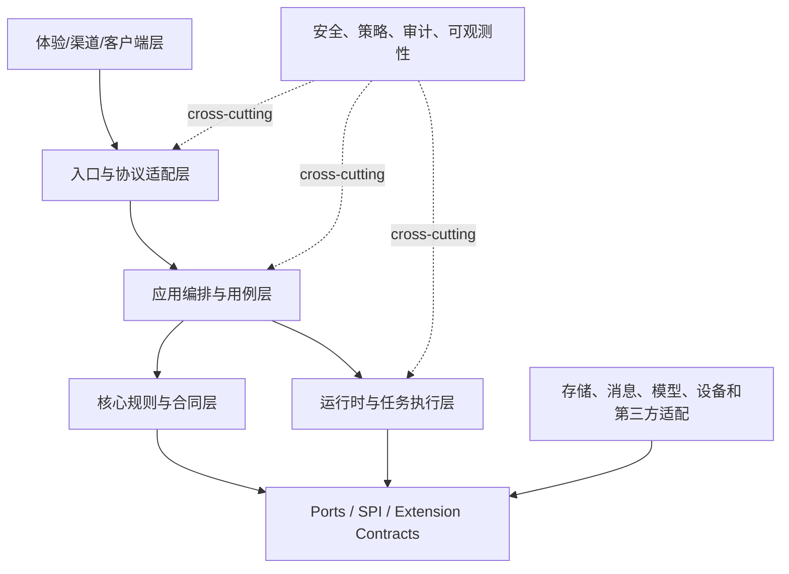

### 7.2 平面或子系统划分

| 平面/子系统 | 负责 | 不负责 | 关键组件 | 对外合同 |
|---|---|---|---|---|
| 控制面 | 配置、策略、治理、发布 | 执行每个数据请求 | `{components}` | `{API/events}` |
| 数据/执行面 | 请求、任务和数据处理 | 长期治理决策 | `{components}` | `{protocol}` |
| 管理/观测面 | 状态、诊断、审计 | 修改业务语义 | `{components}` | `{metrics/CLI}` |

### 7.3 依赖方向

- 高层策略依赖抽象合同，不依赖具体适配器；
- 外部系统通过入口和端口进入，不直接修改核心状态；
- 横切能力通过明确 middleware/hook/interceptor 接入；
- 禁止循环依赖、隐式全局状态和跨边界共享可变对象；
- 每条例外必须有 ADR、限制和移除计划。

## 8. 组件、模块与依赖

### 8.1 组件清单

| 组件 | 类型 | 职责 | 输入 | 输出 | 状态 | 所有者 |
|---|---|---|---|---|---|---|
| `{gateway}` | 入口 | 协议归一、认证、限流 | request/event | command | 已实现 | `{team}` |
| `{orchestrator}` | 应用 | 用例和状态编排 | command | result/events | 部分 | `{team}` |
| `{core}` | 核心 | 规则和合同 | domain input | decision | 已实现 | `{team}` |
| `{adapter}` | 适配 | 外部依赖转换 | port call | dependency result | 已实现 | `{team}` |

### 8.2 依赖图

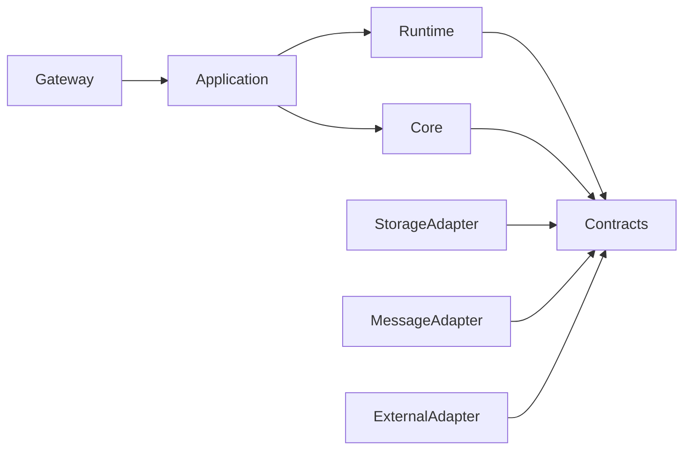

### 8.3 组件合同模板

对每个关键组件填写：

| 字段 | 内容 |
|---|---|
| 组件名 | `{name}` |
| 单一职责 | `{one sentence}` |
| 所有输入 | `{API/events/files/config}` |
| 所有输出 | `{results/events/state}` |
| 拥有状态 | `{state and authority}` |
| 并发模型 | `{thread/task/event loop}` |
| 失败语义 | `{errors/retry/recovery}` |
| 资源边界 | `{CPU/memory/connection}` |
| 扩展点 | `{port/SPI/hook}` |
| 验收证据 | `{tests/traces}` |

### 8.4 仓库/工程结构

```text
{{PROJECT_NAME}}/
├── apps/ or services/       # 可部署入口
├── core/                    # 核心规则和稳定合同
├── application/             # 用例与编排
├── runtime/                 # 任务、调度、并发、生命周期
├── adapters/                # 存储、协议和第三方实现
├── plugins/                 # 可选扩展
├── deploy/                  # 部署清单
├── tests/                   # 契约、集成、系统、恢复测试
└── docs/                    # 架构、协议、ADR、运维
```

目录树必须由真实工程生成或核实，不能把计划目录写成现状。

## 9. 运行时、进程与并发模型

### 9.1 运行单元

| 单元 | 数量/伸缩 | 生命周期 | 并发模型 | 状态归属 | 隔离方式 |
|---|---|---|---|---|---|
| `{process/service}` | `{replicas}` | `{start-stop}` | `{threads/tasks}` | `{state}` | `{boundary}` |

### 9.2 调度与并发

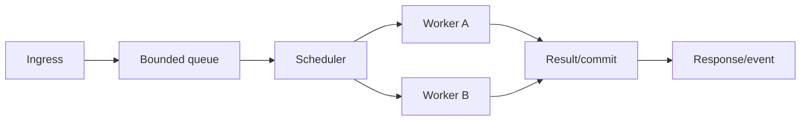

说明：

- 线程、协程、虚拟线程、事件循环或 RTOS task 的选择；
- 队列是否有界、满载策略和背压传播；
- 取消、超时、deadline 和资源释放；
- 上下文、trace、租户和安全身份如何传播；
- 共享状态的锁、原子操作、事务或 actor 所有权；
- 关闭时的停止接收、排空、检查点和强制终止。

### 9.3 并发不变量

| 不变量 | 风险 | 强制机制 | 测试 |
|---|---|---|---|
| 同一幂等键只提交一次 | 重复副作用 | unique key/CAS | race test |
| 状态版本单调递增 | 回退覆盖新状态 | version check | concurrency test |
| 取消后不再写出结果 | 幽灵响应 | cancellation token | cancellation test |

## 10. 核心业务与系统主链

### 10.1 主成功路径

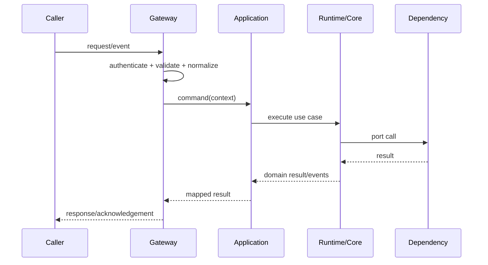

### 10.2 主链步骤表

| 步骤 | 组件 | 输入 | 处理 | 输出 | 超时 | 失败动作 |
|---:|---|---|---|---|---|---|
| 1 | Gateway | raw input | 校验与归一 | command | 1s | 拒绝 |
| 2 | Application | command | 用例编排 | tasks | 5s | 补偿/重试 |
| 3 | Core/Runtime | tasks | 执行规则 | result | 10s | 稳定错误 |
| 4 | Adapter | port call | 访问依赖 | response | 3s | 熔断/降级 |

### 10.3 异常路径

至少为下列情况提供序列或步骤：输入非法、未授权、依赖超时、部分成功、重复请求、取消、节点重启、状态冲突和输出失败。

### 10.4 多流模型（按需）

| 流 | 方向 | 主体 | 状态变化 | 回复/ACK |
|---|---|---|---|---|
| 同步请求流 | Caller → System → Caller | 请求 | 即时事务 | response |
| 异步事件流 | Producer → Broker → Consumer | 事件 | 最终一致 | ACK/DLQ |
| 控制流 | Control Plane → Runtime | 配置/命令 | 版本化 | receipt |
| 观测流 | Runtime → Observability | 信号 | 只追加 | export |

## 11. 状态机、生命周期与任务模型

### 11.1 核心状态机

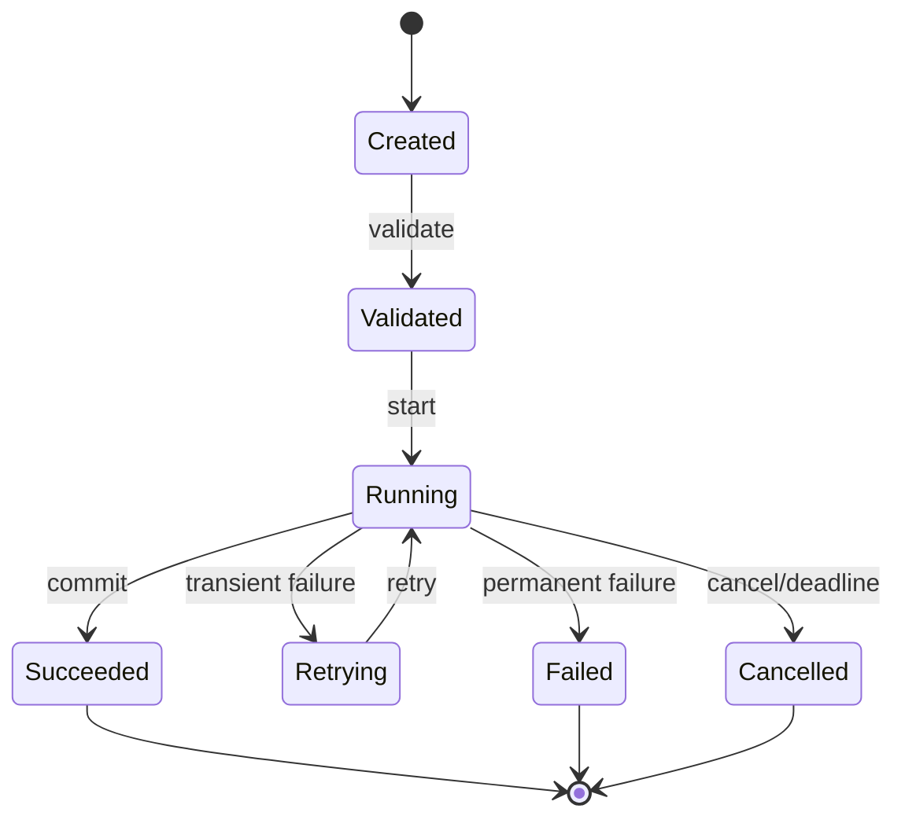

### 11.2 状态转换表

| 当前状态 | 事件 | 守卫条件 | 动作 | 新状态 | 幂等语义 |
|---|---|---|---|---|---|
| Created | validate | schema valid | reserve ID | Validated | 重复验证无副作用 |
| Running | dependency failure | retryable | record + backoff | Retrying | 使用 attempt ID |

### 11.3 生命周期

| 阶段 | 责任 | 外部可见状态 | 失败处理 |
|---|---|---|---|
| 安装/初始化 | 准备 Schema、目录、权限 | not ready | 回滚创建资源 |
| 启动 | 加载配置、依赖、自检 | starting/ready | fail fast 或 degraded |
| 运行 | 接收、执行、观测 | healthy/degraded | 熔断/隔离 |
| 排空 | 停止新流量、完成任务 | draining | deadline 后检查点 |
| 停止 | 释放连接、刷盘 | stopped | 幂等关闭 |
| 升级/迁移 | 版本转换 | maintenance | 可回退 |

## 12. 数据、状态与一致性

### 12.1 数据分类与权威来源

| 数据 | 权威来源 | 读写方 | 生命周期 | 敏感级别 | 备份/清理 |
|---|---|---|---|---|---|
| `{business state}` | `{store}` | `{components}` | 长期 | 高 | `{policy}` |
| `{session/cache}` | `{store}` | `{components}` | TTL | 中 | 自动过期 |
| `{audit}` | `{append log}` | 治理面 | 合规期 | 高 | WORM/归档 |

### 12.2 数据模型

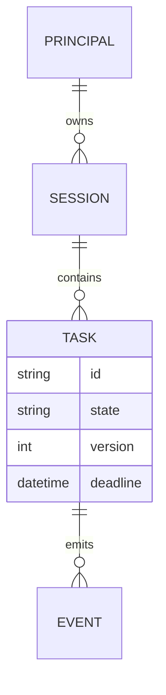

### 12.3 一致性与事务

| 场景 | 一致性要求 | 机制 | 冲突处理 | 补偿 |
|---|---|---|---|---|
| 单库状态变更 | 强一致 | 事务/版本锁 | 重试或冲突错误 | 回滚 |
| 状态 + 事件 | 至少不丢 | outbox | 去重 | replay |
| 跨服务流程 | 最终一致 | saga/process manager | 状态机 | compensating action |

### 12.4 缓存

说明 key、TTL、失效、穿透、击穿、雪崩、多租户隔离、缓存污染和降级。缓存不是权威状态时必须明确。

### 12.5 数据迁移

| 变更 | 向前兼容 | 向后兼容 | 双写/回填 | 回滚限制 |
|---|---|---|---|---|
| `{schema change}` | 是 | 部分 | `{plan}` | `{limit}` |

## 13. 接口、协议与互操作

### 13.1 接口清单

| 接口 | 提供方 | 使用方 | 协议 | 版本 | 认证 | 稳定性 |
|---|---|---|---|---|---|---|
| `{API/event}` | `{component}` | `{consumer}` | HTTP/gRPC/event | v1 | mTLS/token | 稳定 |

### 13.2 标准消息信封

```json
{
  "id": "evt-001",
  "type": "example.action.v1",
  "source": "example-component",
  "tenantId": "tenant-001",
  "correlationId": "corr-001",
  "occurredAt": "2026-01-01T00:00:00Z",
  "payload": {}
}
```

### 13.3 协议语义

说明：版本协商、兼容窗口、未知字段、排序、ACK 时机、幂等键、重试、压缩、分片、最大载荷、超时、时钟、错误码和追踪字段。

### 13.4 错误合同

| 错误码 | 分类 | 是否重试 | 调用方动作 | 是否告警 |
|---|---|:---:|---|:---:|
| `INVALID_INPUT` | 客户端 | 否 | 修正请求 | 否 |
| `CONFLICT` | 并发 | 条件重试 | 重新读取版本 | 否 |
| `DEPENDENCY_UNAVAILABLE` | 暂态 | 是 | 有界退避 | 是 |
| `INTERNAL_ERROR` | 内部 | 视情况 | 使用 correlation ID | 是 |

## 14. 配置、特性开关与秘密

### 14.1 配置来源与优先级

```text
Runtime override
  > environment / secret reference
  > deployment profile
  > configuration file
  > safe default
```

### 14.2 配置分层

| 层 | 内容 | 所有者 | 是否热更新 | 失败行为 |
|---|---|---|:---:|---|
| 全局 | 运行时、安全基线 | 平台 | 部分 | fail fast |
| 环境 | endpoint、容量、观测 | 运维 | 是 | 保留旧版本 |
| 租户 | 策略、配额 | 业务管理员 | 是 | 单租户拒绝 |
| 实例 | 本机资源和设备 | 节点 | 重启 | 节点不可用 |

### 14.3 配置合同

```yaml
runtime:
  profile: server
  workers: 8
  queueCapacity: 1000
security:
  credentialRef: env:SERVICE_TOKEN
observability:
  metrics: true
  tracing: true
```

示例必须标记，不能包含真实秘密。说明 Schema、默认值、废弃字段、未知字段、原子更新、版本和回滚。

### 14.4 Feature flag

| Flag | 默认 | 风险 | 作用域 | 退出条件 | 清理日期 |
|---|:---:|---|---|---|---|
| `{flag}` | off | 中 | 租户/实例 | 指标稳定 | `{date}` |

## 15. 安全、隐私与信任边界

### 15.1 威胁模型

| 资产 | 威胁主体 | 威胁 | 影响 | 防护 | 残余风险 |
|---|---|---|---|---|---|
| 凭据 | 外部/内部 | 泄漏和滥用 | 高 | SecretRef、最小权限、轮换 | 中 |
| 状态 | 非法租户 | 越权访问 | 高 | tenant scope、policy | 低 |
| 执行环境 | 恶意输入 | 命令/代码执行 | 极高 | sandbox、allowlist | 中 |

### 15.2 零信任处理链

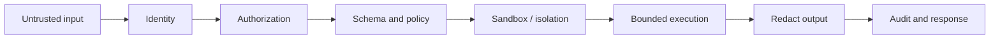

### 15.3 身份与权限

说明主体、服务身份、设备身份、租户、角色、权限、作用域、委托、临时凭据、审批和默认拒绝。

### 15.4 秘密与加密

- 秘密不进入代码、配置样例、日志、指标和追踪；
- 明确传输和静态加密、密钥所有者、轮换和吊销；
- 兼容算法与推荐算法分离；
- 证书、设备身份和签名验证失败默认拒绝。

### 15.5 隔离

| 边界 | 隔离机制 | 可共享 | 禁止共享 | 验证 |
|---|---|---|---|---|
| 租户 | key/schema/context | 公共只读元数据 | 会话、秘密、审计明文 | isolation tests |
| 插件/任务 | 进程/WASM/container/capability | 显式服务 | 文件、网络、凭据 | sandbox tests |
| 设备 | identity/namespace | 协议 Schema | 控制密钥 | device tests |

### 15.6 隐私与审计

记录数据最小化、同意、保留、删除、导出、脱敏、审计完整性和安全披露渠道：{{SECURITY_CONTACT}}。

## 16. 可靠性、失败与恢复

### 16.1 SLO 与恢复目标

| 指标 | 目标 | 测量窗口 | 降级阈值 | 责任方 |
|---|---:|---|---|---|
| 可用性 | `{target}` | 30d | `{threshold}` | `{owner}` |
| P95 延迟 | `{target}` | 5m | `{threshold}` | `{owner}` |
| RTO | `{target}` | incident | — | `{owner}` |
| RPO | `{target}` | incident | — | `{owner}` |

### 16.2 失败模式

| 失败 | 检测 | 局部影响 | 系统行为 | 恢复 | 数据风险 |
|---|---|---|---|---|---|
| 依赖超时 | timeout/metric | 单请求 | 有界重试/熔断 | 自动 | 重复调用 |
| 节点退出 | heartbeat | 节点任务 | 重新调度 | 自动/检查点 | 处理中状态 |
| 状态库不可用 | health/error | 写入阻塞 | 只读/拒绝 | 人工+自动 | 丢失/不一致 |
| 配置错误 | schema/startup check | 实例 | 保留旧配置 | 回滚 | 无 |

### 16.3 重试、幂等与退避

- 只重试明确的暂态错误；
- 所有有副作用操作使用幂等键或去重存储；
- 退避带抖动，并受总 deadline 限制；
- 超过上限进入死信、补偿或人工处理；
- ACK 时机与业务提交关系必须写清。

### 16.4 降级、熔断与隔离舱

| 能力 | 正常 | 降级 | 触发 | 恢复条件 |
|---|---|---|---|---|
| `{capability}` | `{behavior}` | `{fallback}` | `{threshold}` | `{probe}` |

### 16.5 灾难恢复

```text
detect → declare → contain → restore authority state
       → replay/reconcile → validate invariants → reopen traffic
```

说明备份、恢复演练、跨区域/跨节点策略、重放范围、人工审批和恢复后的数据校验。

## 17. 性能、容量与资源预算

### 17.1 工作负载模型

| 场景 | 并发/频率 | 载荷 | 状态规模 | 峰值特征 |
|---|---:|---:|---:|---|
| `{scenario}` | `{value}` | `{size}` | `{size}` | `{burst}` |

### 17.2 性能预算

| 阶段 | P50 | P95 | P99 | 超时 | 预算来源 |
|---|---:|---:|---:|---:|---|
| 入口与校验 | `{ms}` | `{ms}` | `{ms}` | `{ms}` | 总 SLO |
| 核心执行 | `{ms}` | `{ms}` | `{ms}` | `{ms}` | 总 SLO |
| 外部依赖 | `{ms}` | `{ms}` | `{ms}` | `{ms}` | dependency SLA |

### 17.3 容量公式

```text
required_concurrency ≈ peak_requests_per_second × p95_service_time_seconds
queue_budget = burst_rate × tolerated_burst_duration
memory_budget = baseline + active_tasks × per_task_memory + cache_limit
```

### 17.4 资源档位

| Profile | CPU | 内存 | 存储 | 连接/任务 | 启用能力 | 裁剪能力 |
|---|---:|---:|---:|---:|---|---|
| lite | `{budget}` | `{budget}` | `{budget}` | `{limit}` | 核心 | 重型后端 |
| server | `{budget}` | `{budget}` | `{budget}` | `{limit}` | 标准 | 可选 |
| cluster | `{budget}` | `{budget}` | `{budget}` | `{limit}` | 全量治理 | 无 |

所有数字必须标注环境、版本、命令和证据。设计预算与实测结果分开。

## 18. 部署、升级与回滚

### 18.1 部署拓扑

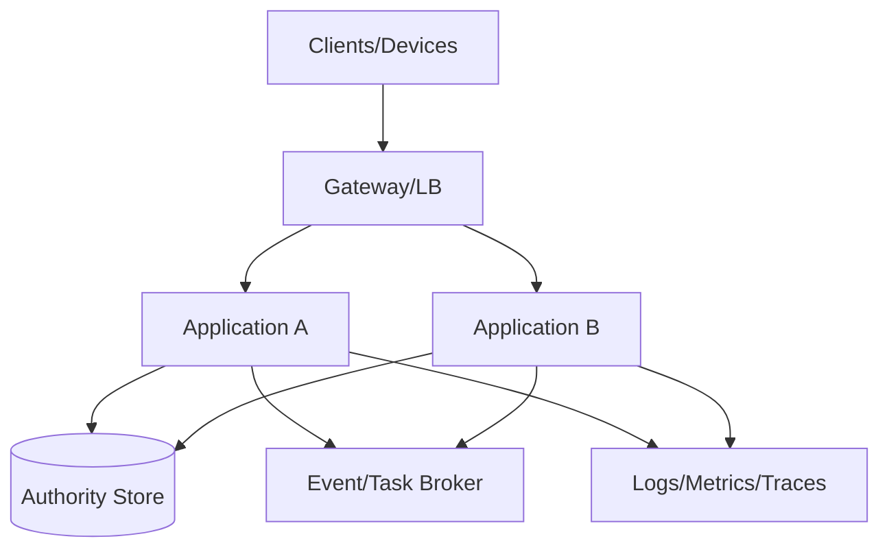

### 18.2 部署形态

| 形态 | 组件 | 适用场景 | 可用性 | 运维复杂度 | 限制 |
|---|---|---|---|---|---|
| 单机 | all-in-one | 开发/小规模 | 低 | 低 | 单点 |
| 服务化 | 分离入口、运行时、状态 | 生产 | 中高 | 中 | 网络依赖 |
| 集群 | 多副本、分片/队列 | 大规模 | 高 | 高 | 一致性成本 |
| 边缘/设备 | 本地裁剪 + 上游协作 | 现场 | 局部自治 | 中 | 资源和网络 |

### 18.3 启动与自检

```text
load config → validate schema → load secrets → check dependencies
→ migrate/compat check → register handlers → readiness=true
```

启动报告至少包括版本、profile、配置来源、启用模块、依赖状态、迁移状态和降级项，不输出秘密。

### 18.4 升级与回滚

| 变更 | 策略 | 向前兼容 | 回滚条件 | 数据限制 |
|---|---|---|---|---|
| 应用版本 | rolling/canary | 是 | 错误率/SLO | 无 |
| Schema | expand-migrate-contract | 是 | 回填前 | 新字段写入 |
| 协议 | 双版本窗口 | 是 | 旧消费者存在 | 消息重放 |
| 设备固件 | OTA A/B | 是 | 健康失败 | 固件格式 |

## 19. 可观测性、运维与诊断

### 19.1 观测模型

| 信号 | 必需字段 | 用途 | 基数/隐私约束 |
|---|---|---|---|
| 日志 | time、level、component、traceId、errorCode | 排障 | 不记录凭据和高基数正文 |
| 指标 | requests、latency、errors、queue、resources | 告警容量 | tenant/user 不做无界 label |
| 追踪 | trace/span、dependency、status | 主链定位 | 敏感属性脱敏 |
| 审计 | actor、action、resource、result、reason | 治理追责 | 防篡改、受控访问 |

### 19.2 健康与就绪

| 检查 | 含义 | 失败影响 | 是否摘流量 |
|---|---|---|:---:|
| liveness | 进程能继续运行 | 重启 | 是 |
| readiness | 能接收新请求 | 暂停流量 | 是 |
| dependency | 关键依赖状态 | 降级或拒绝 | 视能力 |
| self-check/doctor | 配置、权限、协议、状态综合诊断 | 人工处理 | 否 |

### 19.3 告警与 Runbook

| 告警 | 条件 | 级别 | 首个动作 | Runbook |
|---|---|---|---|---|
| `{alert}` | `{expression}` | P1 | `{action}` | `{link}` |

### 19.4 运维命令合同

状态、诊断、迁移、计划和插件命令应支持结构化输出、稳定退出码、dry-run、脱敏和权限校验。

## 20. 扩展、插件与生态边界

### 20.1 扩展点

| 扩展点 | 合同 | 生命周期 | 权限 | 隔离 | 兼容策略 |
|---|---|---|---|---|---|
| `{extension}` | `{interface/schema}` | load/start/stop | `{capabilities}` | `{process/WASM/classloader}` | SemVer |

### 20.2 加载与调用链

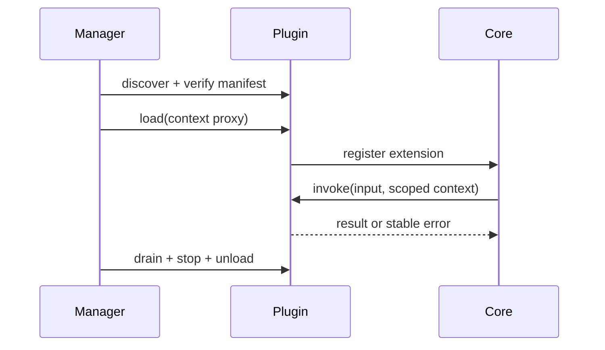

### 20.3 扩展治理

说明发现、清单、签名、权限声明、版本协商、隔离、资源配额、热加载、失败传播、卸载清理和供应链安全。

## 21. 兼容、迁移与演进

### 21.1 兼容矩阵

| 本系统版本 | API/协议 | 数据 | 插件 | 运行环境 | 状态 |
|---|---|---|---|---|---|
| {{VERSION}} | v1 | schema v2 | plugin API v1 | `{runtime}` | 已验证 |

### 21.2 兼容合同

区分源码兼容、二进制兼容、协议兼容、数据兼容、行为兼容和运维兼容。每项写出测试证据。

### 21.3 迁移流程

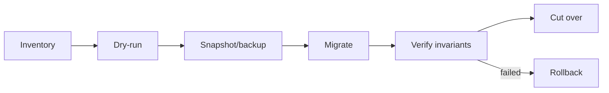

### 21.4 弃用与演进

| 旧合同 | 新合同 | 弃用版本 | 移除版本 | 自动迁移 | 用户动作 |
|---|---|---|---|:---:|---|
| `{old}` | `{new}` | `{version}` | `{version}` | 是/否 | `{action}` |

## 22. 测试、验证与架构验收

### 22.1 证据金字塔

| 层 | 验证对象 | 示例 |
|---|---|---|
| 静态 | 依赖方向、Schema、策略 | architecture test、lint |
| 单元/属性 | 规则、不变量、边界 | unit/property tests |
| 契约 | API、事件、插件、配置 | consumer/producer tests |
| 集成 | 存储、消息、设备、第三方 | testcontainers/simulator |
| 系统/E2E | 主链和异常链 | black-box scenario |
| 混沌/恢复 | 故障、重启、分区、回放 | chaos/DR drill |
| 性能/资源 | SLO、容量、预算 | load/benchmark/budget test |

### 22.2 架构验收矩阵

| 架构声明 | 验收用例 | 环境 | 通过条件 | 证据 |
|---|---|---|---|---|
| 模块依赖单向 | architecture test | CI | 零违规 | `{report}` |
| 请求不丢不重 | restart/replay test | integration | 不变量成立 | `{report}` |
| 租户隔离 | cross-tenant test | security | 零泄漏 | `{report}` |
| 资源预算 | constrained profile | target | 不超预算 | `{report}` |

### 22.3 架构一致性检查

- 图中的组件在源码/部署中存在或明确标记目标态；
- 配置键、协议字段、模块名和命令与实现一致；
- 所有主链都有成功、失败、超时、取消和恢复路径；
- 部署拓扑与运行时依赖、端口和状态归属一致；
- 兼容、性能和安全声明有自动化证据；
- 双语文档的状态、数字、命令和图保持一致。

## 23. 风险、技术债与实施路线

### 23.1 风险登记

| ID | 风险 | 概率 | 影响 | 触发信号 | 缓解 | 负责人 |
|---|---|:---:|:---:|---|---|---|
| `R-001` | `{risk}` | 中 | 高 | `{signal}` | `{mitigation}` | `{owner}` |

### 23.2 技术债

| 技术债 | 当前代价 | 目标 | 偿还阶段 | 删除条件 |
|---|---|---|---|---|
| `{debt}` | `{cost}` | `{target}` | Phase 2 | `{exit}` |

### 23.3 实施路线

| 阶段 | 架构交付物 | 退出条件 | 依赖 | 回退 |
|---|---|---|---|---|
| Phase 0 | 合同、骨架和 CI | 模块/配置/协议检查通过 | toolchain | 删除骨架 |
| Phase 1 | 最小端到端主链 | 成功与失败路径通过 | core adapters | feature flag off |
| Phase 2 | 安全、恢复和观测 | 安全/混沌/运维验收 | deployment | rollback |
| Phase 3 | 容量和生态 | SLO、扩展兼容通过 | production-like env | scale down |

### 23.4 架构完成定义

- [ ] 当前态和目标态可区分
- [ ] 边界、模块、状态和数据所有者明确
- [ ] 核心主链与异常恢复有图、有表、有测试
- [ ] 安全、性能、可靠性和运维目标可测
- [ ] 接口、配置、插件和迁移合同有版本策略
- [ ] ADR、风险、技术债和路线有负责人及退出条件

## 24. 附录

### 附录 A：术语表

| 术语 | 定义 | 禁止混用 |
|---|---|---|
| `{term}` | `{canonical definition}` | `{aliases}` |

### 附录 B：ADR 模板

```markdown
# ADR-NNN：决策标题

- 状态：提议 / 已批准 / 已废弃
- 日期：YYYY-MM-DD
- 决策者：角色

## 上下文
## 架构驱动与约束
## 候选方案
## 决策
## 正向与负向后果
## 验证方式
## 反转条件
```

### 附录 C：接口/协议合同模板

| 字段 | 内容 |
|---|---|
| 名称与版本 | `{name/v1}` |
| 提供方/使用方 | `{provider/consumer}` |
| 输入/输出 Schema | `{link}` |
| 认证与授权 | `{method}` |
| 超时/重试/幂等 | `{semantics}` |
| 错误与恢复 | `{contract}` |
| 兼容窗口 | `{versions}` |
| 契约测试 | `{tests}` |

### 附录 D：修订历史

| 版本 | 日期 | 变更 | 作者 | 评审 |
|---|---|---|---|---|
| {{VERSION}} | {{DATE}} | 初始架构基线 | {{OWNER}} | `{reviewer}` |

---

**文档版本**：{{VERSION}}<br>
**最后更新**：{{DATE}}<br>
**文档状态**：{草案 / 评审中 / 已批准 / 已废弃}
