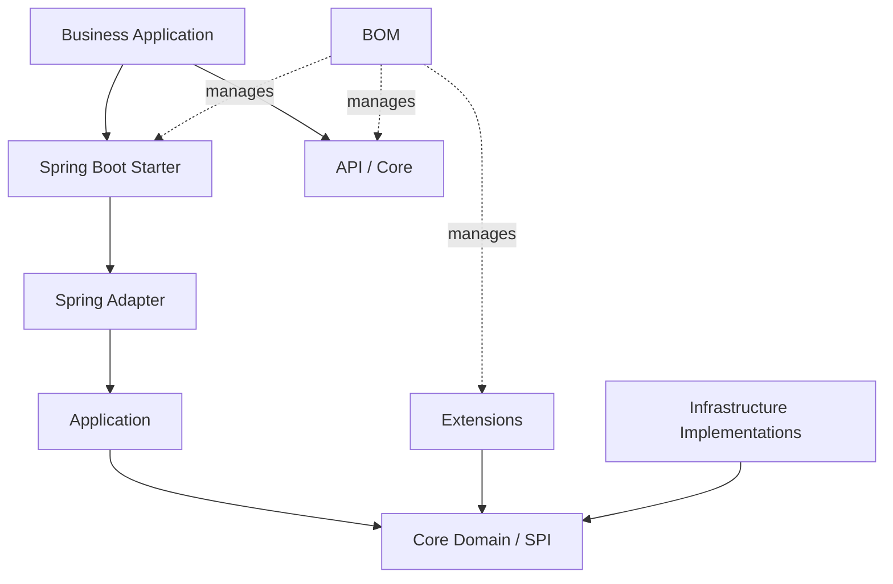

<!-- Java README template. Replace double-brace placeholders from pom.xml, source, CI and releases. -->

<a id="readme-top"></a>

<div align="center">

# {{PROJECT_NAME}}

**{{PROJECT_TAGLINE}}**

[]({{REPOSITORY_URL}})
[](#3-运行要求与兼容性)
[]({{CI_URL}})
[]({{LICENSE_URL}})

[English](./README.md) | [简体中文](./README.zh-CN.md)

[定位](#1-项目定位) · [架构](#4-架构与模块) · [依赖](#5-引入依赖) ·
[快速开始](#6-快速开始) · [配置](#8-配置参考) · [测试](#14-构建与测试) ·
[版本](#15-版本线与兼容策略) · [贡献](#19-贡献与许可证)

</div>

---

> **当前版本**：`{{CURRENT_VERSION}}`<br>
> **JDK 基线**：`{{JAVA_VERSION}}`<br>
> **构建工具**：Maven `{{MAVEN_VERSION}}`<br>
> **项目状态**：{实验性 / 预览 / 稳定 / 维护模式}<br>
> **最后核验**：{{DATE}}

## 1. 项目定位

{{PROJECT_DESCRIPTION}}

### 1.1 是什么

**{{PROJECT_NAME}} 是一个面向 {目标用户} 的 Java {库 / SDK / 框架 / Starter / 服务}，用于 {核心任务}。**

| 维度 | 定位 |
|---|---|
| 本质 | {纯 Java 契约层 / 框架扩展 / SDK / 应用运行时} |
| 消费方 | {业务应用、框架适配器、其他模块} |
| 核心能力 | {三到五项能力} |
| JDK | `{{JAVA_VERSION}}` |
| 坐标 | `{{GROUP_ID}}:{{ARTIFACT_ID}}:{{CURRENT_VERSION}}` |
| 配置前缀 | `{{CONFIG_PREFIX}}` |

### 1.2 不是什么

- 不替代 {数据库、消息代理、身份系统、业务框架等}。
- 不在核心模块中引入 {Spring、Servlet、ORM 或其他框架}，除非模块职责明确要求。
- 不承诺未经过兼容矩阵验证的 JDK、框架或数据库组合。

### 1.3 典型使用场景

| 场景 | 推荐模块 | 结果 |
|---|---|---|
| {纯 Java 使用} | `{{ARTIFACT_ID}}-core` | {结果} |
| {Spring Boot 使用} | `{{ARTIFACT_ID}}-spring-boot-starter` | {结果} |
| {框架扩展} | `{{ARTIFACT_ID}}-extension-*` | {结果} |

## 2. 核心能力与状态

| 能力 | 状态 | 模块 | 说明 | 验证证据 |
|---|:---:|---|---|---|
| {能力 A} | ✅ 稳定 | `{module}` | {输入、行为、输出} | {测试/示例} |
| {能力 B} | 🧪 预览 | `{module}` | {限制} | {测试/Issue} |
| {能力 C} | 🗓️ 计划 | — | {方向} | {Milestone} |

> 功能状态必须与当前分支、测试和发布制品一致。计划项不得写成已支持。

## 3. 运行要求与兼容性

### 3.1 基础要求

| 依赖 | 最低版本 | 推荐版本 | 证据来源 |
|---|---:|---:|---|
| JDK | `{{JAVA_VERSION}}` | `{推荐版本}` | `pom.xml` / CI matrix |
| Maven | `{{MAVEN_VERSION}}` | `{推荐版本}` | Maven Enforcer / CI |
| Spring Boot | `{{SPRING_BOOT_VERSION}}` | `{推荐版本}` | BOM / compatibility tests |
| {数据库/框架} | `{版本}` | `{版本}` | 集成测试 |

### 3.2 版本兼容矩阵

| 项目版本线 | JDK | Spring Boot/框架 | 状态 | 维护策略 |
|---|---:|---:|:---:|---|
| `{当前版本线}` | `{{JAVA_VERSION}}` | `{{SPRING_BOOT_VERSION}}` | ✅ | 活跃开发 |
| `{旧版本线}` | `{JDK}` | `{框架版本}` | 🛠️ | 安全和严重缺陷修复 |

### 3.3 依赖边界

- `core`、`api`、`annotation` 等契约模块应保持最小依赖。
- Spring、ORM、Web、MQ 等能力放入独立适配模块。
- Starter 只负责自动装配、属性绑定和条件化 Bean，不复制 SDK/核心实现。
- 在 README 中明确可选依赖、provided 依赖和传递依赖。

## 4. 架构与模块

### 4.1 一眼看懂

```text
[业务应用]
     │ 引入 BOM + API/Starter
     ▼
┌──────────────────────────────────────────────────────┐
│ {{PROJECT_NAME}}                                     │
│ Starter/Runtime  自动装配、生命周期、框架集成         │
│ Adapter/Extension 协议、数据库、Web、MQ 适配          │
│ Application       用例编排与事务边界                  │
│ Core/API          纯 Java 契约、模型、SPI              │
└──────────────────────────────────────────────────────┘
     │
     ▼
[数据库 / 消息系统 / 外部 API / 框架运行时]
```

### 4.2 模块依赖图



### 4.3 模块清单

| 模块 | 类型 | 职责 | 对外使用 | 依赖约束 |
|---|---|---|:---:|---|
| `{{ARTIFACT_ID}}-bom` | BOM | 统一版本管理 | ✅ | 不含运行时代码 |
| `{{ARTIFACT_ID}}-core` | 核心库 | 模型、契约、SPI | ✅ | 不依赖容器框架 |
| `{{ARTIFACT_ID}}-extension` | 扩展 | 可选实现 | 按需 | 依赖 core |
| `{{ARTIFACT_ID}}-spring` | 适配器 | Spring 集成 | 按需 | 不承担自动装配发布入口 |
| `{{ARTIFACT_ID}}-spring-boot-starter` | Starter | 自动装配和属性绑定 | ✅ | 复用 SDK/adapter，不复制实现 |
| `{{ARTIFACT_ID}}-samples` | 示例 | 可运行用法 | 否 | 不发布为生产依赖 |

### 4.4 架构铁律

| 规则 | 自动验证 |
|---|---|
| 核心层不得依赖框架适配层 | ArchUnit / Maven module check |
| Starter 不复制 SDK 实现 | duplicate/source audit |
| API 模块不引入实现依赖 | dependency analysis |
| 模块间无循环依赖 | Maven reactor / architecture test |

## 5. 引入依赖

### 5.1 使用 BOM（推荐）

```xml
<dependencyManagement>
    <dependencies>
        <dependency>
            <groupId>{{GROUP_ID}}</groupId>
            <artifactId>{{BOM_ARTIFACT_ID}}</artifactId>
            <version>{{CURRENT_VERSION}}</version>
            <type>pom</type>
            <scope>import</scope>
        </dependency>
    </dependencies>
</dependencyManagement>
```

```xml
<dependency>
    <groupId>{{GROUP_ID}}</groupId>
    <artifactId>{{ARTIFACT_ID}}</artifactId>
</dependency>
```

### 5.2 直接引入单模块

```xml
<dependency>
    <groupId>{{GROUP_ID}}</groupId>
    <artifactId>{{ARTIFACT_ID}}</artifactId>
    <version>{{CURRENT_VERSION}}</version>
</dependency>
```

### 5.3 Gradle

```kotlin
dependencies {
    implementation(platform("{{GROUP_ID}}:{{BOM_ARTIFACT_ID}}:{{CURRENT_VERSION}}"))
    implementation("{{GROUP_ID}}:{{ARTIFACT_ID}}")
}
```

### 5.4 仓库配置

{仅在制品不位于 Maven Central 时说明 release/snapshot 仓库；不得提交用户名、密码或私服 token。}

## 6. 快速开始

### 6.1 最小纯 Java 示例

```java
public final class Example {
    public static void main(String[] args) {
        // 使用真实公共 API 展示最短成功路径
    }
}
```

### 6.2 Spring Boot 示例

```java
@SpringBootApplication
public class {{MAIN_CLASS}} {
    public static void main(String[] args) {
        SpringApplication.run({{MAIN_CLASS}}.class, args);
    }
}
```

```yaml
{{CONFIG_PREFIX}}:
  enabled: true
```

```bash
./mvnw spring-boot:run
```

**预期结果**：{日志、响应、事件或测试断言；必须可观察且不包含敏感数据。}

## 7. Starter 与自动装配

<!-- 纯 Java 库删除本节。 -->

### 7.1 激活方式

| 方式 | 推荐度 | 适用场景 |
|---|:---:|---|
| Starter 自动装配 | ✅ | Spring Boot 应用 |
| 显式 `@Import` | ⚠️ | 非 Boot Spring 或测试 |
| 手工 Bean | 按需 | 完全控制生命周期 |

### 7.2 自动装配条件

| Bean/能力 | 条件 | 缺失时行为 | 覆盖方式 |
|---|---|---|---|
| `{bean}` | `@ConditionalOnClass` + property | 不创建或快速失败 | 用户声明同类型 Bean |

### 7.3 Bean 覆盖与生命周期

- 说明哪些 Bean 支持用户覆盖。
- 说明启动、关闭、线程池、连接池和资源释放。
- 自动装配失败必须给出明确字段、类路径或依赖提示。

## 8. 配置参考

### 8.1 配置前缀

`{{CONFIG_PREFIX}}`

### 8.2 配置项

| 属性 | 类型 | 默认值 | 必填 | 说明 | 敏感 |
|---|---|---|:---:|---|:---:|
| `{{CONFIG_PREFIX}}.enabled` | boolean | `true` | 否 | 是否启用 | 否 |
| `{{CONFIG_PREFIX}}.endpoint` | URI | — | 是 | 服务地址 | 否 |
| `{{CONFIG_PREFIX}}.token` | SecretRef | — | 是 | 凭据 | 是 |
| `{{CONFIG_PREFIX}}.timeout` | Duration | `10s` | 否 | 超时 | 否 |

### 8.3 完整配置

```yaml
{{CONFIG_PREFIX}}:
  enabled: true
  endpoint: "${SERVICE_ENDPOINT}"
  token: "${SERVICE_TOKEN}"
  timeout: 10s
  retry:
    max-attempts: 3
```

### 8.4 配置优先级与校验

说明配置文件、环境变量、命令行和编程式配置的优先级，以及未知字段、非法值和缺失密钥的失败行为。

## 9. 核心用法

### 9.1 能力 A

```java
// 完整 import、资源关闭、异常处理和可观察结果
```

### 9.2 能力 B

```java
// 展示组合使用和边界条件
```

### 9.3 异步、响应式或流式能力

说明线程模型、上下文传播、取消、背压、超时和资源释放。

## 10. 公共 API 与 SPI

| 类型 | 稳定性 | 用途 | 实现方 |
|---|:---:|---|---|
| `{PublicApi}` | 稳定 | 业务调用入口 | 项目 |
| `{ExtensionPoint}` | 稳定 | 自定义扩展 | 使用方 |
| `{InternalType}` | 内部 | 实现细节 | 禁止依赖 |

### 10.1 扩展实现流程

1. 实现 SPI。
2. 注册实现或声明 Spring Bean。
3. 添加契约测试。
4. 验证并发、异常和生命周期。
5. 更新服务发现、配置和文档。

## 11. 数据、事务与并发

- 事务边界：{由调用方、框架还是项目管理}。
- 线程安全：{单例、不可变、ThreadLocal、线程池规则}。
- 幂等：{业务键和重复请求策略}。
- 缓存：{生命周期、失效和多租户隔离}。
- 序列化：{格式、版本兼容和时间类型}。

## 12. 安全与可观测性

### 12.1 安全基线

- 凭据从环境或密钥管理服务注入。
- 日志使用 SLF4J，敏感字段必须脱敏。
- 明确反序列化、SQL、表达式、文件和网络输入边界。
- 默认拒绝危险算法、弱配置和宽泛权限。

### 12.2 观测信号

| 信号 | 字段/指标 | 用途 |
|---|---|---|
| 日志 | traceId、业务键、错误码 | 故障定位 |
| 指标 | 吞吐、延迟、失败、重试 | 告警与容量 |
| 追踪 | HTTP/DB/MQ span | 全链路分析 |

## 13. 项目结构

```text
{{PROJECT_NAME}}/
├── {{BOM_ARTIFACT_ID}}/          # 版本管理
├── {{ARTIFACT_ID}}-core/         # 纯 Java 核心
├── {{ARTIFACT_ID}}-extension/    # 可选扩展
├── {{ARTIFACT_ID}}-spring/       # Spring 适配
├── {{ARTIFACT_ID}}-starter/      # 自动装配
├── {{ARTIFACT_ID}}-samples/      # 可运行示例
├── docs/                         # 深度文档
└── pom.xml
```

## 14. 构建与测试

### 14.1 常用命令

```bash
./mvnw clean verify
./mvnw -pl {{ARTIFACT_ID}} -am test
./mvnw -Prelease -Dgpg.skip=true -DskipTests package
```

### 14.2 测试矩阵

| 类型 | 覆盖 | 工具/命令 |
|---|---|---|
| 单元测试 | 核心规则 | JUnit / Surefire |
| 集成测试 | Spring、数据库、MQ | Failsafe / Testcontainers |
| 架构测试 | 分层与依赖 | ArchUnit |
| 兼容测试 | JDK、框架、数据库 | CI matrix |
| 示例测试 | README 最小路径 | compile/run test |

### 14.3 发布门禁

- Maven Enforcer、依赖收敛和重复类检查
- 编译、测试、Javadoc、源码包和制品打包
- 不同 JDK/框架版本矩阵
- API 二进制兼容检查（如适用）
- README 命令和示例验证

## 15. 版本线与兼容策略

| 分支/版本线 | JDK | 框架基线 | 发布坐标 | 状态 |
|---|---:|---:|---|:---:|
| `{line-a}` | `{JDK}` | `{framework}` | `{{GROUP_ID}}:*` | 活跃 |
| `{line-b}` | `{JDK}` | `{framework}` | `{{GROUP_ID}}:*` | 维护 |

只允许 JDK/框架兼容所需差异；共享业务逻辑、文档和测试应保持一致。

## 16. 性能与容量

仅在存在可复现 JMH 或压测结果时填写环境、数据规模、预热、参数、P50/P95/P99 和命令。不要把本机结果写成生产 SLA。

## 17. 发布与部署

### 17.1 Maven 发布

```bash
./mvnw clean deploy -Prelease
```

说明 snapshot/release 仓库、签名、source/javadoc、BOM 发布顺序和远端验证方式。

### 17.2 应用部署（如适用）

说明启动参数、健康检查、JVM 内存、GC、日志、指标、优雅关闭、备份与回滚。

## 18. 文档、示例与排障

| 资源 | 内容 |
|---|---|
| `docs/architecture.md` | 架构和边界 |
| `docs/compatibility.md` | 兼容矩阵 |
| `samples/` | 可运行示例 |
| `CHANGELOG.md` | 版本差异 |

| 症状 | 诊断 | 解决 |
|---|---|---|
| `ClassNotFoundException` | 依赖树和 scope | 引入正确模块/BOM |
| Bean 未创建 | 条件报告和配置前缀 | 修复 classpath/属性 |
| 版本冲突 | `dependency:tree` | BOM 和依赖收敛 |
| 启动或请求失败 | 日志、traceId、健康状态 | 按错误码处理 |

## 19. 贡献与许可证

贡献前运行 `./mvnw clean verify`，说明兼容性、测试、文档和迁移影响。安全问题通过 `{{SECURITY_CONTACT}}` 私密报告。

本项目采用 [{{LICENSE_NAME}}]({{LICENSE_URL}}) 许可证。

---

<div align="center">

[返回顶部](#readme-top) · [文档]({{DOCS_URL}}) · [问题反馈]({{ISSUES_URL}})

</div>
