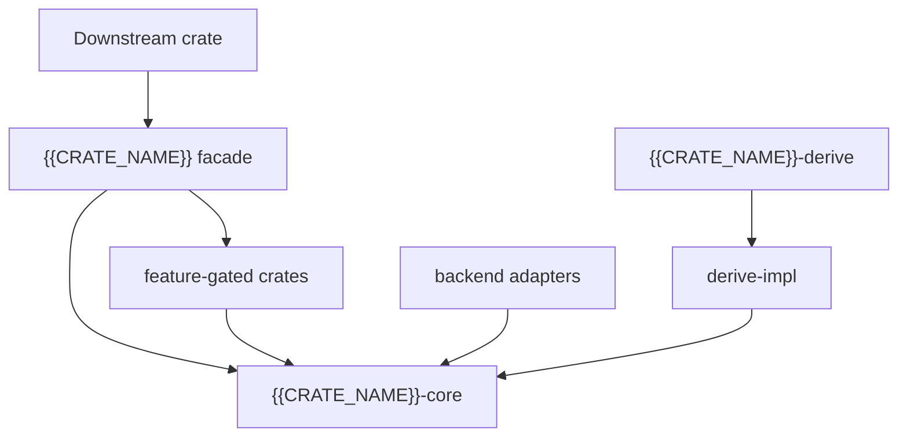

<!--
Rust README common template. Verify all facts from Cargo.toml, source, CI, docs.rs and release metadata.

Before filling it, select optional domain profiles from rust-profiles/README.md:
- document/file-format processing
- upstream compatibility and migration
- large toolbox workspace
- authentication and security framework
- design-only stage
- multilingual README layout

Merge only applicable profile sections, renumber the final document, and remove this comment.
-->

<a id="readme-top"></a>

<div align="center">

# {{PROJECT_NAME}}

**{{PROJECT_TAGLINE}}**

[](https://crates.io/crates/{{CRATE_NAME}})
[](https://docs.rs/{{CRATE_NAME}})
[](#3-rust-基线与平台支持)
[]({{CI_URL}})
[]({{LICENSE_URL}})

[English](./README.md) | [简体中文](./README.zh-CN.md)

[定位](#1-项目定位与状态) · [功能](#2-功能与成熟度) · [架构](#4-workspace-与-crate-架构) ·
[快速开始](#6-快速开始) · [Features](#7-cargo-features) · [质量](#13-构建测试与质量门禁) ·
[发布](#17-cratesio-发布) · [贡献](#19-贡献安全与许可证)

</div>

---

> **当前版本**：`{{CURRENT_VERSION}}`<br>
> **MSRV**：Rust `{{RUST_VERSION}}`<br>
> **Edition**：`{{RUST_EDITION}}`<br>
> **Workspace Resolver**：`{{WORKSPACE_RESOLVER}}`<br>
> **成熟度**：{设计阶段 / 实验性 / 预览 / 稳定 / 维护模式}<br>
> **最后核验**：{{DATE}}

> 如果仓库尚无 `Cargo.toml` 或可发布 crate，删除 crates.io/docs.rs 徽章和安装命令，明确标记“设计阶段，尚未发布”，并链接实施计划。绝不虚构 crate、版本、测试或发布状态。

> **模板组合提示**：本文件负责 Rust 工程共性。文档格式、兼容移植、工具箱、安全认证、设计阶段和多语言项目应先阅读 [`rust-profiles/README.md`](rust-profiles/README.md)，将适用剖面合并到最终 README；不要把所有剖面全部复制。

## 1. 项目定位与状态

{{PROJECT_DESCRIPTION}}

### 1.1 是什么

**{{PROJECT_NAME}} 是一个面向 {目标用户} 的 Rust {crate / workspace / CLI / 服务 / 兼容移植项目}，用于 {核心任务}。**

| 维度 | 内容 |
|---|---|
| 根 crate | `{{CRATE_NAME}}` |
| 当前版本 | `{{CURRENT_VERSION}}` |
| MSRV / Edition | `{{RUST_VERSION}}` / `{{RUST_EDITION}}` |
| 默认 features | `{{DEFAULT_FEATURES}}` |
| unsafe 策略 | `{forbid / deny / isolated / documented}` |
| 发布状态 | {未发布 / crates.io / 私有 registry} |
| 许可证 | `{{LICENSE_NAME}}` |

### 1.2 不是什么

- 不承诺与上游 Java/C/C++/其他语言项目的 1:1 兼容，除非有逐项矩阵和行为测试。
- 不把尚未实现、仅有 stub 或返回 `Unsupported` 的能力标记为已完成。
- 不默认启用所有高成本、平台相关或高风险 feature。
- 不因“纯 Rust”标签忽略底层依赖可能包含的 FFI 或 unsafe。

### 1.3 状态证据

| 声明 | 当前值 | 证据 |
|---|---|---|
| crate 可构建 | {状态} | `cargo check ...` |
| 测试 | {数量/状态} | CI / test report |
| 覆盖率 | {值和口径} | llvm-cov report |
| MSRV | `{{RUST_VERSION}}` | CI MSRV job |
| crates.io | {已发布/未发布} | registry link |
| docs.rs | {成功/失败/未发布} | docs.rs link |

## 2. 功能与成熟度

### 2.1 功能矩阵

| 功能 | 状态 | crate/feature | 限制 | 验证 |
|---|:---:|---|---|---|
| {功能 A} | ✅ 稳定 | `{crate}` / `{feature}` | {限制} | {测试/示例} |
| {功能 B} | 🧪 预览 | `{crate}` / `{feature}` | {限制} | {测试/Issue} |
| {功能 C} | 🚧 部分 | `{crate}` | {缺口} | {兼容矩阵} |
| {功能 D} | 🗓️ 计划 | — | 不可用 | {Roadmap} |
| {功能 E} | ⛔ 不移植 | — | {安全/语义/平台原因} | {决策记录} |

### 2.2 状态定义

| 状态 | 定义 |
|---|---|
| 稳定 | 公共 API、测试、文档和兼容承诺齐全 |
| 预览 | 可用但 API 或行为可能变化 |
| 部分 | 只有明确列出的子集可用 |
| 计划 | 尚无可调用实现 |
| 不移植 | 因 Rust 语义、安全或平台原因明确拒绝复制 |

### 2.3 上游兼容或移植项目（按需）

| 上游能力 | Rust 对应 | 兼容层级 | 证据 | 差异原因 |
|---|---|---|---|---|
| `{upstream API}` | `{Rust API}` | 行为等价/惯用替代/不支持 | {测试} | {所有权、反射、线程、平台等} |

兼容率必须说明分母、统计口径、排除项和 stub 处理，不能只给一个百分比。

## 3. Rust 基线与平台支持

### 3.1 Toolchain

| 项目 | 值 | 来源 |
|---|---|---|
| MSRV | `{{RUST_VERSION}}` | `rust-version` / CI |
| Edition | `{{RUST_EDITION}}` | `Cargo.toml` |
| Resolver | `{{WORKSPACE_RESOLVER}}` | `[workspace]` |
| rustfmt | `{stable/nightly}` | CI |
| Clippy | `-D warnings` | CI |

### 3.2 目标平台矩阵

| Target | 构建 | 测试 | 备注 |
|---|:---:|:---:|---|
| `x86_64-unknown-linux-gnu` | ✅ | ✅ | 主平台 |
| `x86_64-unknown-linux-musl` | {状态} | {状态} | 静态链接/系统依赖 |
| `aarch64-unknown-linux-gnu` | {状态} | {状态} | ARM64 |
| `x86_64-pc-windows-msvc` | {状态} | {状态} | Windows |
| `aarch64-apple-darwin` | {状态} | {状态} | macOS |
| `wasm32-unknown-unknown` | {状态} | {状态} | 若适用 |

### 3.3 `std` / `no_std` / WASM

明确：

- 是否要求 `std`。
- `no_std` 的 alloc、同步原语、时间和随机数来源。
- WASM 不支持的文件、线程、socket 或系统能力。
- 平台 feature 与目标 target 的组合限制。

## 4. Workspace 与 crate 架构

### 4.1 一眼看懂

```text
[应用或下游 crate]
        │ cargo add / features
        ▼
┌──────────────────────────────────────────────────────────┐
│ {{PROJECT_NAME}} Cargo Workspace                         │
│ {{CRATE_NAME}}          用户外观与 Prelude               │
│ {{CRATE_NAME}}-core     类型、trait、错误、公共契约       │
│ {{CRATE_NAME}}-derive   proc-macro 薄入口                 │
│ reader/writer/...       可选能力与后端适配                │
└──────────────────────────────────────────────────────────┘
        │
        ▼
[文件 / 网络 / 数据库 / 第三方引擎]
```

### 4.2 crate 依赖图



### 4.3 Crate Map

| Crate | 发布 | 默认启用 | 职责 | 关键依赖 |
|---|:---:|:---:|---|---|
| `{{CRATE_NAME}}` | ✅ | — | Facade、prelude、feature 汇总 | workspace crates |
| `{{CRATE_NAME}}-core` | ✅ | ✅ | 公共类型、trait、错误 | 最小依赖 |
| `{{CRATE_NAME}}-derive` | ✅ | 按需 | proc-macro 入口 | derive-impl |
| `{{CRATE_NAME}}-derive-impl` | {是/否} | 按需 | 可测试宏逻辑 | syn/quote |
| `{adapter crate}` | 按需 | 否 | 后端或平台适配 | 外部引擎 |

### 4.4 依赖和可见性规则

- 核心 crate 不反向依赖 facade 或 adapter。
- proc-macro 入口尽量薄，业务逻辑放入可测试的普通 crate。
- `pub` 只用于稳定公共契约；内部类型使用 `pub(crate)`。
- 可选依赖必须由同名或明确 feature 控制。
- 避免重复依赖版本和不必要的默认 feature。

## 5. 设计原则

| 原则 | 落地方式 | 验证 |
|---|---|---|
| 类型安全 | Builder、trait、newtype、enum | compile/trybuild tests |
| 所有权清晰 | 明确 owned/borrowed、生命周期 | API review |
| 错误可组合 | 结构化 error enum、source 链 | error tests |
| 默认安全 | 最小 features、敏感值封装 | security tests |
| 零成本抽象 | 泛型/静态分发，必要时说明动态分发 | benchmark |
| 可演进 | 非穷尽 enum、封闭内部类型、版本策略 | semver checks |

## 6. 快速开始

### 6.1 安装

```bash
cargo add {{CRATE_NAME}}
```

或：

```toml
[dependencies]
{{CRATE_NAME}} = "{{CURRENT_VERSION}}"
```

### 6.2 最小示例

```rust
use {{CRATE_NAME}}::prelude::*;

fn main() -> Result<(), Box<dyn std::error::Error>> {
    // 调用真实公共 API
    // 打印或断言一个稳定、可观察结果
    Ok(())
}
```

```bash
cargo run --example minimal
```

**预期输出**：

```text
{稳定输出}
```

### 6.3 从 Git 或本地 workspace 使用

```toml
[dependencies]
{{CRATE_NAME}} = { git = "{{REPOSITORY_URL}}", rev = "{commit}" }
```

本地 path 仅作为开发说明，不得写个人绝对路径。

## 7. Cargo Features

### 7.1 Feature 矩阵

| Feature | 默认 | 增加能力 | 新增依赖 | MSRV/平台 | 安全与体积影响 |
|---|:---:|---|---|---|---|
| `{core}` | ✅ | {能力} | {依赖} | 无 | 最小 |
| `{format}` | 否 | {格式支持} | {依赖} | {限制} | {影响} |
| `{async}` | 否 | 异步 API | runtime | {限制} | {影响} |
| `{full}` | 否 | 汇总 features | 多项 | {限制} | 构建成本高 |

### 7.2 选择依赖

```toml
[dependencies]
{{CRATE_NAME}} = { version = "{{CURRENT_VERSION}}", default-features = false, features = ["{feature-a}"] }
```

### 7.3 Feature 设计规则

- Features 应尽量可叠加，不相互排斥。
- 默认 feature 发布后移除可能构成破坏性变更。
- 每个 feature 都需测试默认关闭、单独启用和全量启用。
- 高成本、平台专用、网络、数据库和加密后端默认关闭。

## 8. 核心 API 与用法

### 8.1 Facade / Builder

```rust
// 完整 import、输入、错误处理和结果验证
```

### 8.2 Derive 宏（如适用）

```rust
#[derive(Debug)]
// #[derive({ProjectModel})]
struct Record {
    // #[project(rename = "name")]
    name: String,
}
```

说明：支持属性、编译期错误、泛型/生命周期限制和 trybuild 测试。

### 8.3 异步或流式 API（如适用）

说明 runtime 中立性、Send/Sync、取消安全、背压、超时和资源释放。

### 8.4 错误模型

| Error variant | 场景 | 是否重试 | source |
|---|---|:---:|---|
| `{InvalidInput}` | 输入非法 | 否 | 可选 |
| `{Io}` | 文件或网络 | 视情况 | `std::io::Error` |
| `{Unsupported}` | 明确未支持 | 否 | 无 |

## 9. 后端、格式与可选引擎

| 能力 | 后端 | Feature | 语义边界 | 许可证 |
|---|---|---|---|---|
| {读取} | `{backend}` | `{feature}` | {限制} | {license} |
| {写入} | `{backend}` | `{feature}` | {限制} | {license} |

如果多个引擎的能力不等价，应提供 capability query 或明确失败，而不是静默降级。

## 10. 并发、内存与资源模型

- `Send` / `Sync`：列出主要公共类型的保证。
- 内存策略：全量、流式、constant-memory 或 mmap。
- 资源释放：Drop、显式 finish/close、临时文件清理。
- 并发：锁、任务、线程池和回调执行上下文。
- 大文件/批处理：批大小、背压、临时空间和部分失败。

## 11. Unsafe、FFI 与安全

### 11.1 Unsafe 策略

| 范围 | 策略 | 说明 |
|---|---|---|
| Workspace | `{forbid/deny}` | 由 workspace lints 强制 |
| 第三方依赖 | 允许但审计 | cargo audit/deny + provenance |
| FFI 模块 | {无/隔离} | 若存在，记录不变量和安全封装 |

“零 unsafe”仅指本 workspace 源码时必须明确，不能暗示整个依赖图无 unsafe。

### 11.2 安全基线

- 不记录密钥、令牌、私钥或敏感文档内容。
- 解析器设置输入大小、递归深度、压缩比和资源上限。
- 加密 API 禁止弱默认值并区分兼容模式与推荐模式。
- 网络客户端明确 TLS、重定向、代理、超时和 SSRF 边界。
- 依赖通过 `cargo audit` / `cargo deny` / SBOM 检查。

### 11.3 漏洞报告

通过 `{{SECURITY_CONTACT}}` 私密报告，不公开提交未修复漏洞。

## 12. 项目结构

```text
{{PROJECT_NAME}}/
├── Cargo.toml              # Workspace、共享依赖、lint、MSRV
├── Cargo.lock              # 应用通常提交；库按策略决定
├── crates/
│   ├── {{CRATE_NAME}}/     # 用户 facade
│   ├── {{CRATE_NAME}}-core/
│   └── {{CRATE_NAME}}-derive/
├── examples/               # cargo run --example
├── benches/                # 可复现 benchmark
├── tests/                  # workspace/端到端测试
├── fuzz/                   # fuzz targets（如适用）
├── docs/                   # 架构、兼容、迁移、安全
└── .github/workflows/      # CI matrix
```

## 13. 构建、测试与质量门禁

### 13.1 基础门禁

```bash
cargo fmt --all -- --check
cargo clippy --workspace --all-targets --all-features -- -D warnings
cargo check --workspace --all-features
cargo test --workspace
cargo test --workspace --no-default-features
cargo test --workspace --all-features
cargo doc --workspace --all-features --no-deps
```

### 13.2 扩展门禁

```bash
cargo llvm-cov --workspace --all-features
cargo audit
cargo deny check
cargo package -p {{CRATE_NAME}} --allow-dirty
```

按适用性增加：MSRV、Nightly、Miri、trybuild、fuzz、WASM、GNU/MUSL、Windows/macOS、文档示例和 semver checks。

### 13.3 测试矩阵

| 类型 | 目的 | 命令/工具 |
|---|---|---|
| 单元测试 | 核心规则 | `cargo test` |
| 集成测试 | crate 协作/真实后端 | `tests/` / testcontainers |
| Doc tests | README/API 示例 | `cargo test --doc` |
| Compile tests | derive/trait 约束 | trybuild |
| Property tests | 边界输入 | proptest |
| Fuzz | 解析器和不可信输入 | cargo-fuzz |
| Miri | 未定义行为 | cargo miri |
| Golden/parity | 输出和上游兼容 | fixtures |

### 13.4 覆盖率声明

必须说明：工具、命令、feature、排除项、行/区域/函数口径，以及 proc-macro/生成代码为什么排除。不要只放无法追溯的徽章。

## 14. 性能与基准

```bash
cargo bench
```

| 场景 | 数据规模 | 吞吐 | 延迟 | 峰值内存 | 版本/提交 |
|---|---:|---:|---:|---:|---|
| {场景} | {值} | {值} | {值} | {值} | `{commit}` |

记录硬件、编译 profile、features、输入数据和完整命令。基准不等于生产 SLA。

## 15. 兼容、迁移与来源

### 15.1 SemVer 与 MSRV

- 公共 API 遵循 {SemVer 策略}。
- MSRV 提升是否构成 minor/major 变更需明确。
- 默认 features、trait bounds、auto traits 和错误枚举变更均需评估兼容性。

### 15.2 上游移植来源（如适用）

| 项目 | 内容 |
|---|---|
| 上游版本/提交 | `{version/commit}` |
| 行为权威 | 上游源码、测试和 fixtures |
| Rust 适配原则 | 保持行为，采用惯用所有权/错误/trait 设计 |
| 不可移植项 | {反射、JVM、平台 GUI、动态代理等} |

### 15.3 迁移指南

提供 API 映射、行为差异、数据兼容、错误变化和可自动化迁移步骤。

## 16. 文档与示例

| 文档 | 作用 |
|---|---|
| `docs/architecture.md` | Workspace、crate 和关键决策 |
| `docs/compatibility.md` | 功能/上游兼容矩阵 |
| `docs/usage-guide.md` | 深入用法 |
| `docs/security.md` | 威胁、unsafe/FFI、披露 |
| `examples/` | 可运行示例 |
| `benches/` | 可复现基准 |

## 17. crates.io 发布

### 17.1 发布前检查

```bash
cargo publish -p {{CRATE_NAME}} --dry-run
cargo package -p {{CRATE_NAME}}
```

- crate 名已确认且未误导。
- `description`、`license`、`repository`、`readme`、`keywords`、`categories` 完整。
- 打包内容不含 fixtures 密钥、大文件、target 或内部资料。
- docs.rs 能在声明的 features/targets 下构建。
- Workspace 内部 crate 按依赖拓扑发布，版本约束使用可发布形式。

### 17.2 发布顺序

```text
core/types → derive-impl → derive → reader/writer/adapters → facade
```

### 17.3 发布后验证

在干净临时目录从 registry 安装，运行最小示例、文档构建和 smoke test，并核对 tag、commit、crate 版本一致。

## 18. 故障排查

| 症状 | 常见原因 | 诊断 | 处理 |
|---|---|---|---|
| MSRV 构建失败 | 依赖提高 Rust 版本 | `cargo tree`, lockfile | pin/升级 MSRV |
| feature 组合失败 | 可选依赖或 cfg 缺失 | feature matrix | 修复 feature 依赖 |
| docs.rs 失败 | 系统依赖/全 feature | docs.rs metadata | 调整 docs.rs features |
| 链接失败 | native 依赖/target | verbose build | 安装依赖或禁用 feature |
| 输出不兼容 | 后端/格式差异 | golden fixture | 明确差异或修复 |

问题报告应包含 rustc/cargo 版本、target、features、最小代码、完整错误和已脱敏输入。

## 19. 贡献、安全与许可证

贡献前运行基础和适用的扩展门禁；新增公共 API 必须包含 docs、示例、测试、SemVer 和 MSRV 影响说明。

本项目采用 [{{LICENSE_NAME}}]({{LICENSE_URL}}) 许可证。移植项目还需列出上游许可证、来源提交和修改范围。

---

<div align="center">

[返回顶部](#readme-top) · [docs.rs](https://docs.rs/{{CRATE_NAME}}) · [crates.io](https://crates.io/crates/{{CRATE_NAME}}) · [Issues]({{ISSUES_URL}})

</div>
