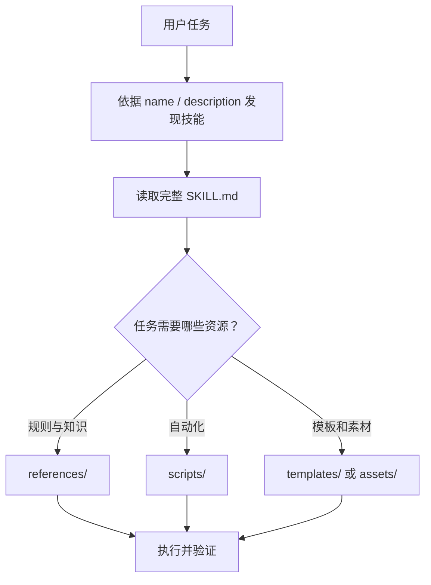

# {{PROJECT_NAME}}

> {{PROJECT_TAGLINE}}

[]({{CI_URL}})
[]({{REPOSITORY_URL}})
[]({{LICENSE_URL}})

[English](README.md) | [简体中文](README.zh-CN.md) · [安装](#安装) · [技能目录](#技能目录) · [贡献](#贡献)

<!--
适用：Agent Skill 包、技能市场、技能导航仓库、生态目录。
若当前仓库只是目录而不承载技能源码，必须明确写出源码所在包，不要虚构本地运行步骤。
技能数量、安装命令、技能名和支持平台必须由清单、目录及 CI 核实。
-->

## 项目定位

{{PROJECT_DESCRIPTION}}

{{PROJECT_NAME}} 是一个面向 {{INSTALL_SCOPE}} 的技能包或生态目录，帮助使用者按任务发现、安装并按需加载可复用的 Agent 能力。

### 适合谁

- 需要为编码 Agent 安装专业能力的开发者；
- 负责维护技能包、市场清单和跨平台适配的作者；
- 需要审计技能来源、触发条件、脚本与权限的团队。

### 核心价值

| 使用者问题 | 本项目提供 | 证据入口 |
|---|---|---|
| 不知道该用哪个技能 | 按场景组织的技能目录与触发说明 | 技能清单、`SKILL.md` |
| 不同 Agent 安装方式不同 | 经验证的安装矩阵 | 安装脚本、CI |
| 技能内容难以维护 | 统一结构、质量门禁与贡献流程 | 校验器、测试 |
| 目录和实际技能容易漂移 | 清单审计与数量校验 | 市场清单、目录扫描 |

## 一眼看懂

```text
用户任务
   │
   ▼
发现技能 ──► 阅读触发条件 ──► 安装技能包/单个技能
   │                                  │
   │                                  ▼
   └────────────── Agent 按需加载 SKILL.md
                                      │
                                      ▼
                         引用 references / scripts / assets
                                      │
                                      ▼
                              生成可验证交付物
```

| 项目属性 | 值 |
|---|---|
| 技能数量 | {{SKILL_COUNT}} |
| 安装范围 | {{INSTALL_SCOPE}} |
| 包名 | `{{PACKAGE_NAME}}` |
| 当前版本 | {{CURRENT_VERSION}} |
| 支持平台 | 见“支持的 Agent” |
| 许可证 | {{LICENSE_NAME}} |

## 仓库类型与边界

先明确本仓库属于哪一种类型：

| 类型 | 本仓库包含 | README 必须说明 |
|---|---|---|
| 技能包 | `skills/<name>/SKILL.md` 及配套资源 | 安装、技能目录、逐技能触发条件、验证 |
| 生态导航仓库 | 市场清单、包索引、安装入口 | 各技能源码实际位置、发现和安装方式 |
| 单技能仓库 | 一个技能及其 references/scripts/assets | 适用场景、工作流、输入输出、权限 |
| 研究仓库 | 原始资料、评估和实验 | 非用户安装目标、成果如何进入正式包 |

### 不应混淆

- 导航仓库不应宣称自己直接包含所有技能源码；
- 技能包 README 不替代每个 `SKILL.md` 的具体执行说明；
- 研究材料不应作为稳定用户接口；
- “目录中存在”不等于“已在目标 Agent 上验证可用”。

## 安装

### 安装整个技能包

```bash
{{INSTALL_COMMAND}}
```

### 安装单个技能

```bash
# 将命令替换为该生态实际支持的精确语法
skills add {{PACKAGE_NAME}} --skill example-skill
```

### 固定版本

```bash
skills add {{PACKAGE_NAME}}@{{CURRENT_VERSION}}
```

### 从源码安装

```bash
git clone {{REPOSITORY_URL}}
cd {{PROJECT_NAME}}
{{BUILD_COMMAND}}
```

不要同时列出未经验证的平台命令。若某平台仅支持手动复制，应写明目标目录、复制范围和更新方式，但不要使用作者本机绝对路径。

### 验证安装

```text
expected package: {{PACKAGE_NAME}}
expected skills: {{SKILL_COUNT}}
expected status: valid
```

给出实际可执行的列表或审计命令，并说明成功输出。

## 快速开始

### 1. 选择技能

根据任务，而不是根据技术名称选择技能：

| 你的任务 | 推荐技能 | 触发示例 |
|---|---|---|
| 创建或完善某类交付物 | `example-authoring` | “为这个项目创建完整文档” |
| 校验已有产物 | `example-review` | “检查文档结构和事实一致性” |
| 执行专项自动化 | `example-automation` | “批量验证并输出报告” |

### 2. 明确调用

```text
请使用 example-authoring 技能，根据当前仓库事实创建交付物，并执行技能要求的验证。
```

### 3. 检查输出

确认 Agent：

- 已读取完整 `SKILL.md`；
- 只加载任务需要的引用材料；
- 使用了技能自带脚本或模板，而非重新臆造；
- 报告了验证命令、结果和剩余边界。

## 技能目录

技能目录应从真实目录或市场清单生成或核对。

| 技能 | 用途 | 何时触发 | 主要资源 | 状态 |
|---|---|---|---|---|
| `example-authoring` | 创建完整交付物 | 用户要求创建、改写或补全文档 | templates、references | 稳定 |
| `example-review` | 审查质量与事实 | 用户要求评审、审计或找缺口 | rubric、scripts | 稳定 |
| `example-automation` | 批量处理 | 用户要求扫描多个目标 | scripts | 实验性 |

### 技能状态

| 状态 | 含义 |
|---|---|
| 稳定 | 结构、脚本和示例通过自动化验证 |
| 实验性 | 可使用，但触发条件或输出契约可能调整 |
| 已弃用 | 保留迁移期，不建议新用户安装 |
| 规划中 | 尚未交付，不计入可安装技能数量 |

## 单个技能的使用方式

每个技能条目至少应告诉读者：

1. 它解决什么任务；
2. 哪些用户表达会触发它；
3. 需要什么输入或本地上下文；
4. 会读取或修改什么；
5. 产出什么以及如何验证；
6. 是否调用脚本、网络、浏览器或外部服务；
7. 有哪些安全限制和失败边界。

### 示例：`example-authoring`

```text
输入：目标仓库、文档类型、语言和约束
过程：检查事实源 → 选择模板 → 填充内容 → 运行验证
输出：完整文档、校验结果、未决事项
```

使用示例：

```text
使用 example-authoring，为当前 Rust workspace 生成 README。
必须从 Cargo.toml、源码和 CI 核实 crate、features、MSRV 与测试命令。
```

## 支持的 Agent

| Agent / 平台 | 安装方式 | 自动发现 | 按需加载 | 验证状态 |
|---|---|:---:|:---:|---|
| Agent A | 包管理器 | 是 | 是 | CI 验证 |
| Agent B | 适配器导出 | 是 | 是 | CI 验证 |
| Agent C | 手动复制 | 取决于配置 | 是 | 人工验证 |

“支持”必须有安装或转换证据。平台只能读取普通 Markdown，并不自动意味着支持脚本、资源挂载或工具调用。

## 技能如何被发现与加载



技能描述是主要触发入口，应描述“何时使用”，不能只复述技能名称。大型引用材料应按任务路由，不应全部塞入 `SKILL.md`。

## 包结构

```text
{{PROJECT_NAME}}/
├── README.md
├── README.zh-CN.md          # 可选，但应与英文版结构等价
├── LICENSE
├── marketplace.json         # 可选：市场或插件清单
├── skills/
│   ├── example-authoring/
│   │   ├── SKILL.md
│   │   ├── references/
│   │   ├── scripts/
│   │   ├── templates/
│   │   └── tests/
│   └── example-review/
│       └── SKILL.md
├── scripts/                 # 仓库级审计、转换或发布脚本
└── evals/                   # 可选：评估用例和期望结果
```

### 资源放置原则

| 内容 | 位置 | 原因 |
|---|---|---|
| 触发条件、主工作流、强制规则 | `SKILL.md` | Agent 必须完整读取 |
| 详细规范和领域知识 | `references/` | 按任务加载，控制上下文 |
| 可重复自动化 | `scripts/` | 降低手工漂移 |
| 输出骨架和静态素材 | `templates/`、`assets/` | 保留完整示例和格式 |
| 行为回归和产物检查 | `tests/`、`evals/` | 证明技能仍然可用 |

## 作者指南

### 最小 `SKILL.md`

```markdown
---
name: example-skill
description: 当用户需要……时使用；适用于……，不适用于……。
---

# Example Skill

## Workflow

1. Inspect evidence.
2. Select only relevant references.
3. Produce the artifact.
4. Run validation.

## Validation

Run the provided checker and report its result.
```

### 编写触发描述

好的描述包含任务动作、对象、场景和边界。例如：“当用户要求为现有项目创建、补全或审查 README 时使用；需要从清单、源码和 CI 核实事实。”

避免只写“README 生成器”或把所有相邻任务都声明为触发范围。

### 渐进式披露

- 主文件保持可执行工作流完整；
- 直接关联的规则放引用文件；
- 仅在任务需要时读取大型示例；
- 脚本接口和预期输出必须在技能中写清；
- 不依赖作者机器上的隐含路径、私有项目或未提交资源。

## 质量与验证

```bash
{{TEST_COMMAND}}
```

### 仓库级门禁

- YAML frontmatter 可解析，`name` 与目录名一致；
- `description` 包含清晰触发场景；
- 引用、脚本和资源路径均存在；
- 安装清单与技能目录数量一致；
- 模板无秘密、私有名称和本机绝对路径；
- 脚本有确定输入输出、失败码和最小权限；
- README 中安装命令与 CI 实际验证一致；
- 第二次运行生成或转换脚本不产生额外差异。

### 单技能评估

| 维度 | 检查问题 |
|---|---|
| 触发准确性 | 该触发时能发现，不该触发时不会越界 |
| 指令完整性 | Agent 无需猜测关键步骤或成功条件 |
| 资源可用性 | 引用和脚本存在且路径可解析 |
| 产物质量 | 输出完整、可用、事实有依据 |
| 安全性 | 权限、秘密、网络和破坏性动作受到约束 |
| 可维护性 | 清单、目录、文档和测试不会长期漂移 |

### 评估用例

至少包含：正常生成、已有内容保留、缺失事实、错误路径、不适用场景和隐私清理。评估不仅检查关键词，还应检查真实产物与退出状态。

## 版本与兼容性

| 版本 | 变化 | 迁移动作 |
|---|---|---|
| {{CURRENT_VERSION}} | 当前技能结构与清单 | 无 |
| 下一个主版本 | 可能调整安装路径或技能名 | 提供映射表和弃用期 |

技能重命名、拆包、脚本参数和资源路径变化都可能破坏现有调用。发布说明应提供旧名到新名映射以及自动迁移方式。

## 生态目录

| 包或仓库 | 领域 | 技能数量 | 安装入口 | 源码位置 |
|---|---|---:|---|---|
| `package-a` | 领域 A | 10 | 已验证命令 | 公共仓库链接 |
| `package-b` | 领域 B | 8 | 已验证命令 | 公共仓库链接 |

生态导航仓库应把“目录信息”和“技能源码”分开陈述，并定期审计失效链接、重复技能和数量漂移。

## 安全与信任

安装技能前应检查来源、许可证、脚本行为、网络访问、工具权限和最近维护状态。技能作者应：

- 不嵌入真实令牌、账号、私有仓库名或本机路径；
- 对外部下载固定版本并校验来源；
- 在执行写入、删除、发布或外部消息前明确授权边界；
- 为脚本提供只读或 dry-run 模式（适用时）；
- 通过 {{SECURITY_CONTACT}} 接收私密漏洞报告。

## 常见问题

### 安装后为什么没有自动触发？

检查技能是否位于目标 Agent 的发现目录、frontmatter 是否有效、描述是否覆盖当前任务，以及 Agent 是否需要重启或刷新索引。

### 为什么技能目录数量与徽章不同？

徽章、市场清单和目录可能来自不同数据源。以审计脚本输出为准，并在发布流程中阻止数量不一致。

### 可以只复制 `SKILL.md` 吗？

只有当它没有引用脚本、模板或其他资源时才可以。默认应安装完整技能目录。

### 导航仓库可以直接修改技能吗？

仅当技能源码确实位于该仓库。若它只是目录，应到表格标注的源码包修改，再同步清单。

## 贡献

1. 确认目标技能包和命名不冲突；
2. 创建完整技能目录并补齐引用、脚本、模板和测试；
3. 更新市场清单、技能目录、数量和双语 README；
4. 运行 {{TEST_COMMAND}}；
5. 在变更说明中列出触发范围、权限、验证结果和兼容性影响。

问题和建议请提交到 [Issues]({{ISSUES_URL}})，安全问题请通过 {{SECURITY_CONTACT}} 报告。

## 许可证

本项目采用 [{{LICENSE_NAME}}]({{LICENSE_URL}}) 许可证。第三方技能、示例和素材可能适用各自许可证，请在对应目录保留声明。
