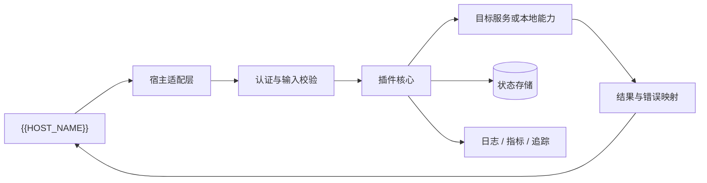
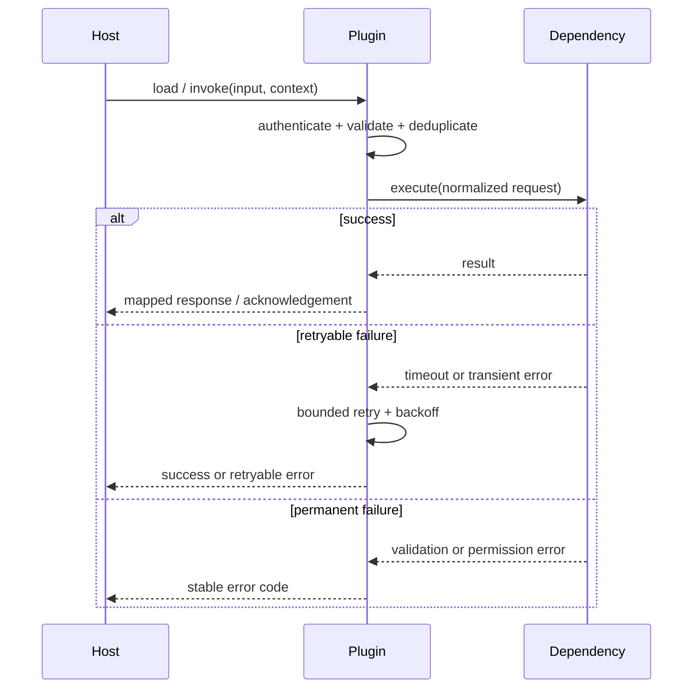

# {{PROJECT_NAME}}

> {{PROJECT_TAGLINE}}

[]({{CI_URL}})
[]({{REPOSITORY_URL}})
[]({{LICENSE_URL}})

[English](README.md) | [简体中文](README.zh-CN.md) · [配置](#配置) · [扩展契约](#扩展契约) · [故障排查](#故障排查)

<!--
适用：宿主应用插件、协议适配器、事件桥接器、工具扩展、渠道连接器。
使用前：
1. 从插件清单、宿主 API、源码、测试和 CI 核实全部事实。
2. 不存在双语 README 时删除语言切换链接。
3. 不存在发布版本、兼容性测试或可验证 CI 时删除对应徽章。
4. 删除不适用章节，不要用“暂无”占位。
-->

## 项目定位

{{PROJECT_DESCRIPTION}}

`{{PLUGIN_ID}}` 是面向 **{{HOST_NAME}}** 的 {{PACKAGE_NAME}}。它负责把宿主提供的事件、命令或能力转换为目标系统可接受的输入，并将处理结果以宿主约定的形式返回。

### 适合谁

- 希望在 {{HOST_NAME}} 中接入 {{PROJECT_NAME}} 能力的使用者；
- 需要扩展、调试或二次开发插件的工程团队；
- 需要审计插件权限、数据流和故障边界的运维与安全人员。

### 解决什么问题

| 问题 | 本插件提供 | 可验证入口 |
|---|---|---|
| 宿主与目标协议不一致 | 输入解析、协议转换、输出映射 | `{{MANIFEST_PATH}}`、集成测试 |
| 生命周期分散 | 统一加载、启动、停止和卸载行为 | 生命周期实现、测试 |
| 配置与密钥易混用 | 明确配置路径、优先级和秘密来源 | `{{CONFIG_PATH}}`、配置校验器 |
| 失败后状态不清晰 | 超时、重试、幂等和可观测性 | 错误模型、指标、日志 |

## 一眼看懂

```text
{{HOST_NAME}}
  │  事件 / 命令 / Hook / Tool Call
  ▼
┌─────────────────────────────────────┐
│ {{PROJECT_NAME}}                    │
│ ① 校验来源与权限                    │
│ ② 解析输入并建立执行上下文          │
│ ③ 调用目标服务或本地能力            │
│ ④ 映射结果、错误与可观测数据        │
└─────────────────────────────────────┘
  │  响应 / 回执 / 事件 / 状态
  ▼
宿主、用户或下游系统
```

| 项目属性 | 值 |
|---|---|
| 插件 ID | `{{PLUGIN_ID}}` |
| 宿主 | {{HOST_NAME}} {{HOST_VERSION}} |
| 当前版本 | {{CURRENT_VERSION}} |
| 插件清单 | `{{MANIFEST_PATH}}` |
| 配置入口 | `{{CONFIG_PATH}}` |
| 主要语言 | {{PRIMARY_LANGUAGE}} |
| 许可证 | {{LICENSE_NAME}} |

## 能力与边界

### 已支持

| 能力 | 输入 | 输出 | 限制 | 状态 |
|---|---|---|---|---|
| 能力 A | 事件或命令 | 结构化响应 | 说明大小、频率或权限限制 | 稳定 |
| 能力 B | 配置与请求 | 异步事件 | 说明宿主版本要求 | 实验性 |

### 不负责

- 不替代宿主的身份认证、租户隔离或权限中心；
- 不持久化超出插件职责的数据，除非“数据与状态”章节明确说明；
- 不保证目标服务不可用时仍能完成业务动作；
- 不把未通过兼容性测试的宿主版本声明为受支持。

### 成熟度

| 状态 | 含义 |
|---|---|
| 稳定 | 有自动化测试和兼容性承诺，可用于生产 |
| 实验性 | API 或行为可能调整，应固定版本并验证 |
| 规划中 | 尚不可用，不应出现在安装或快速开始中 |

## 架构与核心流程



### 组件职责

| 组件 | 负责 | 不负责 |
|---|---|---|
| 宿主适配层 | 生命周期、宿主 API、输入输出映射 | 领域决策 |
| 输入校验 | Schema、权限、大小和频率限制 | 自动修复恶意输入 |
| 插件核心 | 编排用例和错误语义 | 宿主内部状态管理 |
| 目标适配器 | 调用远端或本地依赖 | 泄漏供应商错误到公共契约 |
| 状态存储 | 幂等键、游标或必要缓存 | 保存明文秘密 |

### 调用时序



## 兼容性

| 插件版本 | 宿主版本 | 协议/API 版本 | 运行环境 | 状态 |
|---|---|---|---|---|
| {{CURRENT_VERSION}} | {{HOST_VERSION}} | v1 | {{RUNTIME_NAME}} {{RUNTIME_VERSION}} | 已验证 |

只填写 CI 矩阵或兼容性测试实际覆盖的组合。若宿主 API 存在破坏性变更，说明插件版本与宿主版本的对应策略。

## 安装

### 从插件市场安装

```text
{{INSTALL_COMMAND}}
```

### 从源码安装

```bash
git clone {{REPOSITORY_URL}}
cd {{PROJECT_NAME}}
{{BUILD_COMMAND}}
```

构建产物应放入宿主文档指定的插件目录，或通过宿主提供的安装命令加载。不要在 README 中假设本机绝对路径。

### 确认加载成功

```text
plugin id: {{PLUGIN_ID}}
status: active
version: {{CURRENT_VERSION}}
```

给出宿主中真实可执行的检查命令、管理页入口或健康检查，并写明预期结果。

## 快速开始

### 1. 准备前置条件

- 已安装并启动 {{HOST_NAME}} {{HOST_VERSION}}；
- 已获得目标系统所需的最小权限凭据；
- 网络、代理和证书满足目标服务要求；
- 插件版本与宿主版本匹配。

### 2. 写入最小配置

```yaml
enabled: true
endpoint: https://api.example.com
credentialRef: env:PLUGIN_API_TOKEN
timeout: 10s
```

### 3. 设置秘密

```bash
export PLUGIN_API_TOKEN="replace-with-secret-store-value"
```

示例变量仅说明注入方式，不应提交真实值。

### 4. 触发一次调用

```text
{{START_COMMAND}}
```

预期观察：宿主收到成功响应；插件日志包含请求 ID，不包含令牌或完整敏感载荷；指标中成功计数增加。

## 配置

### 配置入口与优先级

配置文件：`{{CONFIG_PATH}}`

建议优先级从高到低为：

1. 单次调用或宿主动态配置；
2. 环境变量或秘密管理系统；
3. 插件配置文件；
4. 代码默认值。

### 完整示例

```yaml
enabled: true
endpoint: https://api.example.com
credentialRef: env:PLUGIN_API_TOKEN
connectTimeout: 3s
requestTimeout: 10s
retry:
  maxAttempts: 3
  initialBackoff: 200ms
  maxBackoff: 2s
  retryableStatus: [429, 502, 503, 504]
idempotency:
  enabled: true
  ttl: 24h
rateLimit:
  requestsPerSecond: 20
observability:
  logLevel: info
  metrics: true
  tracing: true
```

### 字段说明

| 字段 | 类型 | 默认值 | 必填 | 含义 | 安全要求 |
|---|---|---:|:---:|---|---|
| `enabled` | boolean | `true` | 否 | 是否启用插件 | — |
| `endpoint` | URL | — | 是 | 目标服务地址 | 生产环境使用 TLS |
| `credentialRef` | string | — | 是 | 秘密引用 | 禁止填写明文令牌 |
| `requestTimeout` | duration | `10s` | 否 | 单次请求总超时 | 小于宿主调用超时 |
| `retry.maxAttempts` | integer | `3` | 否 | 最大尝试次数 | 仅重试幂等操作 |

### 配置校验

启动时应拒绝未知字段、非法 URL、负数超时、无效凭据引用和互斥选项。说明错误输出位置以及插件是否会阻止宿主启动。

## 扩展契约

### 生命周期

| 阶段 | 输入 | 必须完成 | 失败语义 |
|---|---|---|---|
| `install` | 清单、宿主上下文 | 校验兼容性、准备资源 | 安装失败，不留下半成品 |
| `load` | 配置、秘密引用 | 注册能力但不处理流量 | 标记不可用 |
| `start` | 运行上下文 | 建立连接、启动消费者 | 可重试或熔断 |
| `stop` | 终止信号 | 停止接收、排空任务 | 超时后安全终止 |
| `uninstall` | 卸载请求 | 删除插件自有资源 | 用户数据按策略保留或删除 |

### 输入契约

```json
{
  "requestId": "req-001",
  "action": "example.execute",
  "payload": {},
  "context": {
    "tenantId": "tenant-001",
    "actorId": "user-001"
  }
}
```

说明必填字段、最大载荷、字符编码、未知字段策略和向后兼容规则。

### 输出契约

```json
{
  "requestId": "req-001",
  "success": true,
  "data": {},
  "error": null
}
```

### 稳定错误模型

| 错误码 | 含义 | 是否重试 | 宿主动作 |
|---|---|:---:|---|
| `INVALID_INPUT` | 输入不符合契约 | 否 | 修正请求 |
| `UNAUTHORIZED` | 凭据无效或权限不足 | 否 | 更新授权 |
| `RATE_LIMITED` | 达到限流阈值 | 是 | 遵循退避时间 |
| `DEPENDENCY_UNAVAILABLE` | 依赖暂时不可用 | 是 | 有界重试或稍后重放 |
| `INTERNAL_ERROR` | 未分类内部错误 | 视情况 | 使用请求 ID 排查 |

## 重试、幂等与恢复

- 只对确认安全的幂等操作自动重试；
- 使用请求 ID、事件 ID 或业务键去重，明确去重窗口；
- 指数退避应带随机抖动并受宿主总超时约束；
- 对持续失败使用熔断、死信或人工重放，不无限循环；
- ACK 应在业务完成后还是接收后发生，必须写清楚；
- 插件重启后是否恢复游标、队列和未完成任务，必须有测试证据。

## 数据与状态

| 数据 | 存储位置 | 生命周期 | 加密 | 清理方式 |
|---|---|---|---|---|
| 幂等键 | 插件状态库 | {{VERSION}} 定义的 TTL | 传输/静态加密 | 自动过期 |
| 游标 | 插件状态库 | 与订阅绑定 | 静态加密 | 卸载或重置命令 |
| 凭据 | 外部秘密管理 | 外部策略 | 由秘密系统负责 | 外部吊销 |

说明升级、卸载、租户删除和灾难恢复时的数据行为。

## 安全

- 声明插件请求的宿主权限及其用途，遵循最小权限；
- 校验事件来源、签名、时间戳和重放窗口；
- 对外部 URL、文件路径、命令参数和模板输入做边界校验；
- 日志、指标、追踪和错误消息必须脱敏；
- 依赖调用设置 TLS、证书校验、超时、限流和响应大小上限；
- 漏洞请通过 {{SECURITY_CONTACT}} 私下报告。

## 可观测性与运行

### 日志

至少包含：插件版本、宿主版本、请求 ID、动作、耗时、结果类别和稳定错误码。禁止记录令牌、Cookie、完整个人数据和未经裁剪的大载荷。

### 指标

| 指标 | 类型 | 含义 |
|---|---|---|
| `plugin_requests_total` | Counter | 按动作和结果统计调用量 |
| `plugin_request_duration_seconds` | Histogram | 端到端耗时 |
| `plugin_retries_total` | Counter | 重试次数及原因 |
| `plugin_inflight_requests` | Gauge | 当前执行中的请求 |

### 健康检查

区分：插件进程存活、配置有效、依赖可达、业务可用。依赖短暂失败不应自动等同于宿主整体不健康。

## 开发与验证

```bash
{{BUILD_COMMAND}}
{{TEST_COMMAND}}
```

最低质量门禁：

- 清单和配置 Schema 校验；
- 生命周期单元测试；
- 输入输出契约测试；
- 宿主兼容性矩阵测试；
- 依赖超时、限流、断连和畸形响应测试；
- 幂等、重试、重启恢复和卸载清理测试；
- 包产物可重复构建和秘密扫描。

## 打包与发布

发布包应包含插件清单、运行产物、配置 Schema、许可证和必要资源。发布前核对版本一致性、宿主兼容范围、升级说明、校验和与签名。

```text
source -> lint/test -> compatibility -> package -> sign -> publish -> smoke test
```

## 升级与迁移

| 变更 | 兼容性 | 用户动作 |
|---|---|---|
| 新增可选配置 | 向后兼容 | 无 |
| 删除或重命名配置 | 破坏性 | 按迁移指南修改 |
| 宿主 API 升级 | 取决于适配层 | 升级匹配的插件版本 |
| 状态格式升级 | 需迁移 | 备份并执行迁移命令 |

说明是否支持回滚，以及新版本写入的状态能否被旧版本读取。

## 故障排查

| 现象 | 优先检查 | 处理方式 |
|---|---|---|
| 插件未被发现 | 安装目录、清单、插件 ID | 运行宿主插件检查命令 |
| 加载失败 | 宿主版本、配置 Schema、依赖 | 查看启动错误码 |
| 调用超时 | 宿主总超时、插件超时、网络 | 缩短重试链并检查依赖 |
| 重复处理 | ACK 时机、幂等键、状态库 | 核对事件 ID 与去重窗口 |
| 无响应但有日志 | 输出映射、宿主回调、权限 | 开启调试追踪并使用请求 ID |
| 升级后异常 | 状态迁移、配置弃用 | 依照迁移指南或安全回滚 |

## 项目结构

```text
{{PROJECT_NAME}}/
├── {{MANIFEST_PATH}}       # 插件身份、入口和权限
├── {{CONFIG_PATH}}         # 配置或 Schema
├── src/                    # 适配层、核心与基础设施
├── tests/                  # 契约、兼容性与故障测试
├── docs/                   # 架构、安全、迁移和协议文档
└── examples/               # 最小可运行示例
```

## 深入文档

- [架构设计]({{DOCS_URL}})
- [配置参考]({{DOCS_URL}})
- [协议与契约]({{DOCS_URL}})
- [安全说明]({{DOCS_URL}})
- [升级指南]({{DOCS_URL}})

## 贡献与支持

提交变更前请说明目标宿主版本，补充契约与兼容性测试，并确保不会扩大默认权限。功能问题提交到 [Issues]({{ISSUES_URL}})，安全问题通过 {{SECURITY_CONTACT}} 报告。

## 许可证

本项目采用 [{{LICENSE_NAME}}]({{LICENSE_URL}}) 许可证。
