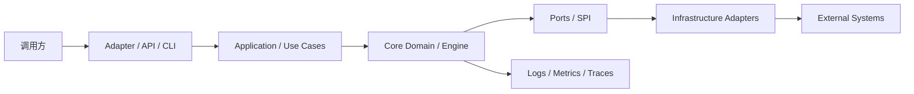
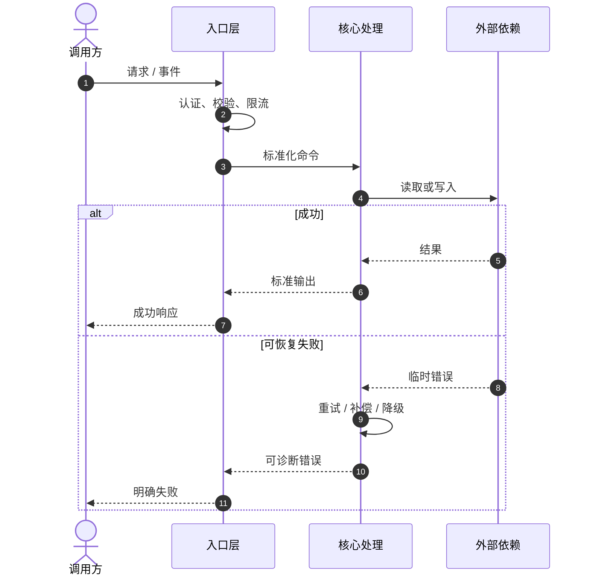
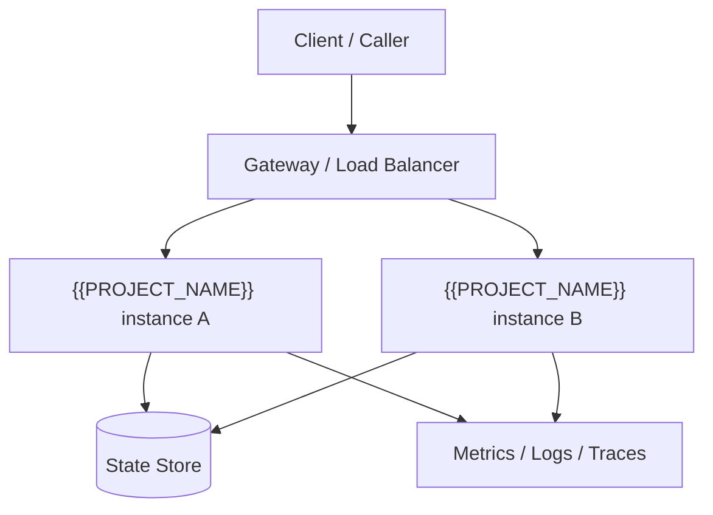

<!--
README authoring instructions:
1. Replace every double-brace placeholder with verified project facts.
2. Keep the required early reading path; delete optional sections that do not apply.
3. Treat single-brace text such as {说明...} as writing guidance and remove it after filling.
4. Keep commands executable and include observable expected results.
5. Never commit real credentials, private local paths, or unsupported status claims.
6. For bilingual READMEs, keep section order and technical identifiers synchronized.
-->

<a id="readme-top"></a>

<div align="center">

# {{PROJECT_NAME}}

**{{PROJECT_TAGLINE}}**

{用一行补充目标用户、核心场景和最主要差异；不要重复标题。}

[]({{REPOSITORY_URL}}/releases)
[]({{CI_URL}})
[]({{LICENSE_URL}})
[](#运行要求)

[English](./README.md) | [简体中文](./README.zh-CN.md)

[项目简介](#1-项目简介) ·
[架构](#3-一眼看懂) ·
[快速开始](#6-快速开始) ·
[配置](#8-配置) ·
[开发](#13-本地开发) ·
[排障](#18-故障排查与常见问题) ·
[贡献](#23-贡献指南)

</div>

---

> **成熟度**：{实验性 / 预览 / 稳定 / 长期支持}<br>
> **当前版本**：`{{CURRENT_VERSION}}`<br>
> **维护状态**：{积极维护 / 维护模式 / 已归档}<br>
> **最后核验**：{{DATE}}

## 1. 项目简介

{{PROJECT_DESCRIPTION}}

### 1.1 一句话定位

**{{PROJECT_NAME}} 是一个面向 {目标用户} 的 {项目类型}，通过 {核心机制} 解决 {核心问题}。**

### 1.2 目标用户

| 用户 | 主要诉求 | 本项目提供的价值 |
|---|---|---|
| {用户类型 A} | {问题或任务} | {能力与结果} |
| {用户类型 B} | {问题或任务} | {能力与结果} |

### 1.3 项目速览

| 项目 | 内容 |
|---|---|
| 项目类型 | {库 / SDK / 框架 / 插件 / CLI / 服务 / 应用 / 示例 / 目录} |
| 包或制品 | `{{PACKAGE_NAME}}` |
| 当前版本 | `{{CURRENT_VERSION}}` |
| 运行时 | `{{RUNTIME_NAME}} {{RUNTIME_VERSION}}` |
| 主要语言 | `{{PRIMARY_LANGUAGE}}` |
| 配置入口 | `{{CONFIG_FILE}}` |
| 文档 | [{{DOCS_URL}}]({{DOCS_URL}}) |
| 问题反馈 | [{{ISSUES_URL}}]({{ISSUES_URL}}) |
| 许可证 | [{{LICENSE_NAME}}]({{LICENSE_URL}}) |

### 1.4 适用与不适用场景

**适合：**

- {适用场景及可观察结果}
- {适用场景及约束}
- {适用场景及规模边界}

**不适合或不负责：**

- {明确非目标，例如不替代数据库、消息代理、身份提供商或业务系统}
- {尚未支持的平台、协议、规模或合规范围}
- {需要由使用方承担的职责}

## 2. 为什么选择本项目

### 2.1 问题与解决方案

| 问题 | 常见后果 | 本项目的解决方式 | 证据或验证 |
|---|---|---|---|
| {问题 A} | {后果} | {机制} | {测试、基准、实现或案例链接} |
| {问题 B} | {后果} | {机制} | {测试、基准、实现或案例链接} |

### 2.2 核心能力

| 能力 | 状态 | 说明 | 起始版本 |
|---|:---:|---|---|
| {能力 A} | ✅ 稳定 | {输入、行为、输出} | `{版本}` |
| {能力 B} | 🧪 预览 | {限制和启用方式} | `{版本}` |
| {能力 C} | 🗓️ 计划 | {目标而非承诺} | `{版本或 TBD}` |

> 状态必须与代码、测试、发布版本和路线图一致。不要把“计划中”写成“已支持”。

### 2.3 典型使用场景

| 场景 | 推荐组合或入口 | 结果 |
|---|---|---|
| {场景 A} | {模块、命令或 API} | {可观察结果} |
| {场景 B} | {模块、命令或 API} | {可观察结果} |

## 3. 一眼看懂

> 首屏架构优先使用 `text` 图，确保在代码托管平台、包注册中心和终端中都可阅读。

```text
[外部输入 / 调用方]
          │
          ▼
┌──────────────────────────────────────────────────────────┐
│ {{PROJECT_NAME}}                                         │
│ 1. 接入与校验：{认证、解析、边界检查}                     │
│ 2. 核心处理：{编排、计算、转换、持久化}                   │
│ 3. 输出与观测：{响应、事件、指标、日志}                   │
└──────────────────────────────────────────────────────────┘
          │
          ▼
[结果 / 下游系统 / 用户可见输出]

异常路径：{失败如何暴露、重试、回滚、降级或进入死信/人工处理}
```

### 3.1 输入、处理与输出

| 阶段 | 内容 | 契约或证据 |
|---|---|---|
| 输入 | {请求、事件、文件、命令或用户操作} | {Schema、接口或示例} |
| 校验 | {格式、权限、幂等、限制} | {实现或测试} |
| 处理 | {核心业务或技术阶段} | {模块或调用链} |
| 输出 | {响应、事件、文件、状态变化} | {Schema 或预期输出} |
| 失败 | {错误分类、重试、回滚、补偿} | {错误模型或运维手册} |

## 4. 架构与核心流程

### 4.1 架构原则

- **边界清晰**：{核心层与适配层如何隔离}
- **依赖单向**：{允许和禁止的依赖方向}
- **失败可见**：{错误、日志、指标、追踪策略}
- **默认安全**：{最小权限、输入限制、敏感信息策略}
- **可演进**：{扩展点、兼容策略、迁移策略}

### 4.2 模块关系



| 模块 | 职责 | 对外契约 | 允许依赖 | 禁止承担 |
|---|---|---|---|---|
| `{module-core}` | {核心模型与规则} | {接口/类型} | {纯语言标准库等} | {框架绑定、I/O} |
| `{module-adapter}` | {协议或框架适配} | {入口} | `{module-core}` | {复制核心规则} |
| `{module-runtime}` | {启动、装配、生命周期} | {命令/服务} | {adapter/core} | {隐藏失败} |

### 4.3 核心时序



### 4.4 能力与责任边界

| 维度 | 本项目负责 | 使用方或外部系统负责 |
|---|---|---|
| 数据 | {解析、校验、转换范围} | {数据质量、保留、主数据等} |
| 安全 | {认证接入、权限检查、脱敏} | {凭据轮换、网络策略、账号治理} |
| 可靠性 | {重试、幂等、超时、恢复} | {外部集群可用性、容量规划} |
| 可观测性 | {日志、指标、追踪字段} | {采集平台、告警路由、值班响应} |

## 5. 运行要求

### 5.1 环境与工具链

| 依赖 | 最低版本 | 推荐版本 | 用途 | 验证命令 |
|---|---:|---:|---|---|
| `{{RUNTIME_NAME}}` | `{{RUNTIME_VERSION}}` | `{推荐版本}` | 运行项目 | `{version command}` |
| `{{PACKAGE_MANAGER}}` | `{最低版本}` | `{推荐版本}` | 依赖与脚本 | `{version command}` |
| {外部服务} | `{最低版本}` | `{推荐版本}` | {用途} | {健康检查} |

### 5.2 兼容性矩阵

| 项目版本 | 运行时 | 框架/宿主 | 平台 | 状态 |
|---|---|---|---|:---:|
| `{{CURRENT_VERSION}}` | `{{RUNTIME_VERSION}}` | `{版本范围}` | `{平台}` | ✅ |
| `{旧版本线}` | `{运行时}` | `{版本范围}` | `{平台}` | 🛠️ 维护 |

### 5.3 前置条件

- {账号、服务、端口、权限或证书}
- {需要提前创建的资源}
- {网络和存储要求}

## 6. 快速开始

> 目标：让全新环境在最少步骤内得到一个可观察的成功结果。命令必须经过真实执行验证。

### 6.1 安装

```bash
{{INSTALL_COMMAND}}
```

### 6.2 最小配置

```yaml
# {{CONFIG_FILE}}
project:
  enabled: true
  endpoint: "${PROJECT_ENDPOINT:-http://localhost:8080}"
  timeout: 10s
```

### 6.3 最小运行示例

```bash
{{START_COMMAND}}
```

### 6.4 预期结果

```text
{粘贴稳定、简短且不包含敏感信息的预期输出}
```

验证：

```bash
{健康检查、示例请求或结果文件检查命令}
```

如果结果不同，直接跳到[故障排查](#18-故障排查与常见问题)。

## 7. 安装方式

### 7.1 包管理器安装

```bash
{{INSTALL_COMMAND}}
```

### 7.2 从源码构建

```bash
git clone {{REPOSITORY_URL}}
cd {{PROJECT_NAME}}
{{PACKAGE_MANAGER}} install
{{BUILD_COMMAND}}
```

<!-- OPTIONAL: 仅发布容器镜像时保留。 -->
### 7.3 容器运行

```bash
docker pull {registry}/{image}:{{CURRENT_VERSION}}
docker run --rm -p 8080:8080 --env-file .env {registry}/{image}:{{CURRENT_VERSION}}
```

<!-- OPTIONAL: 仅提供平台包或安装器时保留。 -->
### 7.4 平台安装包

| 平台 | 架构 | 安装包 | 校验值 |
|---|---|---|---|
| {平台} | `{架构}` | [下载]({release asset URL}) | `{SHA256}` |

## 8. 配置

### 8.1 配置来源与优先级

```text
命令行参数 > 环境变量 > 项目配置文件 > 用户配置文件 > 内置默认值
```

| 层级 | 入口 | 使用场景 |
|---|---|---|
| 命令行 | `{--option}` | 单次运行覆盖 |
| 环境变量 | `{PROJECT_OPTION}` | 容器和密钥注入 |
| 项目配置 | `{{CONFIG_FILE}}` | 仓库级共享设置 |
| 用户配置 | `{user config path}` | 本机偏好，不提交仓库 |

### 8.2 核心配置项

| 配置项 | 类型 | 必填 | 默认值 | 说明 | 敏感 |
|---|---|:---:|---|---|:---:|
| `project.enabled` | boolean | 否 | `true` | 是否启用 | 否 |
| `project.endpoint` | string | 是 | — | 服务地址 | 否 |
| `project.token` | SecretRef | 是 | — | 访问凭据，只允许安全注入 | 是 |
| `project.timeout` | duration | 否 | `10s` | 请求超时 | 否 |

### 8.3 完整配置示例

```yaml
project:
  enabled: true
  endpoint: "${PROJECT_ENDPOINT}"
  token: "${PROJECT_TOKEN}"
  timeout: 10s
  retry:
    maxAttempts: 3
    backoff: 500ms
  observability:
    metrics: true
    tracing: true
```

### 8.4 凭据与敏感配置

- 使用环境变量、SecretRef 或密钥管理服务，不在 README 中填写真实值。
- 日志不得输出 token、密码、私钥、完整连接串或用户敏感数据。
- 说明凭据最小权限、轮换方式和失效后的恢复步骤。
- 示例账号必须是不可用占位符，不能使用通用弱密码。

### 8.5 配置校验

```bash
{config validate command}
```

校验失败必须返回非零退出码，并指出字段路径和修复建议。

## 9. 使用指南

### 9.1 场景一：最常见路径

```{{PRIMARY_LANGUAGE}}
// {提供可编译或可运行的最小示例}
```

**输入**：{输入说明}<br>
**输出**：{输出说明}<br>
**失败**：{错误类型及处理方式}

### 9.2 场景二：组合能力

```{{PRIMARY_LANGUAGE}}
// {展示两个核心能力如何组合，而不是重复安装示例}
```

### 9.3 场景三：异步、流式或批处理

```{{PRIMARY_LANGUAGE}}
// {按项目能力展示取消、背压、超时、部分失败或进度回调}
```

### 9.4 错误处理

| 错误类别 | 是否重试 | 调用方动作 | 观测字段 |
|---|:---:|---|---|
| 参数错误 | 否 | 修正请求 | `error.code`, `field` |
| 鉴权失败 | 否 | 更新凭据 | `requestId`, `principal` |
| 临时依赖失败 | 是 | 指数退避 | `attempt`, `dependency` |
| 永久业务失败 | 否 | 人工或补偿流程 | `businessKey`, `reason` |

## 10. API、CLI 或公共入口

> 库/SDK 保留 API；CLI 保留命令；服务保留端点；插件保留宿主契约。不复制自动生成的全部参考文档。

### 10.1 入口概览

| 入口 | 类型 | 用途 | 稳定性 | 详细文档 |
|---|---|---|:---:|---|
| `{entrypoint}` | {API/CLI/SPI/HTTP} | {用途} | 稳定 | [参考]({relative docs link}) |

### 10.2 最小契约

```text
Input  -> {schema or type}
Output -> {schema or type}
Error  -> {error model}
```

### 10.3 兼容与弃用规则

- {语义化版本或日期版本规则}
- {公共 API 的兼容承诺}
- {弃用通知周期和迁移入口}
- {实验性 API 的标识方式}

## 11. 项目结构

```text
{{PROJECT_NAME}}/
├── src/                 # 生产源码
├── tests/               # 单元、集成与契约测试
├── examples/            # 可运行示例
├── docs/                # 深度设计与使用文档
├── scripts/             # 构建、校验和发布脚本
├── {{CONFIG_FILE}}      # 项目配置
└── README.md
```

| 目录或模块 | 职责 | 主要入口 | 验证方式 |
|---|---|---|---|
| `src/{core}` | {核心职责} | `{symbol/file}` | `{test command}` |
| `src/{adapter}` | {适配职责} | `{symbol/file}` | `{test command}` |
| `examples/` | {演示能力} | `{example}` | `{run command}` |

## 12. 扩展与集成

<!-- OPTIONAL: 仅项目提供 SPI、插件、Provider 或 Hook 时保留。 -->

### 12.1 扩展点

| 扩展点 | 契约 | 生命周期 | 线程/并发模型 | 示例 |
|---|---|---|---|---|
| `{Provider}` | `{interface/trait}` | {创建到销毁} | {约束} | [示例]({link}) |

### 12.2 实现一个扩展

1. 实现稳定契约。
2. 注册或声明扩展元数据。
3. 增加契约测试和失败场景测试。
4. 验证并发、超时、资源释放和兼容性。
5. 更新扩展目录和版本说明。

### 12.3 集成边界

- {宿主生命周期与扩展生命周期关系}
- {禁止访问的内部 API}
- {隔离、资源配额和错误传播规则}

## 13. 本地开发

### 13.1 获取源码

```bash
git clone {{REPOSITORY_URL}}
cd {{PROJECT_NAME}}
{{PACKAGE_MANAGER}} install
```

### 13.2 常用命令

| 任务 | 命令 | 预期结果 |
|---|---|---|
| 构建 | `{{BUILD_COMMAND}}` | 生成可发布制品 |
| 单元测试 | `{{TEST_COMMAND}}` | 全部测试通过 |
| 静态检查 | `{lint command}` | 0 error |
| 格式检查 | `{format check command}` | 无差异 |
| 文档检查 | `{docs check command}` | 链接、示例、结构通过 |
| 示例运行 | `{example command}` | 输出文档中的预期结果 |

### 13.3 开发约定

- 代码风格：{格式化器、lint 和命名规则}
- 分支策略：{主干、版本线、发布分支}
- 提交规范：{Conventional Commits 或项目规则}
- 变更要求：{测试、文档、兼容性、变更日志}

## 14. 测试与质量保证

### 14.1 测试矩阵

| 类型 | 覆盖范围 | 命令 | 外部依赖 |
|---|---|---|---|
| 单元测试 | {核心规则} | `{{TEST_COMMAND}}` | 无 |
| 集成测试 | {适配器与基础设施} | `{integration command}` | {容器或服务} |
| 契约测试 | {API/SPI/协议兼容} | `{contract command}` | {依赖} |
| 端到端测试 | {关键用户旅程} | `{e2e command}` | {环境} |

### 14.2 发布门禁

```bash
{{BUILD_COMMAND}}
{{TEST_COMMAND}}
{lint command}
{compatibility command}
{documentation command}
```

### 14.3 质量声明

| 指标 | 当前值 | 证据 | 核验日期 |
|---|---:|---|---|
| 测试 | {数量或状态} | {CI 或报告链接} | {{DATE}} |
| 覆盖率 | {值及统计口径} | {报告链接} | {{DATE}} |
| 静态检查 | {状态} | {CI 链接} | {{DATE}} |

## 15. 部署与运维

<!-- OPTIONAL: 仅拥有运行时、服务、后台进程或持久状态时保留。 -->

### 15.1 部署拓扑



### 15.2 健康与就绪

| 检查 | 端点或命令 | 成功条件 | 失败动作 |
|---|---|---|---|
| Liveness | `{endpoint}` | {条件} | 重启实例 |
| Readiness | `{endpoint}` | {条件} | 摘除流量 |
| Dependency | `{command}` | {条件} | 降级或告警 |

### 15.3 可观测性

| 信号 | 必要字段 | 主要用途 |
|---|---|---|
| 日志 | `timestamp`, `level`, `requestId`, `error.code` | 故障定位 |
| 指标 | 吞吐、延迟、错误率、饱和度 | 告警与容量 |
| 追踪 | trace/span、依赖、重试 | 全链路分析 |

### 15.4 备份、恢复与回滚

- 备份对象：{数据库、配置、游标、索引、文件}
- 恢复目标：RPO `{值}`，RTO `{值}`
- 升级前检查：{兼容、容量、迁移、备份}
- 回滚触发：{错误率、数据校验、业务指标}
- 回滚步骤：{命令或运行手册链接}

## 16. 安全

### 16.1 信任边界

| 边界 | 威胁 | 控制措施 |
|---|---|---|
| 外部输入 → 项目 | 注入、超限、伪造 | Schema、限流、认证、大小限制 |
| 项目 → 外部服务 | 凭据泄露、SSRF | SecretRef、目标白名单、TLS |
| 多租户或多账号 | 越权、数据串用 | 身份绑定、租户隔离、审计 |

### 16.2 安全基线

- 默认最小权限，危险能力必须显式启用。
- 依赖、镜像和发布制品应有来源及完整性校验。
- 敏感数据在传输和存储时采用适当保护。
- 日志、错误和遥测数据必须脱敏。
- 明确输入大小、速率、超时和资源上限。

### 16.3 漏洞报告

不要公开提交未修复漏洞。请通过 `{{SECURITY_CONTACT}}` 或仓库安全公告通道报告，并提供影响版本、复现步骤和建议缓解方式。

## 17. 性能与容量

<!-- OPTIONAL: 只有可复现基准时才保留具体数字。 -->

### 17.1 基准环境

| 项目 | 值 |
|---|---|
| 版本/提交 | `{{CURRENT_VERSION}}` / `{commit}` |
| 硬件 | {CPU、内存、磁盘、网络} |
| 数据规模 | {请求、消息、文件或记录规模} |
| 命令 | `{benchmark command}` |

### 17.2 基准结果

| 场景 | 吞吐 | P50 | P95 | P99 | 错误率 |
|---|---:|---:|---:|---:|---:|
| {场景} | {值} | {值} | {值} | {值} | {值} |

> 基准只描述该环境的结果，不等同于生产容量承诺。容量规划还需考虑依赖、数据分布、并发模型和故障冗余。

## 18. 故障排查与常见问题

### 18.1 排查顺序

```text
版本与兼容性
    ↓
配置路径与字段
    ↓
凭据和网络
    ↓
项目日志 / 指标 / 追踪
    ↓
外部依赖状态
    ↓
最小复现与问题报告
```

### 18.2 常见问题

| 症状 | 可能原因 | 诊断方式 | 解决方案 |
|---|---|---|---|
| 无法启动 | {版本或配置错误} | `{diagnostic command}` | {修复步骤} |
| 请求超时 | {网络、依赖、容量} | {日志和指标} | {重试、超时或扩容} |
| 结果重复 | {幂等或 ACK 问题} | {业务键和投递记录} | {幂等键、去重或确认策略} |
| 升级失败 | {不兼容或迁移未执行} | {版本和迁移状态} | {迁移或回滚} |

### 18.3 提交有效问题报告

请提供：

- 项目、运行时和依赖版本
- 操作系统与部署方式
- 已脱敏的最小配置
- 最小复现步骤
- 预期行为与实际行为
- 相关日志、错误码和追踪 ID
- 已尝试的排查动作

## 19. 兼容、升级与迁移

### 19.1 版本策略

- 版本格式：{SemVer / CalVer / 项目规则}
- 支持窗口：{当前版本线和维护期限}
- 破坏性变更：{发布和通知规则}
- 安全修复：{回补策略}

### 19.2 升级步骤

1. 阅读变更日志和已知问题。
2. 核对运行时、宿主、依赖和配置兼容性。
3. 在隔离环境备份并演练迁移。
4. 运行兼容性、数据和回滚测试。
5. 灰度发布并观察关键指标。

### 19.3 弃用与迁移表

| 旧入口 | 新入口 | 弃用版本 | 移除版本 | 迁移说明 |
|---|---|---|---|---|
| `{old}` | `{new}` | `{version}` | `{version}` | [指南]({link}) |

## 20. 路线图与项目状态

| 里程碑 | 状态 | 目标 | 验收证据 |
|---|:---:|---|---|
| `{{CURRENT_VERSION}}` | ✅ 已发布 | {范围} | [Release]({release link}) |
| `{next}` | 🚧 进行中 | {范围} | [Milestone]({milestone link}) |
| `{future}` | 🗓️ 计划 | {方向} | {TBD} |

路线图表达方向，不构成未经确认的交付承诺。

## 21. 文档与示例

| 资源 | 内容 | 适合读者 |
|---|---|---|
| [使用指南]({relative link}) | 从入门到常见场景 | 使用者 |
| [架构设计]({relative link}) | 边界、模块、数据流、决策 | 维护者/架构师 |
| [API 参考]({relative link}) | 完整公共契约 | 开发者 |
| [安全说明]({relative link}) | 威胁模型与披露流程 | 安全/运维 |
| [示例目录]({relative link}) | 可运行示例 | 开发者 |
| [变更日志]({relative link}) | 版本差异与迁移 | 所有人 |

## 22. 发布与制品

### 22.1 发布渠道

| 制品 | 渠道 | 命名 | 校验方式 |
|---|---|---|---|
| {包/库} | {registry} | `{{PACKAGE_NAME}}` | {签名/校验值} |
| {容器} | {registry} | `{image}` | {签名/SBOM} |

### 22.2 发布流程

```text
版本确认 → 全量门禁 → 构建制品 → 签名与 SBOM → 发布 → 安装验证 → 公告
```

发布记录必须关联源码提交、制品版本、变更日志和验证结果。

## 23. 贡献指南

欢迎贡献代码、文档、测试和问题复现。开始前请阅读 [CONTRIBUTING.md](CONTRIBUTING.md)。

### 23.1 推荐流程

1. 先搜索现有 Issue 和讨论。
2. 对大改动先提交设计说明或提案。
3. 从最新目标分支创建分支。
4. 增加实现、测试、文档和迁移说明。
5. 运行全部本地门禁。
6. 提交范围清晰的 Pull Request，并说明验证证据。

### 23.2 贡献检查清单

- [ ] 改动范围和动机清晰
- [ ] 新增或更新测试
- [ ] 更新 README、API 或架构文档
- [ ] 兼容性和迁移影响已说明
- [ ] 安全、性能和运维影响已评估
- [ ] 构建、测试、格式、静态检查全部通过

## 24. 社区、支持与治理

| 渠道 | 用途 | 链接 |
|---|---|---|
| Issues | 缺陷和可复现问题 | [提交问题]({{ISSUES_URL}}) |
| Discussions | 使用交流和方案讨论 | [参与讨论]({{REPOSITORY_URL}}/discussions) |
| Security | 私密漏洞报告 | `{{SECURITY_CONTACT}}` |
| Documentation | 使用与设计资料 | [文档]({{DOCS_URL}}) |

### 24.1 支持边界

- 社区支持：{范围与响应预期}
- 商业支持：{如适用，说明入口，不写模糊承诺}
- 不受支持：{EOL 版本、私有 fork、未经验证组合等}

### 24.2 行为准则

参与社区即表示同意遵守 [CODE_OF_CONDUCT.md](CODE_OF_CONDUCT.md)。

## 25. 许可证与致谢

本项目采用 [{{LICENSE_NAME}}]({{LICENSE_URL}}) 许可证。

### 25.1 第三方依赖与归属

- 第三方许可证和 NOTICE：见 `{NOTICE or third-party file}`。
- 衍生或移植内容：明确原项目、许可证和修改范围。
- 商标：项目许可证不自动授予第三方商标使用权。

### 25.2 致谢

感谢所有贡献者、上游项目和社区成员。

---

<div align="center">

**[返回顶部](#readme-top)**

{{PROJECT_NAME}} · {{CURRENT_VERSION}} · {{DATE}}

</div>
