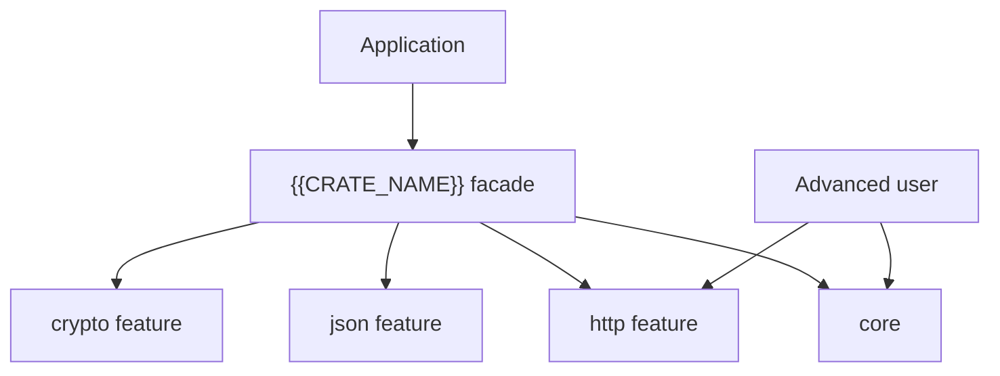

# Rust README 剖面：大型工具箱 Workspace

> 适用于由大量独立 crate、Facade、可选 feature 和平台后端组成的工具集合或基础能力 workspace。

## 使用入口

大型 workspace 首先要回答“用户应该依赖哪个 crate”，而不是只展示目录树。

| 需求 | 推荐依赖 | Features | 代价/限制 |
|---|---|---|---|
| 常用核心工具 | `{{CRATE_NAME}}` | 默认 features | 最简单入口 |
| 单一领域能力 | `{domain-crate}` | 最小 features | 依赖和编译更小 |
| 全部能力 | `{{CRATE_NAME}}` | `full` | 编译时间、体积和平台依赖增加 |
| 上游兼容命名 | `{compat-crate}` | 按需 | 仅覆盖兼容矩阵列出的 API |

```toml
[dependencies]
{{CRATE_NAME}} = "{{CURRENT_VERSION}}"

# 或只依赖单个领域 crate
{domain-crate} = "{{CURRENT_VERSION}}"
```

## 能力地图

按用户任务分组，而不是按仓库字母顺序罗列。

| 领域 | Crate | 代表能力 | 默认启用 | 平台/安全说明 | 状态 |
|---|---|---|:---:|---|---|
| Core | `{core-crate}` | 字符串、集合、类型、ID | ✅ | 无系统依赖 | 稳定 |
| Data | `{data-crate}` | JSON、CSV、配置 | 按需 | 输入大小限制 | 稳定 |
| Crypto | `{crypto-crate}` | 哈希、加密、签名 | 否 | 安全级别见专节 | 稳定/受限 |
| Network | `{http-crate}` | HTTP、代理、TLS | 否 | 网络和 TLS feature | 稳定 |
| Database | `{db-crate}` | SQL、连接适配 | 否 | 后端互斥或可组合 | 实验性 |

## Facade 与重导出



| Facade 模块 | 重导出 crate | Feature | 稳定性 |
|---|---|---|---|
| `{{CRATE_NAME}}::core` | `{core-crate}` | `core` | 稳定 |
| `{{CRATE_NAME}}::http` | `{http-crate}` | `http` | 稳定 |

说明 Facade 是否只重导出、是否增加统一错误/配置，以及直接依赖子 crate 与通过 Facade 使用的 SemVer 差异。

## Feature 成本与组合

| Feature | Crates | 编译/体积影响 | 系统依赖 | Runtime | 安全影响 | 可与其他组合 |
|---|---|---|---|---|---|---|
| `core` | `{core}` | 低 | 无 | 无 | 低 | 是 |
| `http` | `{http}` | 中 | TLS | async | 网络边界 | 是 |
| `database` | `{db}` | 高 | 驱动 | async | 凭据/SQL | 见后端规则 |
| `full` | 全部 | 高 | 多项 | 多项 | 扩大攻击面 | 汇总 |

必须验证：默认、`--no-default-features`、单 feature、常用组合和 `--all-features`。互斥 feature 应说明编译错误和替代组合。

## Crate 分层与依赖规则

```text
Facade / compatibility crates
            │
            ▼
Domain crates (http, crypto, db, image, ...)
            │
            ▼
Core contracts and shared primitives
            │
            ▼
Third-party adapters and platform dependencies
```

- Core 不依赖 Facade、兼容层或高成本领域 crate；
- 领域 crate 之间默认不形成网状依赖；
- 测试支持独立成 crate，不进入生产默认依赖；
- 宏 crate 与实现 crate 分离时明确发布和依赖顺序；
- Workspace 依赖版本统一，避免重复大依赖和 TLS runtime。

## 各领域安全等级

| 领域 | 默认安全承诺 | 禁止或受限能力 | 生产建议 |
|---|---|---|---|
| Crypto | 使用经过审查的原语 | 弱算法、ECB、短密钥 | 默认推荐算法，兼容算法显式启用 |
| HTTP | TLS 验证和超时 | 无限制重定向、明文凭据 | 限制 URL、响应体和代理 |
| Script | 沙箱和资源上限 | 任意文件/命令访问 | 默认禁用高权限能力 |
| Archive | 路径和大小校验 | 路径穿越、压缩炸弹 | 解压预算和目标目录约束 |
| Database | 参数绑定 | 拼接 SQL | 最小权限和秘密管理 |

一个工具箱包含“加密 API”不等于所有算法都适合新系统。README 要区分推荐、安全兼容、仅解码历史数据和禁止使用。

## 多 Crate 测试矩阵

| 门禁 | 范围 | 目的 |
|---|---|---|
| Workspace default | 所有默认能力 | 常规用户路径 |
| No default | 所有 crate | 可选依赖边界 |
| All features | 全量 | 组合和文档完整性 |
| Per-domain | 高风险领域 | 专项安全和集成测试 |
| Cross-platform | Linux/macOS/Windows/MUSL | 平台差异 |
| MSRV | 最小 Rust | 防止依赖漂移 |
| Fuzz/Miri | 解析、unsafe 边界 | 鲁棒性 |

## 发布拓扑

```text
shared primitives
  → core crates
  → domain crates
  → macros / compatibility crates
  → facade crate
```

发布前验证每个 crate 的 package 内容、README 相对链接、内部依赖版本、许可证和 docs.rs features。不要只验证根 Facade。

## README 完成检查

- [ ] 用户能在一分钟内选出正确 crate
- [ ] 能力按任务领域组织，而不是平铺数十个 crate
- [ ] Facade 重导出和直接依赖差异明确
- [ ] Feature 成本、平台和安全影响透明
- [ ] 每个高风险领域有专项安全边界
- [ ] 测试和发布覆盖单 crate 与 workspace 两个层次
