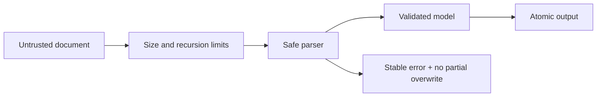

# Rust README 剖面：文档与文件格式处理

> 适用于电子表格、文字文档、版式文档、PDF、图片、压缩包及其他结构化文件处理 crate。只保留项目真实支持的格式和操作。

## 格式与操作支持矩阵

“支持某格式”过于宽泛。读取、创建、编辑、模板填充、转换、签名和往返保真必须分别声明。

| 格式/版本 | 读取 | 新建/写入 | 原位编辑 | 模板填充 | 转换 | 加密/签名 | 状态证据 |
|---|:---:|:---:|:---:|:---:|:---:|:---:|---|
| `{format-a}` | ✅ | ✅ | 部分 | ✅ | — | 部分 | `{tests/fixtures}` |
| `{format-b}` | 只读 | ❌ | ❌ | ❌ | 导出 | ❌ | `{backend docs}` |

状态应使用“稳定、实验性、部分、只读、规划中、不支持”，不能用一个勾号掩盖能力差异。

## 文档处理流水线

```text
输入文件 / 字节流 / 模板
        │
        ▼
格式识别与安全预检
        │
        ▼
容器解包 / 语法解析 / 资源解析
        │
        ▼
统一文档模型或后端对象模型
        │
        ├──► 读取与查询
        ├──► 编辑、模板填充与转换
        └──► 校验、签名或渲染
        │
        ▼
序列化 / 容器重建 / 原子写入
        │
        ▼
输出文件 + 警告 + 保真报告
```

## 能力分层

| 层次 | 内容 | README 应回答 |
|---|---|---|
| 容器 | ZIP、OLE、对象流或页面包 | 是否支持加密、压缩、损坏恢复和大小限制 |
| 语法 | XML、对象、指令或交叉引用 | 未知节点如何处理，解析是否严格 |
| 语义 | 工作簿、段落、页面、表单等 | 哪些对象可读、写、编辑 |
| 版式 | 字体、样式、坐标、分页、图片 | 是否保持视觉结果，如何验证 |
| 高级能力 | 模板、公式、签名、宏、附件 | 支持范围和安全边界 |

## 往返保真与未知内容

说明以下场景：

- `read -> write` 是否保持未修改内容；
- 未识别元素、扩展命名空间、自定义属性和二进制资源是保留、删除还是报错；
- 元素顺序、关系 ID、对象编号和压缩方式变化是否影响兼容性；
- 视觉等价、语义等价、字节等价分别是否承诺；
- 编辑失败时是否保留原文件，以及输出是否采用临时文件加原子替换。

| 内容 | 读取 | 修改 | 往返保留 | 验证方式 |
|---|:---:|:---:|:---:|---|
| 已知文本/单元格/对象 | ✅ | ✅ | ✅ | 结构断言 |
| 样式与主题 | ✅ | 部分 | 部分 | XML diff + 渲染比对 |
| 未知扩展节点 | 透传 | ❌ | ✅ | golden fixture |
| 宏、脚本或活动内容 | 拒绝/隔离 | ❌ | 按策略 | 安全测试 |

## 模板填充语义

当项目支持模板时，README 至少说明：

| 维度 | 需要定义 |
|---|---|
| 占位符语法 | 标量、列表、对象路径、转义和缺失值 |
| 作用域 | 文档、页面、工作表、段落、表格、循环块 |
| 扩展方向 | 横向、纵向、分页或新建工作表/页面 |
| 样式继承 | 字体、边框、数字格式、行高列宽、段落属性 |
| 合并结构 | 合并单元格、跨页表格、嵌套区域 |
| 多次填充 | 是否幂等，重复调用如何处理 |
| 错误 | 未闭合标记、类型不匹配、资源缺失 |

```rust
// 示例必须替换为项目真实公共 API，并验证输出内容。
fn fill_template() -> Result<(), Box<dyn std::error::Error>> {
    Ok(())
}
```

## Derive 与属性映射

| 属性/宏 | 作用对象 | 默认行为 | 冲突规则 | 编译期错误测试 |
|---|---|---|---|---|
| `{rename}` | 字段 | 使用字段名 | 显式值优先 | trybuild |
| `{index}` | 字段 | 按声明顺序 | 索引冲突报错 | trybuild |
| `{format}` | 数值/日期 | 类型默认格式 | 非法格式报错 | unit test |
| `{ignore}` | 字段 | 参与处理 | 忽略读写 | compile test |

如果项目来自注解驱动的上游库，属性表应同时提供上游注解到 Rust 属性的映射。

## 后端与引擎能力

| 后端/引擎 | 读取 | 写入 | 编辑 | 流式 | 平台依赖 | 许可证 | 已知差异 |
|---|:---:|:---:|:---:|:---:|---|---|---|
| `{backend-a}` | ✅ | ✅ | 部分 | ✅ | 纯 Rust | `{license}` | `{difference}` |
| `{backend-b}` | ✅ | ❌ | ❌ | 否 | 系统库 | `{license}` | `{difference}` |

公共 API 应返回明确的 capability/error，不能在后端缺失能力时静默生成不完整文档。

## 大文件、流式与内存

| 模式 | 内存复杂度 | 临时空间 | 适用场景 | 限制 |
|---|---|---|---|---|
| 全量模型 | `O(document)` | 低 | 随机编辑 | 大文件内存高 |
| 流式读取 | `O(batch)` | 低 | 批量导入 | 不支持回看 |
| 常量内存写入 | `O(window)` | 中 | 大规模导出 | 写后不可修改 |
| 临时文件编辑 | 受控 | 高 | 容器重建 | 需要磁盘预算 |

给出批大小、最大对象数、压缩比、递归深度、单资源大小和总解压大小限制。

## 字体、图片、附件与外部资源

- 字体：嵌入、子集化、替代、系统字体发现和许可证；
- 图片：支持格式、色彩空间、透明度、方向和分辨率；
- 附件：文件名清理、类型限制、大小限制和路径穿越防护；
- 外链：是否访问网络、重定向和 SSRF 策略；
- 临时资源：创建位置、权限、清理和崩溃恢复。

## 格式安全

至少测试：ZIP bomb、XML 实体、递归结构、异常尺寸、畸形索引、重复对象、路径穿越、恶意外链、超大图片、损坏签名和加密文件。



## 验证矩阵

| 测试 | 输入 | 断言 |
|---|---|---|
| Golden | 规范样本 | 结构和关键资源一致 |
| Round-trip | 真实文档 | 未修改内容保持 |
| Interop | 多个生产者/消费者 | 可打开且语义一致 |
| Render diff | 固定字体环境 | 页面或视觉差异受控 |
| Property/fuzz | 生成和畸形输入 | 不 panic、不越界、资源受限 |
| Large fixture | 大规模文档 | 内存、时间和临时空间符合声明 |

## README 完成检查

- [ ] 格式版本和操作维度分别声明
- [ ] 读取、创建、编辑和往返保真没有混为一谈
- [ ] 模板、Derive 和属性语义有完整示例
- [ ] 后端能力与许可证透明
- [ ] 大文件和资源上限可验证
- [ ] 安全输入和损坏恢复有测试
