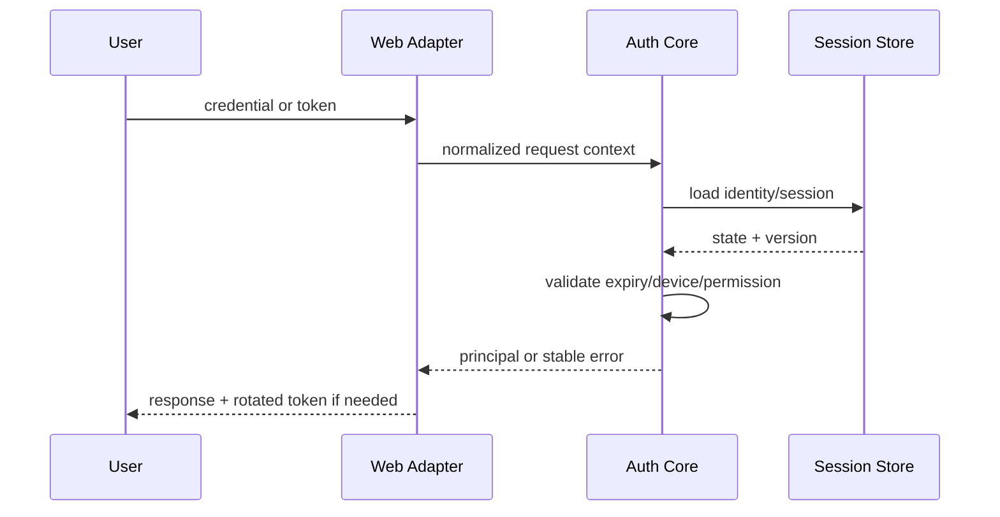

# Rust README 剖面：认证与安全框架

> 适用于登录、Token、会话、权限、角色、SSO、Web 中间件和安全上下文类 Rust 框架。

## 安全定位与责任边界

| 本框架负责 | 调用方仍负责 |
|---|---|
| Token 生成、解析和生命周期 | 用户身份真实性和账号治理 |
| 登录状态、会话和权限判断 | 业务权限模型定义 |
| Web 请求上下文适配 | TLS、网关、防火墙和部署隔离 |
| 存储 SPI 与一致性语义 | Redis/数据库高可用和备份 |
| 安全默认配置和审计事件 | 密钥轮换、秘密系统和事故响应 |

不得使用“绝对安全”“开箱即生产安全”等无法验证的表述。

## 核心数据流



分别描述登录、鉴权、续签、登出、踢下线、顶人、禁用和账号切换；它们的状态变化不能只用一个快速开始示例代替。

## Token 生命周期

| 阶段 | 输入 | 状态变化 | 存储 | 安全要求 |
|---|---|---|---|---|
| 签发 | 身份、设备、策略 | 创建登录状态 | session/token store | 强随机、受控 TTL |
| 校验 | token + context | 可选续期 | read/atomic update | 常量时间比较、时钟容差 |
| 轮换 | 旧 token | 新旧窗口 | versioned state | 防重放、并发安全 |
| 撤销 | token/session/user | 标记无效 | durable revocation | 跨节点传播 |
| 过期 | 时间 | 自动失效 | TTL/cleanup | 不接受无限宽限 |

说明 Token 是有状态、无状态还是混合模式，客户端可见内容、签名/加密算法、密钥 ID、轮换和吊销语义。

## 会话、设备与并发登录

| 策略 | 行为 | 竞态处理 |
|---|---|---|
| 单设备 | 新登录使旧会话失效 | 原子版本或事务 |
| 多设备 | 每设备独立会话 | 设备 ID 和 session ID 分离 |
| 互斥登录 | 同类型设备只能一个 | compare-and-set |
| 踢下线 | 服务端主动撤销 | Pub/Sub 或版本检查 |

说明多节点、网络分区、缓存延迟和重复事件下的最终行为。

## 权限与角色

```text
request
  → authentication
  → principal/session
  → role/permission provider
  → route/method/resource policy
  → allow or stable denial
```

| 能力 | 语义 | 默认策略 |
|---|---|---|
| 角色 | 身份类别或职责集合 | 无角色不自动放行 |
| 权限 | 具体动作/资源 | 默认拒绝 |
| 通配符 | 匹配规则和转义 | 明确优先级 |
| 多账号体系 | 逻辑隔离 | key、context、storage 隔离 |
| 临时身份切换 | 有界作用域 | Drop/guard 自动恢复 |

## Web 框架适配

| Web 框架 | Crate | Middleware/Layer | 状态提取 | 错误响应 | 已验证版本 |
|---|---|---|---|---|---|
| `{framework}` | `{adapter-crate}` | `{Layer}` | header/cookie | JSON/redirect | `{version}` |

Core 应尽量不依赖特定 async runtime；适配层说明 `Send`/`Sync`、请求扩展、body 限制、异步存储和取消行为。

## 存储后端

| 后端 | 用途 | 一致性 | TTL | Pub/Sub | 生产状态 |
|---|---|---|---|---|---|
| Memory | 测试/单进程 | 进程内 | 支持 | 否 | 非集群生产 |
| Redis | 分布式会话 | 命令原子性 | 原生 | 支持 | 按验证结果 |
| `{database}` | 持久状态 | 事务 | 清理任务 | 可选 | 按验证结果 |

说明键格式、序列化版本、租户隔离、数据迁移、连接失败、降级策略和清理责任。

## 配置安全

| 配置 | 安全默认值 | 风险下限/上限 | 变更影响 |
|---|---|---|---|
| Token TTL | 有限 | 禁止无意永久有效 | 会话时长 |
| 并发登录 | 受控 | 按业务明确 | 会话撤销 |
| Cookie | Secure/HttpOnly/SameSite | 生产必须启用 TLS | 浏览器兼容 |
| 密钥 | SecretRef | 禁止明文提交 | 支持轮换 |
| 日志 | 脱敏 | 禁止 token/session 全量 | 排障信息受限 |

## 威胁模型

至少覆盖：Token 猜测、重放、会话固定、权限绕过、跨租户访问、缓存污染、时钟漂移、密钥泄漏、日志泄漏、CSRF、XSS Token 窃取、SSRF 回调和存储不可用。

| 威胁 | 防护 | 残余风险 | 测试 |
|---|---|---|---|
| 重放 | nonce/version/短 TTL | 窗口内风险 | replay test |
| 会话固定 | 登录后轮换 ID | 客户端缓存 | integration test |
| 权限绕过 | 默认拒绝、统一入口 | 错误配置 | policy tests |

## 审计与可观测性

审计事件至少包含时间、租户、主体、动作、资源、结果、原因和 trace ID；不得包含完整凭据。指标应覆盖登录成功/失败、鉴权拒绝、存储延迟、Token 轮换和撤销传播延迟。

## 安全测试

- 状态机和并发竞态测试；
- 多租户、角色、权限和通配符属性测试；
- Token 篡改、过期、轮换和重放测试；
- 多节点存储与 Pub/Sub 故障测试；
- Web adapter 的 Cookie/Header/代理边界测试；
- Golden/parity 测试（兼容其他实现时）；
- 模糊测试不可信 Token、配置和序列化数据。

## README 完成检查

- [ ] 认证、会话、授权和存储职责分开
- [ ] Token 全生命周期和吊销语义明确
- [ ] 多设备、多账号和多节点行为明确
- [ ] Web 适配版本来自测试矩阵
- [ ] 默认配置有安全理由
- [ ] 威胁、审计和漏洞披露可发现
