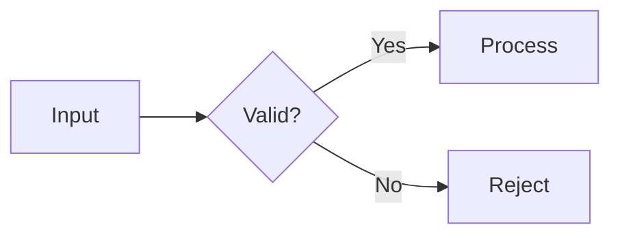

# Mermaid Diagrams

Produce valid Mermaid source that communicates relationships more clearly than prose.

## Routing

- Choose Mermaid by default for Markdown-native diagrams.
- Choose the **`plantuml`** skill for strict UML notation, detailed C4, or `.puml` output. Install with: `npx skills add full-stack-skills/document-skills --skill plantuml`.
- Choose the **`processon-diagram-generator`** skill when the user explicitly wants ProcessOn or hosted editable rendering. Install with: `npx skills add full-stack-skills/document-skills --skill processon-diagram-generator`.
- Do not ask the user to choose a tool when the context already determines a safe default.

## Workflow

1. Extract entities, states, decisions, messages, or dependencies from the request and available source.
2. Select the smallest suitable diagram type.
3. Generate syntactically complete Mermaid source.
4. Keep labels concise and quote labels containing punctuation, parentheses, or special characters.
5. Validate the structure and, when a Mermaid renderer is available, render it before delivery.
6. Save a file only when the user asks for a file or the diagram belongs in an existing document.

## Diagram selection

| Need | Mermaid declaration |
|---|---|
| Process or decision | `flowchart TD` or `flowchart LR` |
| Calls over time | `sequenceDiagram` |
| State lifecycle | `stateDiagram-v2` |
| Type relationships | `classDiagram` |
| Data entities | `erDiagram` |
| Schedule | `gantt` |
| User experience | `journey` |
| Hierarchy | `mindmap` |
| Chronology | `timeline` |
| Lightweight architecture | `architecture-beta` or a flowchart |

Load only the matching file under `examples/` when syntax details are needed. Do not load all examples.

## Authoring rules

- Give every node a stable, simple identifier.
- Quote human-readable labels when they contain punctuation.
- Use one direction consistently; avoid unnecessary crossings.
- Represent a decision with a diamond and label outgoing branches.
- Keep sequence participants and messages explicit.
- Avoid styling that depends on a single renderer unless the target platform is known.
- Split an unreadable diagram instead of shrinking labels or adding excessive subgraphs.
- Do not encode unsupported facts merely to make the diagram look complete.

## Output

For inline delivery, return a fenced block:

````markdown

````

For file delivery, prefer `docs/diagrams/<descriptive-name>.md` unless the repository already has a diagram convention. Preserve existing files and ask before overwriting.

## Validation checklist

- Opening declaration matches the intended diagram type.
- Identifiers are valid and unique.
- Labels with punctuation are quoted.
- All branches, participants, and relationships are connected as intended.
- Fenced Markdown blocks are closed.
- The diagram renders on the user's target platform when that renderer is available.
