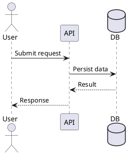

# PlantUML Diagrams

Produce structurally valid PlantUML with explicit semantics and readable layout.

## Routing

- Choose PlantUML for UML, C4, enterprise architecture, or `.puml` output.
- Choose the **`mermaid`** skill for lightweight diagrams embedded directly in Markdown. Install with: `npx skills add full-stack-skills/document-skills --skill mermaid`.
- Choose the **`processon-diagram-generator`** skill when hosted editing or ProcessOn output is explicitly required. Install with: `npx skills add full-stack-skills/document-skills --skill processon-diagram-generator`.
- Do not ask the user to choose a renderer when the requested notation or target format already determines it.

## Workflow

1. Extract actors, components, types, states, messages, or deployment nodes from the request and source.
2. Select the diagram family and intended abstraction level.
3. Generate a complete source block with matching start/end directives.
4. Use aliases for long names and packages/boundaries for meaningful grouping.
5. Validate with a local PlantUML renderer when available; otherwise perform structural checks.
6. Save a `.puml` file only when requested or when integrating into an existing documentation tree.

## Diagram selection

| Need | Primary syntax |
|---|---|
| Runtime interaction | `sequence`, `participant`, `actor` |
| Static type model | `class`, `interface`, relationships |
| Logical architecture | `component`, `package`, `interface` |
| Runtime topology | `node`, `cloud`, `database`, `artifact` |
| Lifecycle | `state`, `[*]` |
| Workflow | `start`, `if`, `while`, `fork`, `stop` |
| User goals | `actor`, `usecase` |
| C4 model | C4 include plus `Person`, `System`, `Container`, `Component` |

Load only the matching file under `examples/` when syntax details are needed.

## Authoring rules

- Wrap standard UML diagrams in `@startuml` and `@enduml`.
- Define aliases once and reuse them consistently.
- Label relationships with purpose or protocol when it improves understanding.
- Separate logical architecture from deployment topology when one diagram becomes crowded.
- Keep C4 levels distinct; do not mix context, container, and component detail without an explicit reason.
- Avoid remote `!include` dependencies unless the user accepts network-dependent rendering.
- Do not invent components, protocols, multiplicities, or calls that are unsupported by evidence.

## Output

Inline delivery:

````markdown

````

File delivery: prefer `docs/diagrams/<descriptive-name>.puml` unless the repository defines another convention. Never overwrite silently.

## Validation checklist

- Start/end directives match.
- Aliases and referenced elements are defined.
- Relationship direction and multiplicity are intentional.
- C4 includes are available in the target rendering environment.
- No secrets or machine-specific paths appear in source.
- Local rendering succeeds when a renderer is available.
