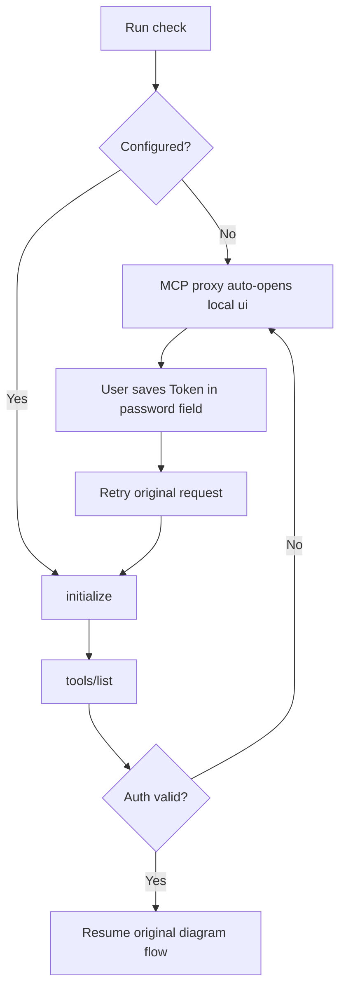

# Setup workflow

## State machine



## Commands

Run from the installed plugin root:

```bash
python3 scripts/processon_setup.py check
python3 scripts/processon_setup.py ui
```

The MCP proxy launches `ui` automatically for missing credentials, a second HTTP 401 after one refresh, or ProcessOn's business-level invalid-token response. A user-scoped marker containing only the launch timestamp prevents repeated windows for 10 minutes. If the browser does not open, use the manual `ui` command above; when no browser is available, fall back to a hidden terminal prompt:

```bash
python3 scripts/processon_setup.py setup
```

`check` outputs only `configured` or `missing`. `ui` listens on a random loopback port and shuts itself down after ten idle minutes. `setup` uses hidden input and never places the value in command history.

## Exception handling

| Signal | User-facing message | Next step |
|---|---|---|
| missing | "ProcessOn is not configured for the current user yet. Please finish the local three-step setup." | Use the automatically opened `ui`; run it manually only if absent |
| Save failed | "The local credential was not saved. Please check the current user config directory permissions." | Keep the existing credential and retry setup |
| `PROCESSON_AUTH_REQUIRED` | "The ProcessOn credential is invalid or expired. Please update it on the local page." | Use the automatically opened page for rotation |
| MCP temporarily unavailable | "The credential is configured, but service reachability has not yet been verified." | Do not repeat generation; retry a read-only check later |

Never use vague prompts like "please provide more information". Always state what is missing, where the user should act, and how to verify after the step is done.
