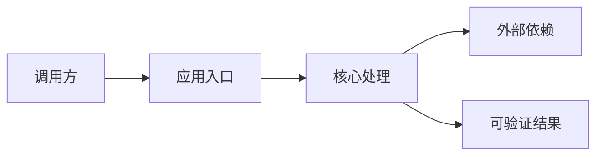

# {技术主题}：{可验证结果}

> {一句话说明读者完成本文后能得到什么，以及本文不覆盖什么。}

## 一、目标与范围

### 1.1 最终结果

{描述最终可运行、可观察或可验证的结果。}

### 1.2 适用读者

- {读者角色与基础知识}

### 1.3 本文不包含

- {明确排除的场景}

## 二、已验证环境

| 项目 | 版本/值 | 验证方式 |
|---|---|---|
| 操作系统 | {系统与架构} | `{命令}` |
| 语言/运行时 | {版本} | `{命令}` |
| 框架/SDK | {版本} | {锁文件/命令/官方资料} |
| 外部服务 | {版本或日期} | {来源} |

## 三、原理与架构

### 3.1 核心概念

{只描述理解实现所需的概念，并给出官方来源。}

### 3.2 请求或数据流



## 四、准备工作

### 4.1 获取项目或创建目录

```bash
{命令}
```

### 4.2 安装依赖

```bash
{命令}
```

### 4.3 配置

```yaml
{最小配置；敏感值使用环境变量占位符}
```

> 不要把真实 Token、密码、内网地址或个人目录写入文章。

## 五、实现步骤

### 5.1 {步骤名称}

{说明为什么需要这一步。}

```{language}
{最小、闭合、可运行的代码}
```

### 5.2 {步骤名称}

```{language}
{代码或配置}
```

## 六、运行与验证

### 6.1 启动

```bash
{启动命令}
```

### 6.2 最小验证

```bash
{测试或调用命令}
```

预期结果：

```text
{经过验证的关键输出；未执行时写明“预期，未在当前环境验证”}
```

### 6.3 自动化测试

```bash
{测试命令}
```

## 七、故障排查

| 现象 | 原因 | 检查方法 | 解决方式 |
|---|---|---|---|
| {现象} | {原因} | `{命令}` | {方案} |

## 八、安全与生产注意事项

- 凭证与密钥：{处理方式}
- 权限边界：{处理方式}
- 超时、重试与幂等：{处理方式}
- 日志与隐私：{处理方式}
- 监控与告警：{处理方式}
- 升级与回滚：{处理方式}

## 九、限制与待确认事项

- {限制、推断或未验证内容}

## 十、验证记录

- 验证日期：{YYYY-MM-DD}
- 操作系统：{系统与架构}
- 运行时版本：{版本}
- 框架/SDK 版本：{版本}
- 执行命令：`{命令}`
- 结果：{实际结果}
- 未验证内容：{无/列表}

## 参考资料

- [{官方资料名称}]({官方链接})
- [{源码或发布说明}]({链接})
