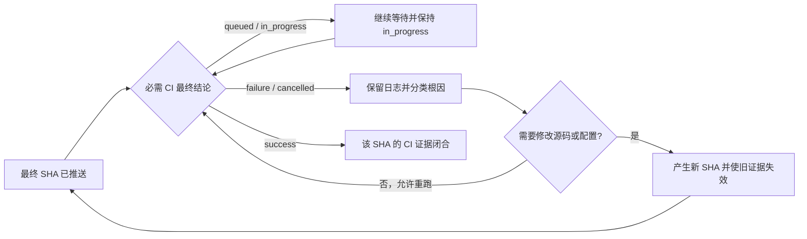

# Multi-branch License Gate Hardening

## 核心原则

把每条维护分支视为独立发布线。只有同一分支最终 SHA 上的许可证、SBOM、完整 Reactor、远端 SHA 与必需 CI 全部闭合，才可声明该分支通过；只有所有目标分支通过，才可声明整体完成。

本 Skill 面向 Maven 多分支发布维护者、发布工程师和审计人员。它不替代项目自己的 JDK/Maven/POM 契约、许可证政策或 CI 必需检查配置。

## 快速开始

可直接提出：

- “审计这三条维护分支的 license gate，并给出缺口矩阵。”
- “检查 SBOM、Reactor、push 与 CI 证据能否闭合到同一 SHA。”
- “这个临时端口冲突后的模块重跑，能否作为完整 Reactor 证据？”

先读取项目指令、现有计划/规格和每条分支的工具链契约，再建立一行一个分支的证据矩阵。用户只要求分析时保持只读；commit、push、重跑 CI 或修改许可证配置都需要处于明确授权范围。

## 能力边界

### 擅长

- 审计多条维护分支的许可证来源证据、选择表、排除表和生成报告。
- 验证 CycloneDX/SPDX SBOM 与实际依赖图、最终提交和发布范围一致。
- 区分完整 Maven Reactor、目标模块复验、`-rf` 恢复执行和 CI 等价验证。
- 核对本地 HEAD、tracking ref、远端 SHA 与该 SHA 触发的必需 CI。

### 需要素材

- 分支/工作树清单，以及每条线规定的 JDK、Maven/Wrapper 和构建命令。
- 项目许可证政策、SBOM 配置、必需 CI 名称及授权的变更/推送范围。
- 命令日志、报告路径、远端 SHA 或 CI run/job 标识；缺失时先输出 `unknown` 缺口，不猜测。

### 超出范围

- 不把法律判断伪装成工程结论；许可证兼容性存在争议时转交法务或项目治理者。
- 不自动选择许可证、伪造证据 URL、放宽必需 CI，或把安全扫描 `skipped` 写成 `passed`。
- 不在未经授权时创建/切换分支、改写历史、commit、push、重跑或取消 CI。

## 工作流

### 1. 冻结范围与分支契约

对每条线记录：仓库根、工作树、分支、目标 SHA、JDK、Maven/Wrapper、POM 拓扑、发布范围、必需 CI。先检查 `git status`，保护用户未提交修改。多仓库或多工作树不得把路径、日志或 SHA 混线。

若项目已有正式规格或执行计划，从当前阶段继续；不要为同一变更重复创建事实源。

### 2. 建立证据矩阵

状态只允许：`passed`、`failed`、`in_progress`、`blocked`、`skipped`、`unknown`。`skipped` 必须附授权与风险，永不等于 `passed`。

| 分支 | SHA | 工具链 | 依赖来源 | 许可证策略 | SBOM | 完整 Reactor | local/tracking/remote | 必需 CI | 总结 |
|---|---|---|---|---|---|---|---|---|---|
| `<line>` | `<sha>` | `<state>` | `<state>` | `<state>` | `<state>` | `<state>` | `<state>` | `<state>` | `<state>` |

每格附可复核证据：实际命令、退出码、报告/日志路径、依赖坐标与版本、URL 及响应语义、run/job URL 或 ID、观察时间。HTTP 200 只证明可访问，不单独证明许可证语义正确。

### 3. 处理许可证与 SBOM

1. 从依赖树或解析后的模型定位精确 `groupId:artifactId:version` 与引入路径。
2. 先检查代码是否直接依赖相关 API，再选择精确排除、上游修复或经治理批准的许可证选择。
3. 许可证来源必须可追溯到该精确版本；优先固定版本、不可变的 POM/源码标签或官方仓库内容。
4. 变更后重新生成许可证报告与 SBOM，并证明旧坐标/陈旧选择已消失、预期依赖仍存在。
5. 跨分支共享脚本时比较内容、调用方式和文件模式；共享实现一致不代表各分支验证可以复用。

不要为让门禁变绿而选择没有可靠依据的许可证。若排除传递依赖，必须补充依赖树、契约/集成测试和新 SBOM 证明其不再进入交付物。

### 4. 闭合完整 Reactor

每条线使用其真实工具链执行项目定义的完整 Reactor。记录命令、工具版本、起止时间、模块/测试计数和最终退出码。

- 目标模块重跑只支持诊断，不自动替代完整 Reactor。
- 一次全新的完整 Reactor 成功，是环境瞬态失败后最清晰的闭合证据。
- 只有能证明失败前已成功模块、恢复点、后续所有模块、源码/SHA/参数未变化时，才可接受 `-rf` 证据链；否则状态仍不是 `passed`。
- “失败前部分成功 + 单模块成功”不得拼成全绿。

### 5. 提交与推送

提交前逐分支检查 diff、意外文件、生成物、脚本字节一致性和文件模式。提交后冻结 SHA；任何修改都会使该线先前基于旧 SHA 的 SBOM、Reactor 或 CI 证据需要重新判定。

推送证明至少包含：本地 `HEAD`、tracking ref、远端分支 SHA 三者一致。`git push` 返回成功只证明传输，不证明远端最终状态或 CI 通过。

### 6. 等待 CI

只跟踪由最终 SHA 触发的必需 workflow/job。状态机：



使用条件等待并降低轮询频率；报告实质状态变化。`queued`、`in_progress`、job 已启动、步骤正在安装依赖或暂时没有失败信号，都不是通过。

### 7. 给出结论

结论先写判定，再写证据和缺口：

```text
判定：passed | partial | failed | blocked
范围：<分支与最终 SHA>
已闭合：<逐项列出>
未闭合：<状态、缺少的具体证据、如何补充>
异常分类：change-related | environment-transient | infrastructure | unknown
剩余风险：<skipped/例外/法律争议/未复核项>
下一动作：<最小且可执行的动作>
```

整体完成条件是所有目标行的必需格均为 `passed`。否则使用 `partial`、`failed` 或 `blocked`，明确“已提交并推送”与“已通过 CI”是不同阶段。

## 证据拼接规则

| 场景 | 是否可拼接 | 条件 |
|---|---|---|
| 同一分支的本地门禁、远端 SHA、CI | 可以 | 同一最终 SHA、正确工具链、范围一致 |
| 多分支共用不可变许可证原始来源 | 有条件 | 精确坐标相同；每条线仍独立生成 SBOM 和跑策略 |
| 失败 Reactor + `-rf` | 有条件 | 能证明完整模块覆盖且代码/参数/SHA 未变 |
| 失败 Reactor + 单模块复验 | 不可以 | 只能支持根因分类 |
| 旧 SHA 报告 + 新 SHA CI | 不可以 | 证据身份不一致 |
| CI started/in_progress + 无失败 | 不可以 | 尚无最终成功结论 |

## 常见错误与红旗

- 看到 HTTP 200 就宣称许可证证据有效。
- 把生成过 SBOM 当成 SBOM 与最终依赖图一致。
- 用错误 JDK/Maven 的成功结果替代维护线契约。
- 用一个分支成功代表所有分支成功。
- 用 push 输出、CI 启动或局部测试宣布整体完成。
- 将临时环境故障直接忽略，而不闭合完整 Reactor。
- 日志路径没有分支标识，导致证据串线。

出现任一红旗时，停止“完成”声明，回到证据矩阵定位首个非 `passed` 单元格。

## FAQ

**Q1：三条线能并行验证吗？** 可以，只要工具链、缓存、端口、日志和工作树隔离，并且输出能映射回各自 SHA。

**Q2：CI 能替代本地 Reactor 吗？** 仅当项目门禁允许且该 CI 在最终 SHA 上执行等价或更强的完整范围；许可证/SBOM job 名称本身不能证明覆盖完整 Reactor。

**Q3：CI 一直运行时怎么交付状态？** 写 `in_progress`，说明已闭合项、正在执行的 job、最近实质进展和仍不可宣布完成的原因。

**Q4：可以复用旧许可证 URL 吗？** 只有精确版本和内容身份仍匹配且来源可复核；仍需在当前分支重新跑政策和 SBOM。

**Q5：Security 被明确豁免怎么办？** 记录 `skipped`、授权来源和残余风险；不得写成安全扫描通过。

**Q6：用户只要审计，不要修改怎么办？** 只读产出矩阵与建议，不生成报告、不改 POM、不提交、不推送、不重跑 CI。

## 深度参考

- 需要逐门禁的证据字段、异常分类和验收规则时，读取 [references/evidence-contract.md](references/evidence-contract.md)。
- 遇到局部重跑、跨 SHA、CI 等待或安全/隐私边界时，读取 [references/anti-patterns.md](references/anti-patterns.md)。
- 处理边缘场景或自定义组织门禁时，读取 [references/faq-deep.md](references/faq-deep.md)。
