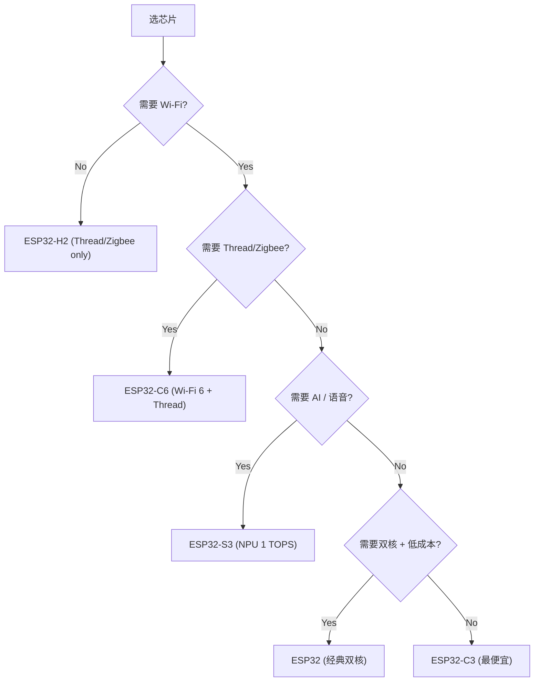

# GE · chip-selection（esp32-variants 黄金示例）

**徽章**：`B0 Build Verification Only`（文档类）

---

## 芯片选型决策表（2026-09-02 基线 v6.1）

> 引用来源：`references/chip-matrix.md` + `references/selection-tree.md`
> 各芯片最低 IDF 版本 = **UNVERIFIED**（基线红线：无官方合并对照表）；通过 `idf.py set-target <chip>` + release notes 三步法核验。

| 芯片 | 架构 | Wi-Fi | BLE | 802.15.4 | 双核 | NPU | 推荐场景 |
|---|---|---|---|---|---|---|---|
| **ESP32** | Xtensa 2×240MHz | Wi-Fi 4 | BT+BLE | — | ✅ | — | 通用 IoT（经典首选） |
| **ESP32-S2** | Xtensa 1×240MHz | Wi-Fi 4 | — | — | ❌ | — | 低功耗 Wi-Fi（无蓝牙） |
| **ESP32-S3** | Xtensa 2×240MHz | Wi-Fi 4 | BLE 5.0 | — | ✅ | 1 TOPS | AI 向量指令 / 语音 |
| **ESP32-C3** | RISC-V 1×160MHz | Wi-Fi 4 | BLE 5.0 | — | ❌ | — | 低成本单核 |
| **ESP32-C6** | RISC-V 1×160MHz | Wi-Fi 6 | BLE 5.0 | **Thread/Zigbee** | ❌ | — | Matter 灯/Thread 网关 |
| **ESP32-H2** | RISC-V 1×96MHz | — | BLE 5.0 | **Thread/Zigbee** | ❌ | — | 纯 Thread/Zigbee 终端 |
| **ESP32-P4** | RISC-V 2×400MHz | — | — | — | ✅ | — | 高性能网关（需外挂 Wi-Fi 芯片） |

## 决策树

## 关键说明

- **Matter 灯**：ESP32-C6/H2（Thread/Zigbee）+ Matter 协议栈（components.espressif.com 运行时核验）
- **P4 不含 Wi-Fi**：需外挂模组（如 ESP32-C6），路由 esp32-idf + esp32-wifi-provision
- **ED25519 安全启动**：基线未确认哪些芯片支持 ED25519，禁止写入
- **C5/S31**：仅存在性提示（中置信），细节未核验
