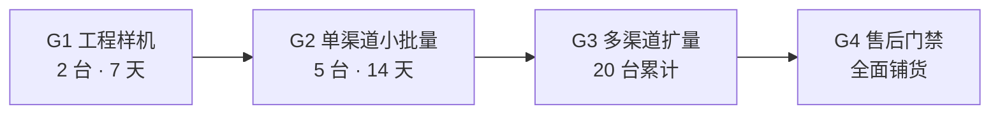

# Golden Example: 商业门禁 G1-G4 流程（fw-hil-testing 黄金示例）

**徽章**：`B0 Build Verification Only`（文档类）
**来源**：从多设备硬件验收实践中提炼的通用模式（非产品专属）。

---

## 四级门禁体系

### Gate 1：工程样机

| 项 | 条件 |
|---|---|
| 样机数 | 2 台 |
| 运行时间 | 7 天连续 |
| 通过标准 | 零崩溃、零数据损坏、OTA 成功 |
| 失败动作 | 回到开发阶段修复 |

### Gate 2：单渠道小批量

| 项 | 条件 |
|---|---|
| 样机数 | 5 台（同一渠道） |
| 观察期 | 14 天 |
| 通过标准 | 激活率 100%、7 日启动率 ≥95%、退款率 ≤10% |
| 失败动作 | 暂停该渠道发货 |

### Gate 3：多渠道扩量

| 项 | 条件 |
|---|---|
| 累计出货 | 20 台（≥2 个渠道） |
| 通过标准 | 各渠道指标稳定 |
| 失败动作 | 回退到 Gate 2 |

### Gate 4：售后门禁

| 项 | 条件 |
|---|---|
| 通过标准 | 退款率 <5%、硬件故障率 <3%、单台月售后 ≤20 分钟 |
| 通过后 | 全面铺货 |
| 失败动作 | 停止扩量，根因分析 |

---

## 核心原则

1. **验收矩阵管单台**：每个验收项有明确的操作/预期/证据
2. **商业门禁管批量**：用统计数据而非个案判断
3. **逐级放行，禁止越级**：G3 失败只回退到 G2，不跳回 G1
4. **每级有明确的失败动作**：不是"观察看看"，而是"回到哪个阶段"

## 与验收矩阵的关系

- 验收矩阵（10 项）适用于 G1-G2 阶段的逐台验证
- G3-G4 阶段用统计指标（激活率/启动率/退款率）而非逐台验收
- HIL 证据在 G1 阶段采集，G2-G4 复用但增量采集
