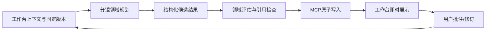

# 分镜插件功能与架构

日期：2026-09-13。状态：规划基线。
公共规范：[数据契约](https://github.com/partme-ai/creative-production-workbench/blob/main/docs/superpowers/specs/contracts.md)、[执行条件](https://github.com/partme-ai/creative-production-workbench/blob/main/docs/superpowers/specs/operations.md)。

## 1. 职责

将导演方案具体化为镜头表、图文分镜、资产绑定、粗预演与生产任务包。输入：选定剧本/导演计划 revision、ShotIntent、固定角色/场景/道具版本、目标时长与素材生成权限。输出：ShotList、Shot / Panel、AssetBinding、AnimaticPlan、ProductionTaskPlan / ShotExecutionPacket。

具体化镜头和分镜，不私自改故事/导演锁定项；图片由现有 Image Factory/Dreamina Design 等插件生成，角色主数据归工作台。

## 2. 工作流与拟定 Skills

下列是计划中的 Skill，尚未生成 SKILL.md 或声称可以调用。

| Skill 计划名 | 用途 | 可观察行为 |
|---|---|---|
| codex-storyboard-resolve | 读取意图与素材 | 核对每场导演意图、现有资产ID/版本和缺失项；允许原创时登记任务，否则集中请求素材。 |
| codex-storyboard-shots | 镜头拆解 | 为每镜创建稳定ID、显示镜号、景别、动作、声音、时长与入出状态；高密度动作拆成可执行镜头。 |
| codex-storyboard-panels | 图文面板 | 每镜允许多个分镜面板；先生成文字布局，按授权调用现有图片插件并关联真实候选文件。 |
| codex-storyboard-continuity | 连续性检查 | 检查角色服装、唯一道具、左右方向、动作接点、光线和剧情状态；检查时长合计与对白长度。 |
| codex-storyboard-animatic | 粗预演计划 | 输出按有理帧率、整数帧编排的面板时长和临时音轨引用，交本地 Worker 生成粗预演。 |
| codex-storyboard-tasks | 生产包交付 | 逐镜绑定固定资产和上游revision，建立任务依赖；自动完整任务交给生产插件，局部变更只影响相关镜头。 |

## 3. 执行协议

1. 通过 workbench_project_context 读取项目目标、相关实体与固定版本。缺上下文时分页读取，不重复导入原文。
2. 如存在同一任务已接受结果，先检查输入 revision 是否变化；不因换新对话而重复执行。
3. 用 workbench_task_claim 领取无冲突任务，绑定租约和 input_refs。
4. 宿主执行本插件领域创作；写入前按契约检查数据形状、ID、来源和时长。
5. document_commit / shot_batch_commit / asset_spec_commit 返回服务生成 revision、hash 和 event cursor。
6. 超时先按 operation_id 核查是否已落盘；不可直接重复产生用户可见实体。
7. 保存候选的技术成功与领域内容评估分离。需要用户评审时在工作台集中呈现问题，不每个中间字段弹窗。
8. 完整制作任务在授权停点前继续；仅本领域任务则交付对应制作包。

## 4. 质量与异常

必须包含以下行为测试/评估：悬空角色/素材引用、重排改变ID、duration累计漂移、多个道具候选误认为复制实体、人物方向跳变、原图缺失冒充已生成、未授权图片生成、上游版本变化。

每份候选显示来源版本、生成方式、未解决问题和人工锁定项。不能将 Schema 通过、关键词存在或模型自评分替代内容验收。

用户改动产生新 revision；插件读取 change_list 并只重做受影响结果。上游原文/剧本更新不直接删除下游图像或视频，标注 stale 并保留已选定版本。

## 5. 与其他插件协作

| 来源 | 本插件处理 | 下游 |
|---|---|---|
| 工作台存储的固定版本输入 | 分镜领域创作与候选评估 | 工作台新 revision |
| 用户界面批注 | 分类为本领域修改或跨领域 ChangeProposal | 相应任务重新规划 |
| 当前不存在的图片/白模/声音 | 登记明确规格与素材需求 | 经授权的现有生产插件 |
| 过期上游数据 | 标记依赖变化，重取必要上下文 | 不盲目复用旧报价/生产请求 |

插件互不直接调用内部代码。宿主负责路由和流程；所有结果关联到同一项目。

## 6. 交付清单

交付 ShotList、Shot / Panel、AssetBinding、AnimaticPlan、ProductionTaskPlan / ShotExecutionPacket 的结构化版本、用户可读视图/导出、上游依赖列表、出处或改编说明、未解决问题、任务执行回执。

集成实施前必须固定 contracts.lock.json 的工作台 commit 与 schema SHA；计划版本不是运行兼容性证明。

## 7. 发行边界

本轮不安装、不创建 marketplace entry。实现阶段再依据真实可用 Skills 创建 .codex-plugin/plugin.json；插件 ID 使用 codex-storyboard，repo 名带 -plugin，与现有组织仓库命名一致。若脚手架要求包目录与ID相同，放在 plugins/codex-storyboard 并在发行目录保持同名，不为绕过规范改变用户仓库名。
