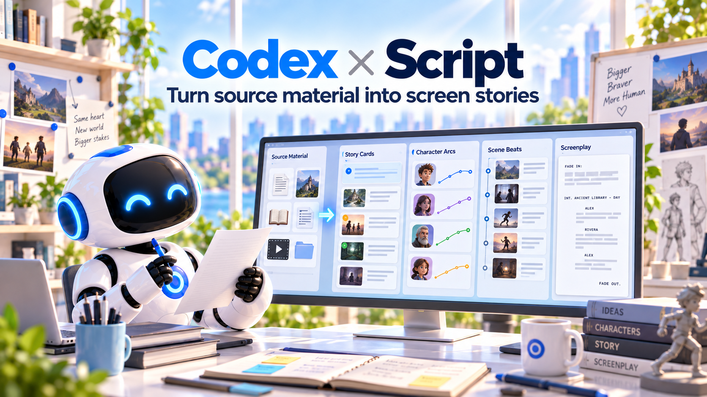

# Codex Script

> Analyze and adapt novels, stories, and existing scripts into outlines, scene-based screenplays, and semantic breakdowns.

[English](README.md) | [简体中文](README.zh-CN.md)

## Status and version

**Design and implementation-planning baseline only. The plugin is not implemented, packaged, or installed.** This repository intentionally contains no empty Skill or MCP manifest that a host could mistake for a working plugin.

The planned plugin ID is `codex-script`; the repository is `codex-script-plugin`.

## Inputs and outputs

- Inputs: SourceMaterial / SourceSpan, adaptation goal, target episode count or duration, locked source facts, and asset policy.
- Outputs: StoryBible, Outline, EpisodeOutline, Screenplay / Scene, BreakdownCandidate, and SourceCoverage.

## Boundaries

The Script plugin decides story and dialogue. It does not create a director's shot strategy, schedule paid image or video generation, or replace workbench asset and version services.

Creative work runs in the Codex / WorkBuddy host and is saved through the workbench MCP as a reviewable version. This plugin owns no independent database. Codex packaging and WorkBuddy integration are verified separately; compatibility between the two is not assumed.

## Documentation

- [Plugin specification](docs/superpowers/specs/plugin-design.md)
- [Implementation plan](docs/superpowers/plans/implementation.md)
- [Workbench architecture](https://github.com/partme-ai/creative-production-workbench/blob/main/docs/superpowers/specs/architecture.md)
- [Shared contracts](https://github.com/partme-ai/creative-production-workbench/blob/main/docs/superpowers/specs/contracts.md)
- [End-to-end workflows](https://github.com/partme-ai/creative-production-workbench/blob/main/docs/superpowers/specs/workflows.md)

## License

This repository currently contains original project design documents, is private, and has no selected open-source license.
