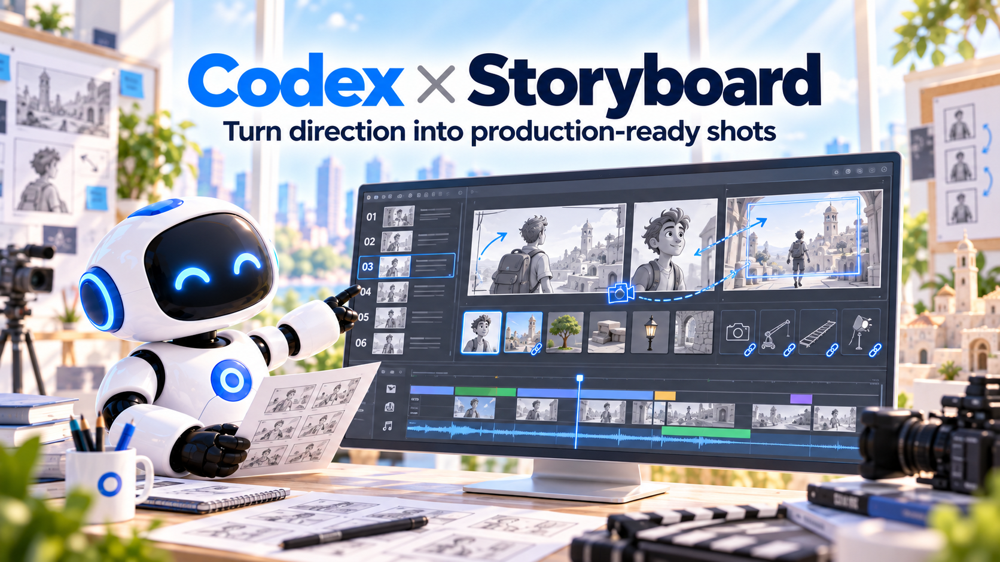

# Codex 分镜

> 将已确认的导演方案具体化为镜头表、图文分镜、资产绑定、粗预演和生产任务包。

[English](README.md) | [简体中文](README.zh-CN.md)

## 状态与版本

**当前仅为设计与开发规划基线，尚未实现、打包或安装。** 本仓库刻意不创建可能被宿主误认为可运行能力的空 Skill 或 MCP manifest。

插件标识规划为 `codex-storyboard`，仓库为 `codex-storyboard-plugin`。

## 输入与输出

- 输入：选定 Screenplay / DirectorPlan revision、ShotIntent、固定角色/场景/道具版本、目标时长与素材生成权限。
- 输出：ShotList、Shot / Panel、AssetBinding、AnimaticPlan、ProductionTaskPlan / ShotExecutionPacket。

## 边界

分镜插件具体化镜头，不私自改变故事或导演锁定项。图片由现有 Image Factory、Dreamina Design 等插件生成；角色主数据归工作台所有。

创作在 Codex / WorkBuddy 宿主执行，结果经工作台 MCP 保存为可审阅版本。本插件不拥有独立数据库。Codex 包格式和 WorkBuddy 接入分别验收，不假定二者天然兼容。

## 文档导航

- [插件功能规格](docs/superpowers/specs/plugin-design.md)
- [开发计划](docs/superpowers/plans/implementation.md)
- [工作台系统架构](https://github.com/partme-ai/creative-production-workbench/blob/main/docs/superpowers/specs/architecture.md)
- [统一契约](https://github.com/partme-ai/creative-production-workbench/blob/main/docs/superpowers/specs/contracts.md)
- [全流程映射](https://github.com/partme-ai/creative-production-workbench/blob/main/docs/superpowers/specs/workflows.md)

## 许可证

当前文档为项目原创设计，仓库为私有，尚未选择对外开源许可。
