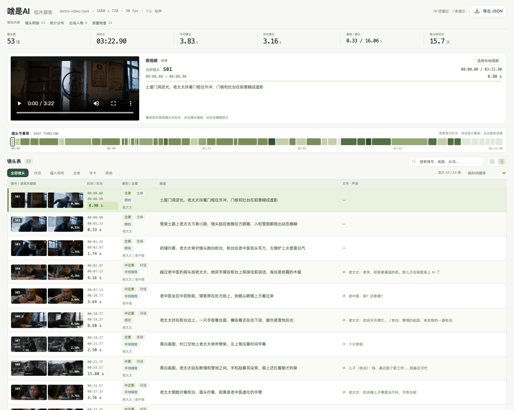

[](README.md)
[](README.en.md)

# video-shots

给成片**拉片**：把一条视频拆成逐镜头的分析表——**时长、景别、类别、运镜、画面、节奏**。

前提刻在骨子里：**镜头边界是量出来的，不是看出来的。** 模型看视频最不可靠的就是报时间，
所以这里划一条死线，两边各干各的：

```
代码量：切点（ffmpeg 场景检测）→ 时长（切点相减，两位小数）→ 实测运动（逐帧差分中位数）
模型判：景别 → 类别 → 运镜 → 画面 → 节奏  ← 只有这几件事是模型的活
代码查：15 道质量门逐条对账              ← 判错的当场拦下
```



**报告是一个单文件交互页**：内嵌播放器（播放时同步高亮镜头、点镜头跳转、时间轴按进度填充）、
镜头节奏带、可搜索可筛选可排序的镜头表（列表 / 卡片两种视图、首尾关键帧并排、点图开大图）、
统计分布、出场人物、质量检查。零外部依赖，离线双击能开。

样式和交互是 `scripts/report.css` 与 `report.js` 两份**可以直接编辑的资产**，
render 时整段内联——改报告的长相不用碰生成器，页面上的每个数字都从 `shots.json` 算：


## 最硬的一道门：运镜对账像素

摄影机真动了，像素不可能不变。所以「声称推/拉/摇/移/跟，**实测帧间变化接近 0**」这一向
**直接拦**——这是模型拉片最常见的幻觉，一拦一个准。

反过来（声称固定、实测很动）**不拦**，只出提示：固定机位前面有人跳舞，帧间差一样会爆。
**误拦的门比没有门更糟**，所以这道门只守它守得住的那一向。

```
✅ 运镜实测对账
提示（不拦）：
   · S46：写的是「固定」，实测帧间变化 12.3 偏高——若是主体在动就对，若是机位在动要改运镜
```

## 看片靠联系表，不是一张张翻

每镜抽两张关键帧——**起手帧 a**（进入 15% 处）和**收尾帧 b**（85% 处），各拼成一张联系表：

- **a 表看内容**：一屏二十几个镜头，这一段在讲什么一眼就有数
- **b 表看运镜**：同一格前后对照，取景变了是推拉摇移，取景没变只有人动了是固定机位

只在判不准的那几个镜头上回去看单帧。一张张翻完整部片是浪费额度。

## 检测漏刀多刀，用 recut 修，不用手改

场景检测必然在两个地方出错：**叠化和暗场对暗场漏刀**，**手持晃动和闪光多刀**。

```bash
node scripts/video-shots.mjs recut shots.json --track track.json \
  --split 63.5 --split 127.37 --merge 45.97 > shots.new.json
```

自动重编号、重算时长与实测运动，补的刀记进 `manualCuts`。**边界没动过的镜头标注原样保留；
被拆被并的清空标注并在 note 里写明出身**——这两半是不是一回事，得重新看画面。

手改 `start` / `end` 挪刀过不了 `boundary` 门：**自己加的刀必须声明**。

## 质量门：15 道，全是代码

与被学习的那套主张一致：**checklist 交给模型自觉是靠不住的**。

| 门 | 规则 |
| --- | --- |
| **时间轴连续** | 按时间排序、首尾相接、从 0.00 开始、收在片尾（容差可配） |
| 时长自洽 | `seconds` = `end − start`；短于 0.3 秒的镜头必须在 note 里说明是闪切还是检测碎片 |
| 镜号纪律 | `S01` 起、两位补零、连号——镜号就是关键帧文件名 |
| 景别 / 类别 / 运镜 | 三张词表逐个对账，空着不填也拦 |
| 转场枚举 | 可省略；写了就得在表里 |
| **画面描述可核对** | 够长（中文 ≥12 字 / 英文 ≥8 词）+ 空话词表（「氛围感」/ "visually stunning"）+ 不许「这个镜头…」/ "This shot…" 开头 |
| **画面描述不重复** | 两镜一字不差 = 没看第二眼 |
| 主体对账 | `subjects` 的编号必须在 `cast` 里；没建 cast **明说跳过** |
| **类别要有证据** | 对话必须有台词、字卡必须有画面文字、反应必须写是谁在反应、空镜里不许有人 |
| **运镜实测对账** | 声称大幅运镜却实测几乎不动 → 拦（只守这一向）。没给 `--track` **明说跳过** |
| **边界来自检测** | 每个边界要么来自 `seedCuts`，要么写进 `manualCuts`。凭空挪刀过不去 |
| 关键帧齐全 | 报告要嵌图，缺图**明说缺**，不猜不骗 |
| **节奏分析可核对** | `rhythm` 是可选字段，但**整片标或整片不标**；标了就得写清观众这一刻看到什么，空话照拦 |

自测里每道门都有**击穿用例**——证明它真的会拦：

```bash
node scripts/selftest.mjs
# ✅ 449 项断言全部通过（15 道门每道都有击穿用例）
```

## 用法

```bash
# 1. 切点与时长（看一眼 stderr 的镜头数，不对就调 --threshold 重跑）
node scripts/video-shots.mjs seed video.mp4 --track track.json --title "片名" > shots.json

# 2. 关键帧与联系表
node scripts/video-shots.mjs frames shots.json --video video.mp4
node scripts/video-shots.mjs sheet  shots.json --cols 4 --rows 6
node scripts/video-shots.mjs sheet  shots.json --cols 4 --rows 6 --pick b

# 3. 看联系表，逐批填 景别 / 类别 / 运镜 / 画面（模型的活）

# 4. 漏刀补刀、多刀并刀
node scripts/video-shots.mjs recut shots.json --track track.json --split 63.5 > shots.new.json

# 5. 校验（有违规退出码 1）
node scripts/video-shots.mjs validate shots.json --track track.json --frames frames

# 6. 出表与报告（--video 给报告里的播放器指原片）
node scripts/video-shots.mjs render shots.json --md   --track track.json > shots.md
node scripts/video-shots.mjs render shots.json --html --track track.json \
  --video ../video.mp4 > shots-report.html
```

所有命令都认 `--lang zh|en`：门的名字、违规信息、命令行输出、报告界面、四张词表全跟着切。
`seed --lang en` 会把 `lang: "en"` 写进底稿，后面的命令不带 `--lang` 也跟着走英文——
连 `recut` 补刀写的 `note`、英文表格里的标点都是半角的。
**画面描述的判据跟着描述本身的语言走**——中文数字数（≥12 字），英文数词数（≥8 词），
空话词表（「氛围感」/ "visually stunning"）和废话开头（「这个镜头…」/ "This shot…"）各一套。

依赖：`node` >= 18（只用标准库）+ `ffmpeg` / `ffprobe`。**零 npm 依赖、零 API key。**

## 自带样例

`examples/demo-shots.json`：一条 202.9 秒 AI 短片的完整拉片。

| | |
| --- | --- |
| 镜头数 | 53 |
| 平均 / 中位镜长 | 3.83 秒 / 3.16 秒 |
| 最短 / 最长 | 0.33 秒（雪地奔跑的闪切） / 16.06 秒（结尾光柱下的长镜头） |
| 每分钟切次 | 15.7 |
| 类别大头 | 对话 58%、反应 10%、插入特写 9% |
| 节奏大头 | 递进 13 镜、收口 6 镜、重音 6 镜；钩子落在开篇三镜与「染上 AI」那句台词上 |
| 运镜大头 | 固定 55%、手持微晃 42% |
| 补刀 | 10 刀（叠化与片尾字卡各占一半），全部记在 `manualCuts` 里 |
| 质量门 | 15 道全绿，留着两条提示当范例（运镜实测偏高、片尾连着六镜节奏发平） |

它是质量基准，也是自测夹具。

## 自己跑一遍

仓库根目录的 `demo-report/` 就是这条样例的**完整产物**（报告 + 106 张关键帧 + 主数据），
双击 `shots-report.html` 就能看。想从零复现：

```bash
node scripts/video-shots.mjs seed ../../demo-video.mp4 --threshold 0.15 --track track.json > shots.json
```

## 来源

skill 的写法、报告的界面语言、「质量门全部由代码确定性检查」的主张，
学自 [eternityspring/shuohao-skills](https://github.com/eternityspring/shuohao-skills)（Apache-2.0）。
方法论已内化成本目录自己的 `references/`——**本 skill 自包含，不依赖任何外部 skill**。

那套 skill 做的是「小说 → 分镜 → 视频」的正向管线；这一个是反向：**成片 → 镜头表**。
两边的 `size` / `camera` 词表可以对得上，拉片的产物能直接当仿写的参考。
