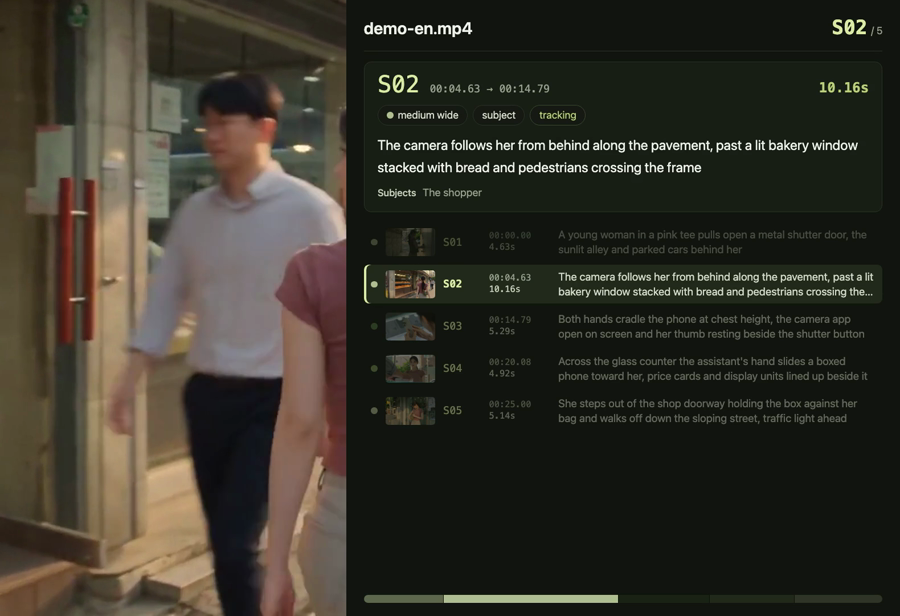
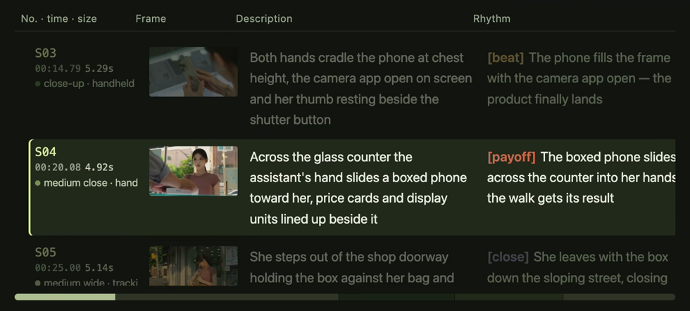

[](README.md)
[](README.en.md)

# video-sync

Turns a [video-shots](../video-shots/README.en.md) breakdown plus the source film into a
**video you can just watch**: the footage on one side, the current shot's data on the other.
**The panel changes when the film cuts** — the shot list scrolls itself and highlights the shot
that is playing.

## The layout follows the aspect ratio, nothing else

| Source | Layout | |
| --- | --- | --- |
| Landscape (w > h), square | **footage on top, data below** | `vstack` |
| Portrait (h > w) | **footage on the left, data on the right** | `hstack` |

The portrait case — the output is 1580×1080, roughly 3:2, not a vertical clip jammed into 16:9
with black bars:



Both directions **scale the footage as-is — never cropped, never stretched**; the panel fills the
rest of the canvas. Every dimension is rounded to an even number (h264 requires it) and the
panel's short side never drops below 260px (below that the text stops fitting).

It **never upscales by default**. But the panel is sized off the footage, so a small source gets a
small panel — a 640×360 clip only leaves 640×288, and four columns in that are unreadable. For
those, `--scale 2` takes the footage area to 1280×720 and the panel to 1280×576, aspect ratio
untouched. Details in [`references/layout.md`](references/layout.md).

## Three screenshots, and ffmpeg does the moving

Only two things on the panel ever change: **how far the list has scrolled** and **which row is
lit**. So neither per-frame screenshots nor one-per-shot:

```
measure once  row positions, the list viewport, the full table height (the browser knows, the script cannot)
shoot three   the static base (header + progress), the whole table dimmed, the whole table lit
compose       crop a viewport out of the dimmed strip → scrolling
              crop one row out of the lit strip → the highlight
```

For a 53-shot film that is 3 screenshots instead of 53 (12 seconds), and it buys **real continuous
motion**.

**The playing shot sits on the second row**: shots 1 and 2 leave the list still (only the
highlight moves down), and **from the third shot on every cut scrolls exactly one row**. The
scroll takes 0.45s and then stops — a list that creeps through a 16-second take is just
distracting. The highlight bar rides the same easing.

Row height **follows the content** (a longer description makes a taller row), so the highlight is
layered by height: `crop` cannot change height at runtime, so one layer per distinct row height,
and the ones not in use are parked off-screen.

Four traps, documented in [`references/layout.md`](references/layout.md): `drawbox` evaluates its
expressions only once at init (so it cannot animate); a whole-film expression makes ffmpeg's
parser fail outright at around a hundred terms (hence `sendcmd`, one short command per shot); the
`x` you crop at has to be the `x` you overlay back at (otherwise the whole table shifts right by
one indent and loses the same width off its right edge); and an unused highlight layer has to park
outside the **whole panel**, not just outside the list viewport, or a slice of it shows over the
progress bar.

## The layout is yours to change

The panel is an HTML page and **everything about how it looks lives in
[`scripts/panel.css`](scripts/panel.css)** — edit that and the layout changes. No need to touch
the script or rethink the screenshot logic. Re-run `panels` and you have the new design.

| | |
| --- | --- |
|  |  |
| Landscape: header + four columns (no./time/size/camera · frame · description · rhythm) | Portrait: the same four, narrow and tall |

`panels` also writes `panels/panel.html` — **open it in a browser to preview**, add `#S07` to the
URL to switch shots. Both layouts share one DOM and switch grid areas via `.landscape` /
`.portrait` on `.panel`, so there is no second template to forget about. Conventions in
[`references/panel-style.md`](references/panel-style.md).

Font size scales with the panel (`base = clamp(12, min(width/38, height/26), 26)`), so the CSS
uses **rem everywhere** — this is video, and 13px that reads fine on a monitor is mush on a phone.

## Usage

```bash
# 0. Start from a video-shots run: shots.json (+ frames/ for thumbnails)

# 1. Geometry only, no video work (seconds — check the numbers before committing)
node scripts/video-sync.mjs plan shots.json --video clip.mp4

# 2. Render panels: three stills plus a previewable panel.html
node scripts/video-sync.mjs panels shots.json --video clip.mp4 --frames frames --lang en

# 3. Compose (audio is carried over from the source)
node scripts/video-sync.mjs compose shots.json --video clip.mp4 -o out.mp4

# or in one go
node scripts/video-sync.mjs export shots.json --video clip.mp4 --frames frames -o out.mp4
```

Knobs: `--panel <ratio>` (landscape: panel height ÷ footage height, default 0.8; portrait: panel
width ÷ footage width, default 1.6), `--scale <factor>` (how far to blow up the footage area,
default 1 = never upscale; this is what makes a small source's panel readable),
`--width` / `--height` (caps on the footage area), `--crf`
(quality), `--ease` (easing seconds at each cut), `--anchor` (which row the playing shot sits on,
default 1 = second row), `--lang zh|en`.

Requirements: `node` >= 18 (standard library only) + `ffmpeg` / `ffprobe` + a headless browser
(Chrome / Chromium / Edge; `--chrome` takes a path). **No npm dependencies, no API keys.**

## "It didn't error" is not verification

Pull at least three frames and check **which shot the footage belongs to, whether the panel shows
that same shot number, and whether the highlighted row moved with it**:

```bash
for t in 5 30 60; do ffmpeg -v error -y -ss $t -i out.mp4 -frames:v 1 -q:v 3 /tmp/check-$t.jpg; done
```

A mismatch usually means shots.json and the film are not the same clip.

## Self-test

```bash
node scripts/selftest.mjs
# ✅ 122 assertions passed
```

No ffmpeg, no browser. It checks: geometry (landscape/square/portrait, even dimensions, caps,
knobs, erroring instead of guessing when dimensions are unreadable); the panel page's data
contract (vocabularies and rhythm roles sent as names not enum keys, thumbnails only when the file
exists, `<script>` escaped); the animation commands (every one must stay short, a long take clamps
once the scroll lands, `--ease` takes effect); and the ffmpeg arguments (vstack/hstack, `setsar=1`,
all three stills need `-loop`, no audio mapping on a silent source, the film must be input 0).

## Relationship to video-shots

```
video-shots  →  shots.json + frames/  →  video-sync  →  out.mp4
(breakdown: cutting and annotating)      (compositing: footage + data)
```

**The two skills are independent**: this one **carries its own copy** of the four vocabularies
rather than importing across directories — a skill has to survive being copied out on its own. The
price is that a new term added in `video-shots` has to be added here too, or it shows up as a raw
enum key.

## What it looks like

A 287.4-second English excerpt with its 46-shot breakdown, 1280×1296 (the source is 640×360,
blown up with `--scale 2`). The panel switches with every cut; the list scrolls up and the
highlight rides along:

<video src="https://github.com/eternityspring/reelbench-skills/raw/main/demo-sync/demo-en-sync.mp4" controls muted playsinline width="760"></video>

If the player does not load, grab the file: [`demo-sync/demo-en-sync.mp4`](../../demo-sync/demo-en-sync.mp4)
